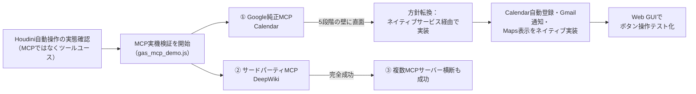
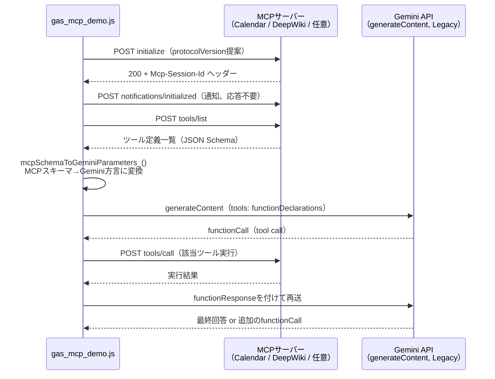
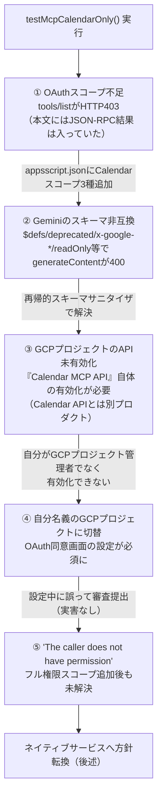
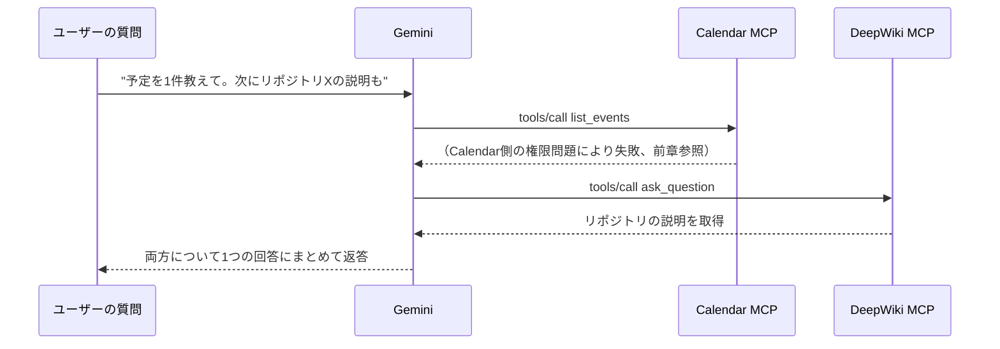
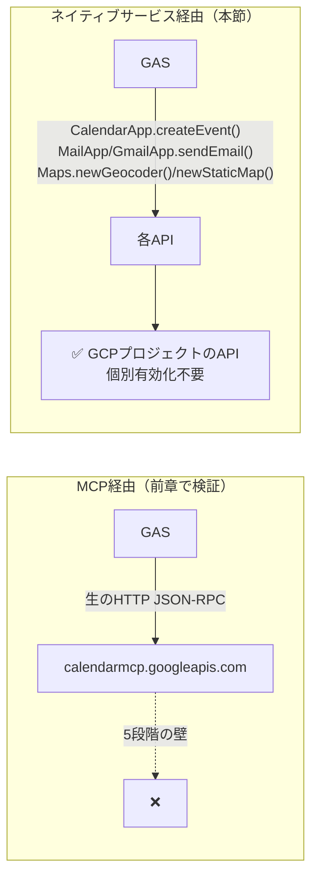
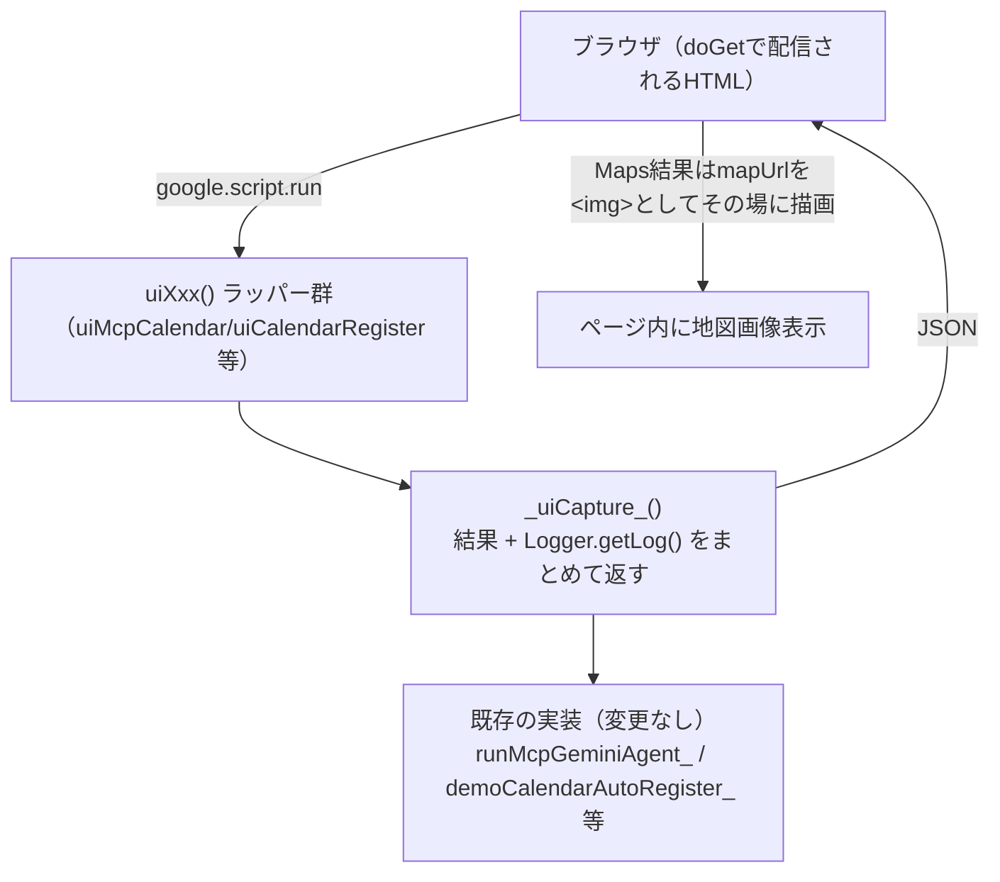

# gas_mcp_demo.js 実装ログ — MCP実機検証とGoogleサービス連携レポート

**作成日:** 2026-08-14
**対象:** [gas_mcp_demo.js](gas_mcp_demo.js)（本番のcloudRAGパイプライン（[gas_cloud_rag.js](../scripts/gas_cloud_rag.js)）とは独立した検証用スクリプト。本番には一切組み込んでいない）
**位置づけ:** 技術資料。「GeminiでMCP連携してどこまで操作できるか」をGAS上で実機検証した記録。Google純正MCPサーバー（Calendar）で実際に直面した壁、サードパーティMCP（DeepWiki）・複数サーバー横断の成功、代替として実装したGASネイティブサービス経由のGoogle連携、テスト用Web GUIまでをまとめる。[docs/model-strategy-report.md](../docs/model-strategy-report.md)で行ったGoogle管理MCPサーバーの調査（一次情報収集）を踏まえて、実際に実装・実機検証した記録という位置づけ。

---

## 目次

1. [概要](#1-概要)
2. [実装アーキテクチャ：MCP JSON-RPCクライアントの自前実装](#2-実装アーキテクチャmcp-json-rpcクライアントの自前実装)
3. [検証①: Google純正MCP（Calendar）— 直面した壁の連鎖](#3-検証1-google純正mcpcalendar--直面した壁の連鎖)
4. [検証②③: サードパーティMCP（DeepWiki）と複数サーバー横断](#4-検証23-サードパーティmcpdeepwikiと複数サーバー横断)
5. [方針転換：GASネイティブサービス経由の実装](#5-方針転換gasネイティブサービス経由の実装)
6. [Web GUI](#6-web-gui)
7. [変更ファイル一覧](#7-変更ファイル一覧)
8. [未解決事項・今後の方針](#8-未解決事項今後の方針)

---

## 1. 概要

Houdini自動操作の実態確認（「MCPではなくAnthropicツールユース」）をきっかけに、「では実際にMCP経由でGoogleサービス（Calendar/Gmail/Maps）やサードパーティサービスを操作するとどこまでできるのか」を、GAS上で最小構成のMCPクライアントを自前実装して実機検証した。

結論を先に書くと：

- **Google純正MCP（Calendar）は、OAuthスコープ→Geminiのスキーマ非互換→GCPプロジェクトのAPI有効化→OAuth同意画面設定→組織のガバナンスと、5段階の壁が連続する**（詳細は「Google純正MCPの検証」章）
- **サードパーティMCP（DeepWiki、認証不要）は一切の障害なく完全に成功**（詳細は「サードパーティMCPの検証」章）
- **複数MCPサーバーを同時に渡すと、Geminiは自然文の内容に応じて正しく使い分ける**（詳細は「複数サーバー横断」章）
- **GAS上でCalendar/Gmail/Mapsを使うだけなら、MCPを経由する必然性は無い**。ネイティブサービス（`CalendarApp`/`MailApp`/`GmailApp`/`Maps`）の方が圧倒的に速く確実に動く（詳細は「ネイティブサービス経由の実装」章）
- MCPが本当に価値を持つのは、①GASの外（Django/Firebase等）で動かす場合、②複数の異なるAIクライアントから同じ連携を使い回したい場合、③ユーザーの自然文からどのツールを呼ぶかLLMに動的判断させたい場合



---

## 2. 実装アーキテクチャ：MCP JSON-RPCクライアントの自前実装

GASにはMCP用のSDKが無いため、`UrlFetchApp`（同期HTTP）だけでMCPのStreamable HTTPトランスポートを実装した。



**技術的なポイント**：

| 課題 | 対応 |
|---|---|
| GASの`UrlFetchApp`は真のストリーミング（SSE逐次受信）非対応 | レスポンス本文はストリームが閉じるまで待ってから丸ごと文字列取得できる特性を利用し、`text/event-stream`形式でも`data:`行を自前パースすれば1リクエスト1レスポンスのJSON-RPCは成立する（`mcpParseJsonRpcBody_`） |
| MCPのJSON Schema（`inputSchema`）とGeminiのfunction calling方言に差異 | `mcpSchemaToGeminiParameters_`で`$ref`を`$defs`の実体に展開してから、`$defs`/`deprecated`/`readOnly`/`writeOnly`/`x-`始まりのベンダー拡張キー等を再帰的に除去（詳細は次章） |
| セッション管理 | `initialize`応答の`Mcp-Session-Id`ヘッダーを以降の全リクエストに付与 |

---

## 3. 検証①: Google純正MCP（Calendar）— 直面した壁の連鎖

「Google純正のMCPサーバーだから、Google純正のGASからならすぐ使えるはず」という前提を検証したところ、**5段階の壁が連続して発生した**。各段階は独立した原因を持ち、1つ解決すると次が現れる形だった。



### 3.1 ①OAuthスコープ不足（HTTP 403だが本文は正常）

初回実行時、`tools/list`がHTTP 403を返したが、**レスポンス本文には正常なJSON-RPC結果（ツール一覧）が入っているという不可解な状態**だった。`debugOAuthScopes()`（`ScriptApp.getOAuthToken()`をGoogleの`tokeninfo`エンドポイントに投げて実際の付与スコープを確認する自作の診断関数）で調べたところ、`scope`には`script.external_request`しか入っておらず、Calendarスコープが一切無いことが判明した。

原因：GASのOAuthスコープは通常「コード内で`CalendarApp`等の組み込みサービスを呼んでいるか」を自動検出して決まるが、本実装は`UrlFetchApp`で手動にHTTPを叩いているだけなので自動検出が効かない。`appsscript.json`に`oauthScopes`を明示しない限りCalendarスコープは絶対に付与されない。

→ `calendar.calendarlist.readonly` / `calendar.events.freebusy` / `calendar.events.readonly` の3スコープを追加して解決。

### 3.2 ②Geminiのスキーマ非互換

スコープ追加後、`tools/list`は正常化したが、今度は`generateContent`が400エラーになった。Calendar MCPのツールスキーマには、Geminiのfunction calling方言（OpenAPI 3.0のサブセット）が受け付けないキーが複数含まれていた：

| 検出されたキー | 対応 |
|---|---|
| `$defs` / `$ref` | 単純に削除すると参照先を失って壊れるため、`$ref`を`$defs`の実体でその場に展開してから除去 |
| `deprecated` | 除去 |
| `x-google-enum-descriptions`（ベンダー拡張） | `x-`始まりのキーを一括除去 |
| `readOnly` / `writeOnly` | 除去（1回目の修正で漏れており、2回目のテストで別エラーとして発覚） |

再帰的なスキーマサニタイザ（`mcpResolveRefs_` → `mcpStripUnsupportedKeys_`）を実装して解決。

### 3.3 ③GCPプロジェクトのAPI未有効化

スキーマ修正後、`tools/list`は通ったが、実際にデータへアクセスする`tools/call`（`list_events`等）が以下のエラーで失敗した：

```
Calendar MCP API has not been used in project【プロジェクト番号】before or it is disabled.
```

これは**「Google Calendar API」とは別に、「Calendar MCP API」という2026年発表の新プロダクト自体を、GCPプロジェクト側で個別に有効化する必要がある**ことが原因。ユーザーはこのGASプロジェクトが紐づくGCPプロジェクトの管理者ではなかったため、この時点で自力での解決ができなかった。

### 3.4 ④GCPプロジェクトの切り替えとOAuth同意画面

自分名義の新規GCPプロジェクトを作成し、Apps Scriptの「GCPプロジェクトを変更」で切り替えることで、自分の権限でAPIを有効化できるようにした。ただし新規プロジェクトでは「OAuth同意画面の設定」が別途必須で、その設定中に誤ってGoogleへの検証（verification）審査を提出してしまう一幕があった。実害としては：「テスト中」ステータスのまま・自分がテストユーザーに登録済みであれば、審査結果を待たずに利用できるため問題は無かった。

### 3.5 ⑤"The caller does not have permission"（未解決）

GCPプロジェクト切り替え・API有効化・OAuth同意画面設定を終えた後、`tools/call`のエラーは変わったが解決はしなかった：

```json
{"content":[{"text":"The caller does not have permission","type":"text"}],"isError":true}
```

その後、後述するネイティブサービスの実装で`CalendarApp.createEvent()`に**フル権限の`https://www.googleapis.com/auth/calendar`スコープ**が必要と判明し、これを`oauthScopes`に追加した。副次的にCalendar MCP側の権限問題も解決するのではと期待して再テストしたが、**この時点でも"The caller does not have permission"のまま変化しなかった**（本レポート末尾の「未解決事項・今後の方針」に記載）。

---

## 4. 検証②③: サードパーティMCP（DeepWiki）と複数サーバー横断

### 4.1 DeepWiki MCP（認証不要）— 完全成功

`https://mcp.deepwiki.com/mcp`（GitHubリポジトリのドキュメントQ&A、認証不要の公開MCPサーバー）に対しては、セッション確立・ツール一覧取得・`ask_question`ツールの呼び出し・最終回答生成まで、**一度も障害なく成功**した。これは「Google製以外のMCPサーバーもGASから同じ仕組みで問題なく操作できる」ことの直接的な証拠になった。

### 4.2 複数MCPサーバー横断

Calendar MCPとDeepWiki MCPを同時に1つのGeminiセッションへ渡し、「まず私の直近の予定を1件だけ教えてください。次に、GitHubリポジトリ〜」という複合質問を投げたところ、**Gemini自身が質問の前半はCalendarツール（`list_events`）、後半はDeepWikiツール（`ask_question`）と正しく使い分けて**回答を組み立てた。



これは「GAS+Geminiで複数のMCPサーバー（Google純正・サードパーティ問わず）を横断的に操作できるか」という当初の問いに対する、実証済みの回答である。

---

## 5. 方針転換：GASネイティブサービス経由の実装

ここまでのCalendar MCPでの経験を踏まえ、「決定的な処理（判断を伴わない自動化）にLLM/MCPを挟む必要は無い」という原則（[docs/model-strategy-report.md](../docs/model-strategy-report.md)の運用方針とも整合）のもと、GASの組み込みAdvanced Servicesで同じ目的を達成する実装に切り替えた。



実装したもの（すべて[gas_mcp_demo.js](gas_mcp_demo.js)内、本番未接続のデモ関数）：

| 機能 | 関数 | 用途 |
|---|---|---|
| Calendar自動登録 | `demoCalendarAutoRegister_` | 「ナレッジ登録したら必ずカレンダーに追加」という決定的パイプラインの実装例 |
| Gmail通知 | `demoGmailNotify_` | 「異常検知したら必ず通知」という決定的パイプラインの実装例。表示名変更・別アドレス（要Gmail側でSend As認証済み）からの送信の両方に対応 |
| 監視→アラート | `demoMonitorAndAlert_` | 閾値判定は普通のコードで行い、超過時のみ`demoGmailNotify_`を呼ぶ。LLM/MCP不使用の決定的パイプラインそのもの |
| Maps表示 | `demoMapsShow_` | 場所名→ジオコーディング→静的地図画像URL生成 |

実装過程で判明した、ネイティブサービス固有のスコープ・課金要件（いずれもドキュメントの表記だけでは分からず、実機検証で確定させたもの）：

| サービス | 要求される権限・条件 | 実機で判明した注意点 |
|---|---|---|
| `CalendarApp.createEvent()` | `https://www.googleapis.com/auth/calendar`（フル権限） | 新しい細分化スコープ`calendar.events`では「Specified permissions are not sufficient」エラーになる。CalendarAppは古典的なフルスコープ体系のみ認識する |
| `Session.getActiveUser()` / `getEffectiveUser()` | `https://www.googleapis.com/auth/userinfo.email` | 送信先未指定時に自分のメアドを解決するために必要。**両メソッドとも同じスコープを要求**するため、`getEffectiveUser()`への切り替えでは回避できない（公式ドキュメントで確認済み） |
| `GmailApp.sendEmail(...,{from: alias})` | `https://mail.google.com/`（フル権限） | 送信専用の狭いスコープが存在しない。「送信元を変えたい」という目的に対してはかなり広い権限要求になる。`from`には`GmailApp.getAliases()`が返す、Gmail側で事前に認証済みのアドレスしか指定できない |
| `Maps.newStaticMap().getMapUrl()` | `MAPS_API_KEY`スクリプトプロパティ（課金設定済みAPIキー） | OAuthスコープではなく別体系のAPIキー認証。**2018年以降、Google Maps Static APIはAPIキー無しだと画像を返さない仕様**（エラー画像 or 実用にならないレート制限）。未設定のままだと`mapUrl`生成自体は成功するため、実際にブラウザで開いて初めて失敗に気づく。対策として`demoMapsShow_`はURLを返す前にサーバー側で`UrlFetchApp.fetch`により画像取得を検証し、失敗時は原因（キー未設定/無効）を明示するエラーで即座に落とすようにした |

---

## 6. Web GUI

Apps Scriptエディタの「実行」ボタン＋実行ログでの動作確認に代えて、ブラウザから各機能をボタン操作でテストできるWeb GUIを`doGet(e)`として追加した。



- 9枚のカード（①〜⑤: MCP経由、⑥〜⑨: ネイティブサービス経由）で構成
- `_uiCapture_()`が各テスト実行のLogger出力を丸ごとキャプチャして返すため、GUIの「詳細ログ」パネルにApps Scriptエディタの実行ログと同等の詳細trace（`[Google Calendar MCP] tools/call: list_events args=...`等）が表示される
- 既存のテスト関数（`testMcpCalendarOnly()`等）は変更せず、GUI用の薄いラッパー関数（`uiMcpCalendar()`等）を追加する形で実装したため、エディタからの直接実行と両方の経路が使える
- デプロイは「デプロイ→新しいデプロイ→種類:ウェブアプリ→実行ユーザー:自分→アクセス:自分のみ」を推奨（「全員」にすると、アクセスした全員の操作がデプロイ者のGoogleアカウント権限で実行される点に注意）

---

## 7. 変更ファイル一覧

| ファイル | 変更内容 |
|---|---|
| [gas_mcp_demo.js](gas_mcp_demo.js) | 新規作成・継続拡張。MCP JSON-RPCクライアントの実装、Calendar MCPの検証、DeepWiki・複数サーバーの検証、ネイティブサービスでの実装、Web GUIを単一ファイルに集約 |

本番の[scripts/gas_cloud_rag.js](../scripts/gas_cloud_rag.js)への変更は無し（意図的に分離。ユーザーの明示的な要望）。

---

## 8. 未解決事項・今後の方針

| # | 項目 | 内容 |
|---|---|---|
| 1 | Calendar MCPの"The caller does not have permission"が未解決 | フル権限スコープ（`calendar`）追加後も解消せず。GCPプロジェクト単位のIAM設定、または組織のGoogle Workspace側API制御（Admin Console → セキュリティ → APIの制御）が別途関わっている可能性がある。この経路自体は前述のネイティブサービスの実装で代替できているため優先度は高くないが、原因は特定できていない |
| 2 | Maps Static APIの課金要件 | `MAPS_API_KEY`は無料枠（月200ドル分のクレジット）はあるが課金アカウントの設定が前提。個人検証用途を超えて使う場合はコスト監視が必要 |
| 3 | GmailAppのフル権限スコープ | 「送信元アドレスを変えたい」というささやかな目的に対して、Gmailの読み書き削除を含む広い権限を要求する設計。表示名変更だけで足りるならMailApp（狭いスコープ）に留めるべき |
| 4 | 将来のFirebase等への移行を見据えた設計 | GASを離れる場合、ネイティブサービス（`CalendarApp`等）の代替が無くなるため、その時点でGoogle製MCPサーバーまたは`googleapis`ライブラリ経由のREST APIが選択肢になる。呼び出し側のロジックを変えずに実装だけ差し替えられるよう、薄いアダプタ層（`registerKnowledgeEvent()`/`sendAlert()`/`showLocation()`等の安定インターフェース）を挟む方針を提案済み（未実装） |
| 5 | RAG本体への統合 | 今回の実装は全て検証用デモに留めており、実際のナレッジ登録フロー（`gas_cloud_rag.js`の`adminKbImportQaCsv`等）や監視処理への組み込みはまだ行っていない |

---

*関連ドキュメント: [docs/model-strategy-report.md](../docs/model-strategy-report.md)（Google管理MCPサーバーの一次調査） / [docs/claude-token-security-report.md](../docs/claude-token-security-report.md)（cloudRAGのClaude APIセキュリティ設計） / [setup-guide.md](setup-guide.md)（このデモの導入手順書）*
