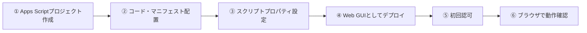

# gas_mcp_demo.js 導入手順書

**対象読者:** このデモを初めてセットアップし、Web GUIから動かしてみたい人
**前提知識:** Googleアカウントの基本操作。Apps Scriptの経験は無くても手順通りに進められます
**関連ドキュメント:** 実装の詳しい背景・実機検証で分かったこと → [gas-mcp-demo-report.md](gas-mcp-demo-report.md)

---

## 目次

1. [これは何か](#1-これは何か)
2. [事前に用意するもの](#2-事前に用意するもの)
3. [Apps Scriptプロジェクトを作成する](#3-apps-scriptプロジェクトを作成する)
4. [コードとマニフェストを配置する](#4-コードとマニフェストを配置する)
5. [スクリプトプロパティを設定する](#5-スクリプトプロパティを設定する)
6. [Web GUIをデプロイする](#6-web-guiをデプロイする)
7. [初回の認可](#7-初回の認可)
8. [動作確認（まずは何から試すか）](#8-動作確認まずは何から試すか)
9. [（任意・上級者向け）Calendar MCPを試す場合](#9-任意上級者向けcalendar-mcpを試す場合)
10. [トラブルシューティング](#10-トラブルシューティング)

---

## 1. これは何か

`gas_mcp_demo.js`は、Google Apps Script（GAS）上でGeminiとMCP（Model Context Protocol）連携、およびGoogleサービス（Calendar/Gmail/Maps）連携がどこまでできるかを検証するためのデモです。ブラウザで開けるWeb GUIから、ボタン操作で9つの機能を試せます。

- **本番システムとは完全に独立**しています。既存のシステムには一切影響しません
- 検証専用なので、自分だけがアクセスできる形でデプロイすることを推奨します（手順6で説明）

---

## 2. 事前に用意するもの

| 項目 | 必須か | 用途 |
|---|---|---|
| Googleアカウント | 必須 | Apps Scriptの実行に使う |
| Gemini APIキー | 必須 | [Google AI Studio](https://aistudio.google.com/)で無料発行できる |
| Google Maps Platform APIキー | 任意（Maps表示機能を使うなら実質必須） | Google Cloud Consoleで発行。課金アカウントの設定が必要（月200ドル分の無料枠あり） |
| 試したい外部MCPサーバーのURL・トークン | 任意 | 「任意のMCPサーバー」カードを使う場合のみ（例: GitHub MCP） |

---

## 3. Apps Scriptプロジェクトを作成する

1. [script.google.com](https://script.google.com/) を開く
2. 「新しいプロジェクト」をクリック
3. 左上のプロジェクト名（「無題のプロジェクト」）をクリックし、分かりやすい名前に変更する（例: 「MCP連携デモ」）

---

## 4. コードとマニフェストを配置する

1. エディタに最初から入っている `コード.gs` の中身をすべて削除し、[gas_mcp_demo.js](gas_mcp_demo.js) の内容を丸ごと貼り付ける
2. 左メニューの**歯車アイコン**（プロジェクトの設定）を開き、「**"appsscript.json" マニフェスト ファイルをエディタで表示する**」にチェックを入れる
3. ファイル一覧に新しく現れる `appsscript.json` を開き、中身をすべて削除して、[appscript.json](appscript.json) の内容を貼り付けて保存する

`appscript.json`には、この後の手順で説明する全機能分のOAuthスコープと、Web GUIのデプロイ設定（自分のみアクセス可）があらかじめ入っています。

---

## 5. スクリプトプロパティを設定する

左メニューの**歯車アイコン**（プロジェクトの設定）→ 一番下の「**スクリプト プロパティ**」→「**スクリプト プロパティを編集**」から追加します。

| プロパティ名 | 必須か | 用途 | 値の取得方法 | 未設定のときの挙動 |
|---|---|---|---|---|
| `GEMINI_API_KEY` | **必須** | Gemini API（generateContent）の呼び出しに使う | [Google AI Studio](https://aistudio.google.com/)で発行 | MCP系の全機能（①〜④）がエラーになる |
| `MAPS_API_KEY` | 任意（Maps表示機能⑨を使うなら実質必須） | 地図画像（Maps Static API）の取得に使う | Google Cloud Console →「APIとサービス」→「認証情報」で発行。「Maps Static API」の有効化と課金アカウントの設定が必要 | 地図画像を取得できず、機能⑨がエラーで落ちる（2018年以降、APIキー無しでは画像を返さない仕様のため） |
| `GMAIL_FROM_ALIAS` | 任意 | Gmail通知（機能⑦）の送信元アドレスを、自分の別アドレスに変更したい場合 | Gmail設定の「他のメールアドレスから送信」で事前に認証済みのアドレス | 送信元アドレスは変わらない（表示名のみ変更されたMailAppでの送信になる） |
| `MCP_CUSTOM_URL` | 任意 | 「任意のMCPサーバー」カード（機能④）で、GUIに毎回URLを入力しなくて済むようにする | 試したいMCPサーバーのエンドポイントURL（例: `https://api.githubcopilot.com/mcp/`） | GUIのカードにURLを直接入力すれば、この設定が無くても動く |
| `MCP_CUSTOM_BEARER_TOKEN` | 任意 | 上記カスタムMCPサーバーの認証トークン | サービスごとに取得方法が異なる（例: GitHubのPersonal Access Token） | GUIのカードに直接入力すれば、この設定が無くても動く。両方未設定なら認証不要のMCPサーバーのみ試せる |

---

## 6. Web GUIをデプロイする

1. エディタ右上の「**デプロイ**」→「**新しいデプロイ**」
2. 「種類の選択」の歯車アイコンをクリックし、「**ウェブアプリ**」を選ぶ
3. 「次のユーザーとして実行」→「**自分**」
4. 「アクセスできるユーザー」→「**自分のみ**」
5. 「デプロイ」をクリック

> ⚠️ **「アクセスできるユーザー」を「全員」にする場合の注意**：このデモを他の人にも触ってもらいたい場合に選ぶことになりますが、アクセスした人の操作（Calendarへの書き込み・メール送信を含む）は**すべてデプロイした人のGoogleアカウント権限で実行されます**。人に見せる際は、自分のアカウントで代表して操作を見せる（画面共有）方が安全です。

デプロイが完了すると、Web GUIのURLが発行されます。このURLをブラウザで開くと画面が表示されます。

---

## 7. 初回の認可

初めて機能を実行すると、Googleの認可画面がポップアップで表示されます。

1. アカウントを選択
2. 「このアプリは Google で確認されていません」という警告が出ます → これは**自分で作成したスクリプトだから**表示される通常の画面です。「**詳細**」をクリックし、「**（プロジェクト名）に移動（安全ではないページ）**」を選ぶ
3. 要求される権限一覧を確認し、「**許可**」をクリック

機能を追加で使うたびに（Calendar・Gmail等、新しいスコープを初めて使う瞬間）、再度この認可画面が出ることがあります。

---

## 8. 動作確認（まずは何から試すか）

| 順番 | カード名 | 特徴 |
|---|---|---|
| 1番手におすすめ | ② DeepWiki MCP | 追加設定が一切不要。認証不要の公開MCPサーバーなので、GEMINI_API_KEYさえ設定してあればすぐ動く |
| 2番手 | ⑨ Maps表示 | MAPS_API_KEYさえ設定すれば、その場で地図画像が表示されて分かりやすい |
| 3番手 | ⑥⑦⑧ Calendar自動登録／Gmail通知／監視アラート | GASネイティブサービスのみで完結。appsscript.jsonのスコープが正しければすぐ動く |
| 上級者向け | ① Google Calendar MCP | 追加のGoogle Cloud側設定が必要（次章参照）。既知の未解決問題があります |

各カードには「実行」ボタンと「詳細ログ」の折りたたみがあります。詳細ログにはApps Scriptの実行ログと同等の詳しい経過が表示されるので、うまくいかない場合はまずここを確認してください。

---

## 9. （任意・上級者向け）Calendar MCPを試す場合

「① Google Calendar MCP」カードのみ、追加の設定と心構えが必要です。

- GASプロジェクトが紐づくGoogle CloudプロジェクトでCalendar MCP APIを有効化する必要があります（プロジェクトの管理者権限が必要）
- 自分がそのプロジェクトの管理者でない場合、自分名義の別プロジェクトに切り替える必要があります（OAuth同意画面の設定も追加で必要）
- **実機検証の結果、上記をすべて終えても"The caller does not have permission"というエラーが解消しないケースが確認されています**（原因未特定）

このカード以外（②〜⑨）は、この面倒な設定は一切不要です。まずはそちらから試すことを強くおすすめします。詳しい経緯は [gas-mcp-demo-report.md](gas-mcp-demo-report.md) の「Google純正MCP（Calendar）— 直面した壁の連鎖」章にまとめてあります。

---

## 10. トラブルシューティング

| 症状 | 原因・対処 |
|---|---|
| Gemini APIエラー（400番台） | `GEMINI_API_KEY`が未設定・無効な可能性。手順5を確認 |
| Calendar登録・Gmail通知でスコープ関連のエラー | `appsscript.json`のoauthScopesが正しく貼り付けられているか確認（手順4）。新しいスコープを追加した直後は再認可（手順7）が必要 |
| Maps表示で「地図画像を取得できませんでした」 | `MAPS_API_KEY`が未設定、またはMaps Static APIが未有効化／課金未設定。手順5を確認 |
| 「① Google Calendar MCP」だけ失敗する | 既知の問題です。9章を参照。他のカードには影響しません |
| デプロイしたURLを開いても真っ白 | デプロイ設定（手順6）で種類が「ウェブアプリ」になっているか確認。コード貼り付け後は保存を忘れずに |

より詳しい技術的背景（実際に発生したエラーの詳細・原因調査の過程）は [gas-mcp-demo-report.md](gas-mcp-demo-report.md) を参照してください。
