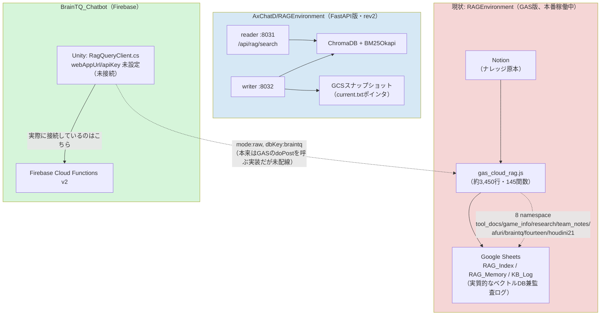

# RAG Environment → AxChatD 統合計画

**作成日:** 2026-08-27
**対象:**
- 統合元: `AXTechCare/RAGEnvironment`（本リポジトリ`DevelopmentRAGEnvironment`の公開用ミラー。Local RAG + GAS製Cloud RAGの2系統）
- 統合先: `AXTechCare/AxChatD`配下の`RAGEnvironment/`（`git subtree`で取り込まれた、別系統のFastAPI製RAG。reader/writer分離、Cloud Run稼働）
- 比較対象: `cloudflare-rag-poc/`（本リポジトリ内、GAS版の機能をCloudflare Workers+D1+Vectorizeで再実装した技術検証。本番影響なし）
- 関連: `BrainTQ_Chatbot`（Firebase Cloud Functions v2 + Firestore + Anonymous Auth。Unity製の認知機能評価アプリ）

**前提として明確にしておくこと:** 「AxChatD側RAG Environment」という名前は同じだが、**現在の`RAGEnvironment`（GAS）とは全くの別実装**である。今回の「統合」は、GAS側にしかない機能・データを、AxChatD側の実装に**移植・再実装**する作業であり、単純なコードのマージではない。

---

## 目次

1. [現状整理](#1-現状整理)
2. [三者比較：GAS・Cloudflare RAG POC・AxChatD RAGEnvironment](#2-三者比較gascloudflare-rag-pocaxchatd-ragenvironment)
3. [Firebase移行についての注記](#3-firebase移行についての注記)
4. [フェーズ①: BrainTQ先行リリースに必要なもの](#4-フェーズ1-braintq先行リリースに必要なもの)
5. [フェーズ②: Webアカウント登録管理システム完成後に対応するもの](#5-フェーズ2-webアカウント登録管理システム完成後に対応するもの)
6. [未確定事項（要確認）](#6-未確定事項要確認)

---

## 1. 現状整理

**分かっている重要な事実（2026-08-27、AxChatD/RAGEnvironmentの機能を詳細棚卸しして更新）:**

| 事実 | 意味 |
|---|---|
| BrainTQのUnityクライアント（`RagQueryClient.cs`）は`webAppUrl`/`apiKey`が未設定で、GAS版RAGに一度も本番接続していない | 「稼働中のシステムを止めずに移行する」制約が無い。**GASを経由せず、最初からAxChatD側に直接接続する構成で実装してよい** |
| AxChatDの`RAGEnvironment`は、ハイブリッド検索（ChromaDB+BM25Okapi+RRF）・namespace/PEP・監査ログ・スナップショットバックアップなど、想像以上に機能が豊富（サーバー側だけで約9,430行）。一方でHyDE・レート制限・トークン予算管理・チャット履歴・出典引用率メトリクス・自動アラートは**確認したところ実在しない** | 単なるデータ移行では済まないが、「ゼロから作る」割合はGAS側の主要機能（検索・namespace・監査）については小さい。**足りない部分は運用上リスクになりやすい項目（予算管理・レート制限）に集中している** |
| 「Webアカウント登録管理システム」はAxChatD内に一切コードが存在しない | フェーズ②はゼロからの新規開発として計画する |
| AxChatD/RAGEnvironmentは現状Cloud Run + FastAPI + ChromaDBで、Firebase化されているのは Hosting のみ（認証も独自SQLite+`X-API-Key`） | 「Firebase環境」とは呼べるが、LiveChat/AnnomalyDetectionほど深くFirebaseネイティブではない |
| AxChatD内に「braintq」という文字列を含むコードは実在するが、`AnnomalyDetection`モジュール内でBrainTQのFirebaseプロジェクトから直接プレイヤー/ゲーム結果を読み取る**異常検知ダッシュボード用**のコードであり、RAGとは無関係 | RAG統合において「braintq」を検索してヒットするコードの大半は無関係。混同しないよう注意 |

## 2. 三者比較：GAS・Cloudflare RAG POC・AxChatD RAGEnvironment

3つとも「検索拡張生成（RAG）」という点は共通だが、実装の成熟度・得意分野が大きく異なる。以下は実際にコードを読んで確認した事実ベースの比較（推測は含まない）。

### 2-1. 機能比較表

| 機能 | GAS Cloud RAG（本番稼働中） | Cloudflare RAG POC（検証環境） | AxChatD RAGEnvironment |
|---|---|---|---|
| 検索方式 | ハイブリッド（ベクトル+BM25+RRF） | ハイブリッド（Vectorize+D1 FTS5 trigram+RRF） | ハイブリッド（ChromaDB+BM25Okapi+RRF、k=60） |
| 埋め込みモデル | Gemini embedding | Gemini embedding-001（768次元、API呼び出し） | multilingual-e5-large（**自己ホスト**、sentence-transformers） |
| HyDE（クエリ拡張） | ✅ あり | ✅ あり | ❌ 無し |
| namespace/マルチテナント | ✅ 8個、GAS側管理 | ✅ shared/personal、D1管理 | ✅ 6個、PEP（Policy Enforcement Point）によるロール×許可リストの二重制御 |
| 認証 | APIキーハッシュ＋管理者権限 | APIキーハッシュ（SHA-256）＋admin/member/guest | APIキーハッシュ（SHA-256）＋admin/user（SQLite） |
| レート制限 | ✅ あり | ✅ あり（60秒30回） | ❌ **無し** |
| トークン/利用量予算管理 | ✅ あり（RAG・Claude別） | ✅ あり（RAG・Claude別、D1） | ❌ **無し** |
| 監査ログ | ✅ あり（クエリのハッシュ化） | ✅ あり（D1 audit_log） | ✅ あり（JSONL＋SQLite。実装は一番手厚いが、一部テーブルは生クエリ文を平文保存しており設計上は要注意） |
| 出典引用率／ハルシネーション検知指標 | ✅ あり（`parseExtractionRate_`） | ✅ あり（`extractionRate`＋複数出典の貢献度バー） | ⚠️ 出典（sources/contexts）は返すが、**引用率のような数値指標は無い** |
| 画像添付つき質問（マルチモーダル） | ✅ あり | ✅ あり | ❌ 無し |
| チャット履歴・評価（👍/👎） | ✅ あり | ✅ あり | ❌ **無し**（似た機能として理解度スコアがあるが`deprecated`指定・別用途） |
| ナレッジ取り込みの幅 | URL・QA CSV・YouTube文字起こし・FAQ単発・文書アップロード（PDF/DOCX/PPTX/音声/動画） | 同左（2026-08-27に大幅拡充：FAQ単発・Notion書き込み・画像添付質問を追加） | **URL・再帰クロール・定期自動再クロール・YouTube字幕・FAQ単発・QA CSV一括・文書直接投稿API・文書アップロード**（GASより取り込み経路自体は多い） |
| 音声/動画の文字起こし | ✅ あり（Gemini File API） | ✅ あり | ❌ 無し（YouTubeは字幕取得のみ、ASRは無い） |
| 画像のOCR取り込み（画像→ナレッジ化） | 未整理 | 未実装（用途無しのため見送り） | ✅ あり（Gemini Vision OCR） |
| PDF処理 | Geminiネイティブ理解 | Geminiネイティブ理解＋File API | ✅ 3方式選択式（docling/pymupdf/vision OCR） |
| Notion連携 | ✅ 読み込み＋**書き込み**（全登録がNotionへの書き戻しを経由） | ✅ 読み込み＋書き込み（2026-08-27にFAQ単発登録へオプトインで追加） | ⚠️ **読み込みのみ**（1回限りのpull変換、継続同期なし、書き戻し無し） |
| Google Drive連携 | ✅ 読み込み＋書き込み | ✅ 読み込みのみ | ❌ 無し |
| 非同期ジョブキュー（重い変換の裏側実行） | ❌ 無し | ❌ 無し（クライアント駆動のバッチループ） | ✅ あり（writer側の変換・インデックス構築を非同期ジョブ化） |
| バックアップ／ロールバック | ✅ あり | ✅ あり（JSON出力＋opId単位ロールバック） | ✅ あり（操作単位ロールバック＋GCSフルスナップショット、パス traversal対策込み） |
| ヘルスチェック・自動アラート（Slack/メール等） | ✅ あり（30分毎、Slack+Gmail） | ✅ あり（30分毎、Slack+Gmail） | ⚠️ ヘルスチェックエンドポイントはあるが**自動アラートは無し**（デプロイ時に1回叩くだけ） |
| 管理UI | ✅ フル（キー発行・namespace・同期・利用統計・監査） | ✅ フル（同左＋評価統計） | ⚠️ **ナレッジ/writer管理UIのみ**。ユーザー・APIキー発行や監査ログ閲覧のUIは無く、API/CLI直叩きが必要 |
| デプロイ・開発体験 | GASエディタへのコピペ（バージョン管理弱い、6分実行時間制約） | `wrangler deploy`（TypeScript、型安全、git管理） | Docker/Cloud Run（Python、型安全、git管理、rollout script有） |
| 保存先 | Google Sheets（行数上限あり） | D1（SQLite）+Vectorize | SQLite＋ChromaDB（ローカルディスク）＋GCSスナップショット |

### 2-2. それぞれの利点・欠点

**GAS Cloud RAG（現行本番）**
- 利点：唯一「実際に本番で動いている」実績がある。Google Workspace/個人アカウントの範囲で完結しインフラコストが実質ゼロ。ナレッジ登録が必ずNotion/Driveへの書き戻しを経由するため、非エンジニアでもNotion側でナレッジを直接確認・編集できる。
- 欠点：GASエディタへの手動コピペ配布でバージョン管理・環境間の差分管理が弱い。実行時間6分・サブリクエスト数上限などGAS特有の制約に継続的に悩まされてきた（本セッションのトラブルシューティング参照）。Sheetsをデータベース代わりにしているため長期的なスケーラビリティに不安がある。

**Cloudflare RAG POC（検証環境）**
- 利点：型安全（TypeScript）でgit管理・単一コマンドデプロイ。エッジ実行で世界中どこからでも低レイテンシ。GAS版の機能をほぼ完全に移植した上で、大容量ファイル対応・503耐性・複数出典の貢献度表示など**GAS版より優れた点も複数ある**（本セッションで実装）。
- 欠点：まだ検証環境であり本番実績が無い。AxChatDのような非同期ジョブキュー・再帰クロール・定期自動再クロールが無く、重い変換はクライアント駆動のバッチループに依存する（本セッションで503対策は入れたが、根本的にはAxChatD writerの設計の方が頑健）。Cloudflareという新しいベンダー依存が増える。

**AxChatD RAGEnvironment**
- 利点：**サーバーサイドのエンジニアリング成熟度は3つの中で最も高い**（非同期ジョブ、再帰クロール、定期自動再クロール、3方式のPDF処理、画像OCR取り込み、パストラバーサル対策込みのスナップショット機構）。埋め込みを自己ホストしているため、Gemini embedding APIへの呼び出しコスト・依存が無い。BrainTQと同じGCPプロジェクト/組織内で完結し、組織的な統制が取りやすい。
- 欠点：**運用上のガードレールがGAS/Cloudflareに比べて明確に手薄**（レート制限・トークン予算管理が皆無、自動アラートも無い）。BrainTQのような外部に公開するサービスへ接続する場合、コスト暴走・過負荷への防御が無い状態での接続になる。HyDE・出典引用率・チャット履歴/評価が無いため、回答品質面でGAS版と同等の体験を再現するには追加実装が要る。ユーザー/APIキー管理のUIが無くCLI/API直叩きが前提になっている。

### 2-3. 示唆

- **検索エンジンの中身（ハイブリッド検索・namespace・監査ログ・バックアップ）はAxChatDが既に高水準で持っており、ここは移植対象というより「活用するだけ」で済む。**
- **一方、GAS版が持つ「安全に外部公開するための仕組み」（レート制限・トークン予算・自動アラート）はAxChatDに丸ごと欠けている。** BrainTQ接続に向けては、この差分を埋めることが実質的な最優先タスクになる（§4-2で詳述）。
- Cloudflare RAG POCは統合先の候補ではなく、あくまで「GAS版の機能をどう作り替えられるか」を検証した参考実装という位置づけのままでよい。ただしその過程で得た知見（範囲取得によるファイルサイズ上限の撤廃、503対策のタイムアウト設計、複数出典の貢献度表示など）は、AxChatD側の改修時に参考にできる。

## 3. Firebase移行についての注記

[Cloudflare-vs-Firebase比較資料](cloudflare-vs-firebase-comparison.md)は元々Cloudflare実装との比較として書いたものだが、AxChatD側が今後「Cloud Run + FastAPI + ChromaDB」から「Firebase Cloud Functions + Firestore」へ寄せていく前提であれば、比較資料で指摘した以下の制約がそのまま当てはまる。

| 比較資料での指摘 | AxChatD統合での意味 |
|---|---|
| Firestoreにはネイティブなフルテキスト検索機能が無い（[§3.1](cloudflare-vs-firebase-comparison.md#31-フルテキスト検索d1-fts5-vs-firestoreに検索機能が無い)） | 現行のChromaDB内蔵BM25をFirestoreに置き換える場合、Algolia/Typesense等の外部検索サービスが**別途必須**になる |
| ベクトル検索はVertex AI Vector Searchが対応するが、インデックスのデプロイ・エンドポイント常時起動が必要で、アイドルコストも発生する（[§3.2](cloudflare-vs-firebase-comparison.md#32-ベクトル検索vectorize-vs-vertex-ai-vector-search)） | 現行のChromaDB（プロセス内蔵、追加インフラ不要）と比べてセットアップ・運用コストが増える |
| Cloud FunctionsはGCPネイティブなためApplication Default Credentialsがそのまま使え、Google API認証が大幅に簡単になる（[§4.1](cloudflare-vs-firebase-comparison.md#41-google-api認証)） | Notion同期処理をFirebase Functionsに実装する場合、サービスアカウントキーの発行・管理が不要になる利点がある |

**結論として提案したいこと:** 「AxChatD側RAGをFirebase化する」というゴールと「GAS版RAGの機能をAxChatD側へ移植する」というゴールは**分けて意思決定した方がよい**。後者（機能移植）は現行のCloud Run + FastAPI構成のままでも十分達成できる。Firestore化・Vertex AI化は、フルテキスト検索用の外部サービス契約という新たなコストを伴うため、フェーズ②以降で改めて是非を判断することを推奨する。以降の計画では、**フェーズ①はCloud Run + FastAPI構成を維持したまま機能移植する前提**で整理し、Firestore/Vertex AI化はフェーズ②の検討事項として扱う。

## 4. フェーズ①: BrainTQ先行リリースに必要なもの

BrainTQが実際に使うのは`braintq` namespaceのみ。フェーズ①のスコープは**「braintq namespaceの検索機能を、AxChatD側で動かし、BrainTQから直接呼べるようにする」**ことに限定する。

### 4-1. 現RAG EnvironmentからAxChatD側へ移す必要があるもの

| 項目 | 内容 | 備考 |
|---|---|---|
| braintqナレッジのデータ本体 | Google Sheets `RAG_Index`（braintq分の行）に入っている、埋め込み済みチャンク・原文・メタデータ | Sheetsから直接エクスポートし、AxChatD側のChromaDBへ再投入（埋め込みモデルがGemini→multilingual-e5-largeに変わるため、ベクトルは必ず再生成すること） |
| Notion同期設定 | braintq namespaceが参照しているNotionデータベースID一覧 | AxChatDのNotion連携は現状「1回限りのpull」のため、継続同期にするか、初回のみのインポートで良しとするかを§4-2で決める |
| `FACT_HEAVY_DOMAINS`のチューニング値 | GAS側で`braintq`が事実重視ドメインとしてHyDE重みを抑制する設定になっている | AxChatD側にはHyDE自体が無いため、この値は「参考情報」としてのみ移す（§4-2でHyDEを新設する場合に活用） |
| `KB_Log`の運用知見 | 同期エラー時にどう気づいて対処していたか | ドキュメント化のみで十分。AxChatD側は`/api/knowledge/history`で同期履歴を確認できる |

**移さなくてよいもの:** GASのコード自体（`gas_cloud_rag.js`）は移植の"参照実装"としてのみ使う。他7つのnamespace（tool_docs等）のデータは、BrainTQが使わないためフェーズ①では対象外。

### 4-2. AxChatD側で追加・改修が必要なもの

2026-08-27の機能棚卸しにより、「何があるか」ではなく「何が無いか」がかなり具体的に判明した。特に上位2件はBrainTQのような外部公開サービスに接続する前提では**必須級**。

| 項目 | 内容 | 優先度 |
|---|---|---|
| **レート制限の新設** | 現状AxChatDには一切レート制限が無い。BrainTQからの想定外の連投・不具合による過負荷を防ぐため、GAS/Cloudflare版と同等の固定ウィンドウ方式（例：60秒30回）を`/api/rag/search`に追加する | **必須** |
| **トークン/利用量予算管理の新設** | 現状AxChatDには使用量の上限管理が皆無。埋め込みは自己ホストのため直接的なAPI課金は無いが、LLM生成（Gemini/Claude呼び出し）側のコスト暴走を防ぐため、キー単位の予算管理を新設する | **必須** |
| braintq namespaceの登録・許可設定 | AxChatDのnamespace定義（`NAMESPACE_PERMISSIONS`）に`braintq`を追加し、BrainTQ用に発行するAPIキーへ許可を紐付ける | 必須（実装は小規模） |
| BrainTQ向け検索APIのアダプタ | `RagQueryClient.cs`が呼んでいる`mode:"raw", dbKey:"braintq"`相当のリクエスト形式を、`/api/rag/search`が受けられるようにする（Unity側の改修を最小化するため、AxChatD側でGAS互換の形式を吸収するのが望ましい） | 必須 |
| 認証方式の決定 | AxChatDは現状`X-API-Key`（独自SQLite管理）。BrainTQ用に新規キーを発行する運用でよいか、Firebase Authに寄せるかを決める | 必須（実装より先に方針決定） |
| HyDE相当のロジック | 事実ベースの回答精度を保つため、最低限「HyDEを使わない・素のクエリでベクトル検索する」フラグだけでも用意する。braintqは元々HyDE抑制対象だったため、無くても大きな精度劣化は無い可能性がある | 推奨 |
| 出典引用率メトリクスの追加 | AxChatDは出典（sources/contexts）は返すが、「回答中で実際に何割が引用として使われたか」という数値化はしていない。ハルシネーション検知の観点から、GAS/Cloudflare版と同じ`[n]`引用マーカーの出現回数ベースの算出ロジックを追加する | 推奨（無くても動くが、品質監視ができない） |

### 4-3. BrainTQ側で変更が必要なもの

| 項目 | 内容 |
|---|---|
| `RagQueryClient.cs`の接続先設定 | `webAppUrl`をAxChatD側のreaderエンドポイントURLに、`apiKey`を新規発行するAPIキーに設定する。**GASへの接続を一度も本番稼働させていないため、GAS経由の設定をそのまま置き換えるだけで済み、移行に伴う切り戻しリスクが無い** |
| リクエスト形式の調整 | AxChatD側でGAS互換アダプタを用意しない場合、`mode:"raw"`形式のペイロードをAxChatD側の`/api/rag/search`が期待する形式に変換するコードをUnity側に追加する必要がある |
| エラーハンドリング | Cloud Runのコールドスタート・タイムアウトを想定したリトライ処理を追加する |

### 4-4. リリース前に確認・テストしておくべきもの

| 項目 | 内容 |
|---|---|
| レート制限・予算管理の動作確認 | §4-2で新設した機能が実際に想定通り機能するか（上限到達時に適切なエラーを返すか、正常系を邪魔しないか）を負荷テストで確認 |
| 回答精度の比較 | 同じ質問セットをGAS版（`braintq`）とAxChatD版の両方に投げ、回答内容・出典引用の妥当性を比較する。HyDE無効化ロジックの移植漏れがあると、事実ベースの質問で回答がぶれる可能性がある |
| 認知機能評価スケール（MMSE/TIPI-J/HHIE-S/ReaCT-Kyoto）関連の質問への応答 | BrainTQの利用シーン特有の質問パターンで、期待通りの参考情報が返るか個別に確認 |
| namespace分離の検証 | braintq以外のnamespaceのデータが誤って混入していないか |
| 負荷・レイテンシ | Cloud Runのコールドスタートを含めた応答時間が、Unityクライアント側のタイムアウト設定内に収まるか |
| APIキー・認証の疎通 | 発行したAPIキーでの認証が正しく機能し、キー漏洩時に無効化できる運用（失効フロー）が用意されているか |
| ロールバック手順 | 万一AxChatD側で問題が出た場合、BrainTQ側の設定をどう戻すか（未接続状態に戻すだけなので影響は小さいが、手順として明文化しておく） |

---

## 5. フェーズ②: Webアカウント登録管理システム完成後に対応するもの

「Webアカウント登録管理システム」自体がまだ存在しないため、このフェーズは**その完成を前提条件とする、より広いスコープの統合**になる。

### 5-1. 現RAG EnvironmentからAxChatD側へ移す必要があるもの

| 項目 | 内容 |
|---|---|
| 残り7namespace分のナレッジデータ | `tool_docs, game_info, research, team_notes, afuri, fourteen, houdini21` |
| Notion同期対象データベースIDの全リスト | namespaceごとの対応関係を含む設定情報 |
| ユーザー・テナントの権限モデル | GAS版では明示的な「ユーザーアカウント」の概念が薄く、namespace単位のアクセス管理が中心。Webアカウント登録管理システムが持つユーザー単位の権限と、AxChatD既存のPEP（ロール×namespace許可リスト）をどう対応付けるか設計が必要 |
| 利用状況・監査ログの参照実装 | `KB_Log`が担っていた記録方式を、AxChatD側の同期履歴・監査ログに引き継ぐ（AxChatDの監査ログ実装自体は既に3システム中最も手厚いため、大きな追加実装は不要） |

### 5-2. AxChatD側で追加・改修が必要なもの

| 項目 | 内容 |
|---|---|
| 全namespace対応のマルチテナント拡張 | フェーズ①でbraintq用に追加したnamespace定義を、残り7つにも拡張（PEPの仕組み自体は既にあるため定義追加が中心） |
| Webアカウント登録管理システムとの連携 | ユーザー登録・ログイン後に、そのユーザーがアクセスできるnamespaceを紐付けるアクセス制御層 |
| **管理UIへのユーザー/APIキー管理・監査ログ閲覧の追加** | 現状AxChatDのAdminPage.tsxはナレッジ/writer管理のみで、ユーザー作成・APIキー発行・監査ログ閲覧はAPI/CLI直叩きが前提になっている。Webアカウント管理システムと統合するこのタイミングで、正式な管理UIに組み込む |
| チャット履歴・評価（👍/👎）機能の新設要否判断 | GAS/Cloudflare版にはあるがAxChatDには無い。全ユーザー向けに展開するなら、回答品質の継続的な改善サイクルのために新設を検討する |
| ヘルスチェック・自動アラート（Slack/メール）の新設 | 現状は手動のヘルスチェックエンドポイントのみ。利用者が増えるフェーズ②では、GAS/Cloudflare版と同様の自動アラートが実運用上望ましい |
| 音声/動画の文字起こし対応の要否判断 | GAS/CloudflareにはあるがAxChatdには無い（YouTube字幕取得のみ）。全namespace展開時にこの形式のナレッジが必要か確認する |
| Firestore/Vertex AI化の要否判断（[§3](#3-firebase移行についての注記)参照） | 8namespace全体の規模感を踏まえ、ChromaDB継続かFirestore+Vertex AI移行かをこの段階で確定させる |
| BrainTQ以外のフロントエンド（LiveChatなど）からの利用経路 | AxChatD内の他サブシステムがRAGを使う要件があるなら、共通の内部APIとして設計し直す |

### 5-3. BrainTQ側で変更が必要なもの

| 項目 | 内容 |
|---|---|
| Webアカウント連携 | BrainTQ利用者がWebアカウント登録管理システム経由で認証する場合、`RagQueryClient.cs`の認証方式をAPIキー固定からユーザートークンベースに変更する必要がある可能性 |
| namespace切り替え | braintq専用固定ではなく、必要に応じて複数namespaceを横断検索する要件が出てくればクライアント側のリクエストパラメータ拡張が必要 |

### 5-4. リリース前に確認・テストしておくべきもの

| 項目 | 内容 |
|---|---|
| 全namespace分の回答精度の一括比較 | GAS版と新環境で、各namespace代表質問セットに対する回答・引用元を突き合わせる |
| マルチテナントのアクセス制御の抜け漏れ | あるユーザーが権限外のnamespaceのデータを検索結果として受け取ってしまわないか |
| Webアカウント登録管理システムとの結合テスト | アカウント作成〜RAG利用までの一連の導線が問題なく通るか |
| コスト試算 | Firestore/Vertex AI化した場合の運用コストが、想定利用規模に対して許容範囲か |
| GAS版の廃止判断 | 全namespace移行が完了し、新環境での運用が安定した時点で、GAS版（Notion同期・Sheets運用）を廃止するかどうかの最終確認 |

---

## 6. 未確定事項（要確認）

1. **AxChatD/RAGEnvironmentの認証方式**を`X-API-Key`のまま使うか、Firebase Authに寄せるか。フェーズ①のBrainTQ接続方式に直接影響する。
2. **Firestore/Vertex AI化を本当に目指すのか**、それともCloud Run + ChromaDBの構成を維持しつつ機能だけ拡張するのか。
3. **「Webアカウント登録管理システム」の要件・着手時期**が具体的にまだ無いため、フェーズ②の開始時期は未定のまま。
4. **AxChatD側のNotion連携（1回限りのpull）を、GAS版のような継続同期に強化するか**、それとも現状のまま「初回インポート＋手動再取り込み」で運用するか。AxChatD既存の再帰クロール・定期自動再クロール機能が既にWebページに対しては強力なため、Notionについても同様の定期ポーリングを追加するかは検討の余地がある。
5. 8namespaceのうち、braintq以外（tool_docs等）は本リポジトリ（`DevelopmentRAGEnvironment`/`cloudflare-rag-poc`）側で既にCloudflare実装への移行検証が進行中のものと**重複していないか**。もし同じナレッジをCloudflare側とAxChatD側の両方で二重運用することになるなら、どちらを正とするか整理が必要。

---

*関連ドキュメント: [docs/cloudflare-vs-firebase-comparison.md](cloudflare-vs-firebase-comparison.md) / [docs/cloudflare-rag-operations-manual.md](cloudflare-rag-operations-manual.md) / [docs/gas-feature-parity.md](gas-feature-parity.md)*
