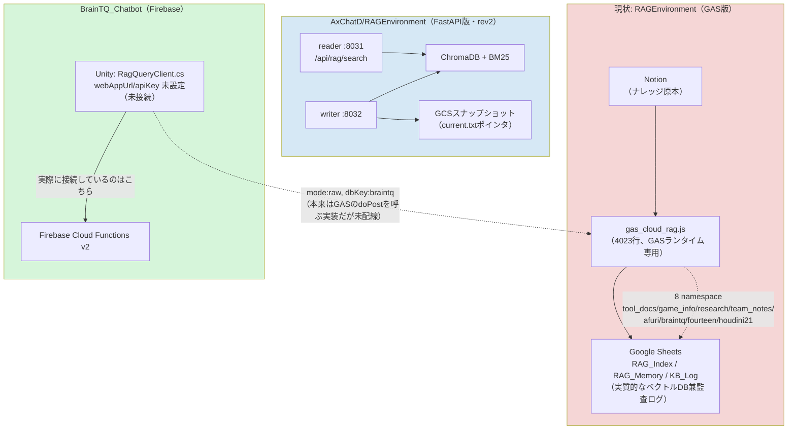

# RAG Environment → AxChatD 統合計画

**作成日:** 2026-08-27
**対象:**
- 統合元: `AXTechCare/RAGEnvironment`（本リポジトリ`DevelopmentRAGEnvironment`の公開用ミラー。Local RAG + GAS製Cloud RAGの2系統）
- 統合先: `AXTechCare/AxChatD`配下の`RAGEnvironment/`（`git subtree`で取り込まれた、別系統のFastAPI製RAG。reader/writer分離、Cloud Run稼働）
- 関連: `BrainTQ_Chatbot`（Firebase Cloud Functions v2 + Firestore + Anonymous Auth。Unity製の認知機能評価アプリ）

**前提として明確にしておくこと:** 「AxChatD側RAG Environment」という名前は同じだが、**現在の`RAGEnvironment`（GAS）とは全くの別実装**である。今回の「統合」は、GAS側にしかない機能・データを、AxChatD側の実装に**移植・再実装**する作業であり、単純なコードのマージではない。

---

## 目次

1. [現状整理](#1-現状整理)
2. [Firebase移行についての注記](#2-firebase移行についての注記)
3. [フェーズ①: BrainTQ先行リリースに必要なもの](#3-フェーズ1-braintq先行リリースに必要なもの)
4. [フェーズ②: Webアカウント登録管理システム完成後に対応するもの](#4-フェーズ2-webアカウント登録管理システム完成後に対応するもの)
5. [未確定事項（要確認）](#5-未確定事項要確認)

---

## 1. 現状整理

**分かっている重要な事実:**

| 事実 | 意味 |
|---|---|
| BrainTQのUnityクライアント（`RagQueryClient.cs`）は`webAppUrl`/`apiKey`が未設定で、GAS版RAGに一度も本番接続していない | 「稼働中のシステムを止めずに移行する」制約が無い。**GASを経由せず、最初からAxChatD側に直接接続する構成で実装してよい** |
| AxChatDの`RAGEnvironment`（FastAPI版）に、Notion同期・テナント（namespace）モデル・GASのHyDE重み付けロジックに相当するものは存在しない | 単なるデータ移行では済まず、機能そのものの再実装が必要 |
| 「Webアカウント登録管理システム」はAxChatD内に一切コードが存在しない | フェーズ②はゼロからの新規開発として計画する |
| AxChatD/RAGEnvironmentは現状Cloud Run + FastAPI + ChromaDBで、Firebase化されているのは Hosting のみ（認証も独自SQLite+`X-API-Key`） | 「Firebase環境」とは呼べるが、LiveChat/AnnomalyDetectionほど深くFirebaseネイティブではない |

## 2. Firebase移行についての注記

[Cloudflare-vs-Firebase比較資料](cloudflare-vs-firebase-comparison.md)は元々Cloudflare実装との比較として書いたものだが、AxChatD側が今後「Cloud Run + FastAPI + ChromaDB」から「Firebase Cloud Functions + Firestore」へ寄せていく前提であれば、比較資料で指摘した以下の制約がそのまま当てはまる。

| 比較資料での指摘 | AxChatD統合での意味 |
|---|---|
| Firestoreにはネイティブなフルテキスト検索機能が無い（[§3.1](cloudflare-vs-firebase-comparison.md#31-フルテキスト検索d1-fts5-vs-firestoreに検索機能が無い)） | 現行のChromaDB内蔵BM25をFirestoreに置き換える場合、Algolia/Typesense等の外部検索サービスが**別途必須**になる。BM25検索を捨ててベクトル検索のみにするか、外部サービスを追加契約するかの判断が要る |
| ベクトル検索はVertex AI Vector Searchが対応するが、インデックスのデプロイ・エンドポイント常時起動が必要で、アイドルコストも発生する（[§3.2](cloudflare-vs-firebase-comparison.md#32-ベクトル検索vectorize-vs-vertex-ai-vector-search)） | 現行のChromaDB（プロセス内蔵、追加インフラ不要）と比べてセットアップ・運用コストが増える。小規模なnamespace数（8個程度）であれば、Cloud Run + ChromaDBのまま据え置く選択肢も十分あり得る |
| Cloud FunctionsはGCPネイティブなためApplication Default Credentialsがそのまま使え、Google API認証が大幅に簡単になる（[§4.1](cloudflare-vs-firebase-comparison.md#41-google-api認証)） | Notion同期処理をFirebase Functionsに実装する場合、GASのようなランタイム制約が無くなり、サービスアカウントキーの発行・管理が不要になる利点がある |

**結論として提案したいこと:** 「AxChatD側RAGをFirebase化する」というゴールと「GAS版RAGの機能をAxChatD側へ移植する」というゴールは**分けて意思決定した方がよい**。後者（機能移植）は現行のCloud Run + FastAPI構成のままでも十分達成できる。Firestore化・Vertex AI化は、フルテキスト検索用の外部サービス契約という新たなコストを伴うため、フェーズ②以降（あるいはさらに先）で改めて是非を判断することを推奨する。以降の計画では、**フェーズ①はCloud Run + FastAPI構成を維持したまま機能移植する前提**で整理し、Firestore/Vertex AI化はフェーズ②の検討事項として扱う。

## 3. フェーズ①: BrainTQ先行リリースに必要なもの

BrainTQが実際に使うのは`braintq` namespaceのみ。フェーズ①のスコープは**「braintq namespaceの検索機能を、AxChatD側で動かし、BrainTQから直接呼べるようにする」**ことに限定する。

### 3-1. 現RAG EnvironmentからAxChatD側へ移す必要があるもの

| 項目 | 内容 | 備考 |
|---|---|---|
| braintqナレッジのデータ本体 | Google Sheets `RAG_Index`（braintq分の行）に入っている、埋め込み済みチャンク・原文・メタデータ | Sheetsから直接エクスポートし、AxChatD側のChromaDBへ再投入（埋め込みベクトルはモデルが変わるなら再生成が安全） |
| Notion同期設定 | braintq namespaceが参照しているNotionデータベースID一覧 | AxChatD側に同期処理を実装した後、この参照先をそのまま使う |
| `FACT_HEAVY_DOMAINS`のチューニング値 | GAS側で`braintq`が事実重視ドメインとして HyDE 重みを抑制する設定になっている | AxChatD側のクエリ拡張ロジックに同等のフラグとして移植（HyDE相当の処理自体が無ければ§3-2で新設） |
| `KB_Log`の運用知見 | 同期エラー時にどう気づいて対処していたか（手順としての知見。データそのものはAxChatD側の同期履歴に置き換わるため移す必要は無い） | ドキュメント化のみで十分 |

**移さなくてよいもの:** GASのコード自体（`gas_cloud_rag.js`）は移植の"参照実装"としてのみ使い、そのまま持ち込む対象ではない。他7つのnamespace（tool_docs等）のデータは、BrainTQが使わないためフェーズ①では対象外（フェーズ②以降で全体移行を検討）。

### 3-2. AxChatD側で追加・改修が必要なもの

| 項目 | 内容 | 優先度 |
|---|---|---|
| braintq namespace相当のコレクション作成 | AxChatD/RAGEnvironmentのChromaDBに`braintq`用のコレクションを新設し、テナント分離できるようにする（現状のFastAPI実装にnamespace/テナント概念が無いなら、最小限でも「コレクション名で分離」する形を追加） | 必須 |
| ナレッジ登録・更新API | Notion → AxChatD側の同期処理（writerサービス:8032に相当する経路）。既存のwriterにNotion取り込みエンドポイントを追加するのが最短 | 必須 |
| BrainTQ向け検索API | `RagQueryClient.cs`が呼んでいる`mode:"raw", dbKey:"braintq"`相当のリクエスト形式を、readerの`/api/rag/search`が受けられるようにアダプタ層を追加（Unity側の改修を最小化するため、AxChatD側でGAS互換のリクエスト/レスポンス形式を吸収するのが望ましい） | 必須 |
| 認証方式の決定 | AxChatD/RAGEnvironmentは現状`X-API-Key`（独自SQLite管理）。BrainTQ用に新規キーを発行する運用でよいか、Firebase Auth連携に寄せるかを決める | 必須（実装より先に方針決定） |
| HyDE/事実重視ドメイン相当のロジック | 現状のFastAPI実装にクエリ拡張（HyDE）が無い場合、braintqのような事実ベースの回答精度を保つため、最低限「HyDEを使わない・素のクエリでベクトル検索する」フラグだけでも用意する | 推奨（無くても動くが精度に影響） |

### 3-3. BrainTQ側で変更が必要なもの

| 項目 | 内容 |
|---|---|
| `RagQueryClient.cs`の接続先設定 | `webAppUrl`をAxChatD側のreaderエンドポイントURLに、`apiKey`を新規発行するAPIキーに設定する。**GASへの接続を一度も本番稼働させていないため、GAS経由の設定をそのまま置き換えるだけで済み、移行に伴う切り戻しリスクが無い** |
| リクエスト形式の調整 | AxChatD側でGAS互換アダプタを用意しない場合、`mode:"raw"`形式のペイロードをAxChatD側の`/api/rag/search`が期待する形式に変換するコードをUnity側に追加する必要がある（§3-2の実装方針次第で要否が変わる） |
| エラーハンドリング | GAS版で発生していた「サブリクエスト数上限」のようなCloud Run特有の制約は無いが、Cloud Runのコールドスタート・タイムアウトを想定したリトライ処理は必要 |

### 3-4. リリース前に確認・テストしておくべきもの

| 項目 | 内容 |
|---|---|
| 回答精度の比較 | 同じ質問セットをGAS版（`braintq`）とAxChatD版の両方に投げ、回答内容・出典引用の妥当性を比較する。特にHyDE無効化ロジックの移植漏れがあると、事実ベースの質問で回答がぶれる可能性がある |
| 認知機能評価スケール（MMSE/TIPI-J/HHIE-S/ReaCT-Kyoto）関連の質問への応答 | BrainTQの利用シーン特有の質問パターンで、期待通りの参考情報が返るか個別に確認 |
| namespace分離の検証 | braintq以外のnamespace（存在すれば）のデータが誤って混入していないか |
| 負荷・レイテンシ | Cloud Runのコールドスタートを含めた応答時間が、Unityクライアント側のタイムアウト設定内に収まるか |
| APIキー・認証の疎通 | 発行したAPIキーでの認証が正しく機能し、キー漏洩時に無効化できる運用（失効フロー）が用意されているか |
| ロールバック手順 | 万一AxChatD側で問題が出た場合、BrainTQ側の設定をどう戻すか（未接続状態に戻すだけなので影響は小さいが、手順として明文化しておく） |

---

## 4. フェーズ②: Webアカウント登録管理システム完成後に対応するもの

「Webアカウント登録管理システム」自体がまだ存在しないため、このフェーズは**その完成を前提条件とする、より広いスコープの統合**になる。

### 4-1. 現RAG EnvironmentからAxChatD側へ移す必要があるもの

| 項目 | 内容 |
|---|---|
| 残り7namespace分のナレッジデータ | `tool_docs, game_info, research, team_notes, afuri, fourteen, houdini21`（本リポジトリで実際に運用中のnamespace群） |
| Notion同期対象データベースIDの全リスト | namespaceごとの対応関係を含む設定情報 |
| ユーザー・テナントの権限モデル | GAS版では明示的な「ユーザーアカウント」の概念が薄く、namespace単位のアクセス管理が中心。Webアカウント登録管理システムが持つユーザー単位の権限と、namespace単位のアクセス制御をどう対応付けるか設計が必要 |
| 利用状況・監査ログの参照実装 | `KB_Log`が担っていた「いつ・何が同期されたか」の記録方式を、AxChatD側の同期履歴機能に引き継ぐ |

### 4-2. AxChatD側で追加・改修が必要なもの

| 項目 | 内容 |
|---|---|
| 全namespace対応のマルチテナント機能 | フェーズ①でbraintq専用に作った最小限のコレクション分離を、任意のnamespaceを追加登録できる汎用的な仕組みに拡張 |
| Webアカウント登録管理システムとの連携 | ユーザー登録・ログイン後に、そのユーザーがアクセスできるnamespaceを紐付けるアクセス制御層（[運用手順書§3](cloudflare-rag-technical-report.md)のAPIキー×namespace許可リストの考え方が参考になる） |
| ナレッジ管理UI | 現在GAS版の管理シート相当の操作（同期実行・ロールバック・namespace管理）を、AxChatD側の管理画面として用意 |
| Firestore/Vertex AI化の要否判断（[§2](#2-firebase移行についての注記)参照） | 8namespace全体の規模感を踏まえ、ChromaDB継続かFirestore+Vertex AI移行かをこの段階で確定させる |
| BrainTQ以外のフロントエンド（LiveChatなど）からの利用経路 | AxChatD内の他サブシステム（LiveChat/AnnomalyDetection）がRAGを使う要件があるなら、共通の内部APIとして設計し直す |

### 4-3. BrainTQ側で変更が必要なもの

| 項目 | 内容 |
|---|---|
| Webアカウント連携 | BrainTQ利用者がWebアカウント登録管理システム経由で認証する場合、`RagQueryClient.cs`の認証方式をAPIキー固定からユーザートークンベースに変更する必要がある可能性 |
| namespace切り替え | braintq専用固定ではなく、必要に応じて複数namespaceを横断検索する要件が出てくればクライアント側のリクエストパラメータ拡張が必要 |

### 4-4. リリース前に確認・テストしておくべきもの

| 項目 | 内容 |
|---|---|
| 全namespace分の回答精度の一括比較 | GAS版と新環境で、各namespace代表質問セットに対する回答・引用元を突き合わせる（[運用手順書§4.3の出典引用率](cloudflare-rag-operations-manual.md#43-出典引用率の確認)の考え方を流用可能） |
| マルチテナントのアクセス制御の抜け漏れ | あるユーザーが権限外のnamespaceのデータを検索結果として受け取ってしまわないか |
| Webアカウント登録管理システムとの結合テスト | アカウント作成〜RAG利用までの一連の導線が問題なく通るか |
| コスト試算 | Firestore/Vertex AI化した場合の運用コストが、想定利用規模に対して許容範囲か（[§5コスト構造の違い](cloudflare-vs-firebase-comparison.md#5-コスト構造の違い)参照） |
| GAS版の廃止判断 | 全namespace移行が完了し、新環境での運用が安定した時点で、GAS版（Notion同期・Sheets運用）を廃止するかどうかの最終確認 |

---

## 5. 未確定事項（要確認）

この計画は、これまでの調査で判明した事実をもとに立てたものだが、以下は実際に着手する前にユーザー側での確認・意思決定が必要な項目:

1. **AxChatD/RAGEnvironmentの認証方式**を`X-API-Key`のまま使うか、Firebase Auth（LiveChat/AnnomalyDetectionと揃える）に寄せるか。フェーズ①のBrainTQ接続方式に直接影響する。
2. **Firestore/Vertex AI化を本当に目指すのか**、それともCloud Run + ChromaDBの構成を維持しつつ機能だけ拡張するのか（[§2](#2-firebase移行についての注記)の判断）。
3. **「Webアカウント登録管理システム」の要件・着手時期**が具体的にまだ無いため、フェーズ②の開始時期は未定のまま。要件が固まり次第、このドキュメントの4章を詳細化する。
4. 8namespaceのうち、braintq以外（tool_docs等）は本リポジトリ（`DevelopmentRAGEnvironment`/`cloudflare-rag-poc`）側で既にCloudflare実装への移行が進行中のものと**重複していないか**。もし同じナレッジをCloudflare側とAxChatD側の両方で二重運用することになるなら、どちらを正とするか整理が必要。

---

*関連ドキュメント: [docs/cloudflare-vs-firebase-comparison.md](cloudflare-vs-firebase-comparison.md) / [docs/cloudflare-rag-operations-manual.md](cloudflare-rag-operations-manual.md) / [docs/gas-feature-parity.md](gas-feature-parity.md)*
