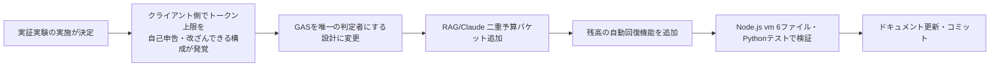
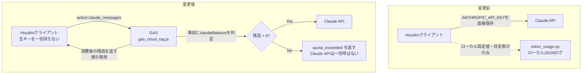
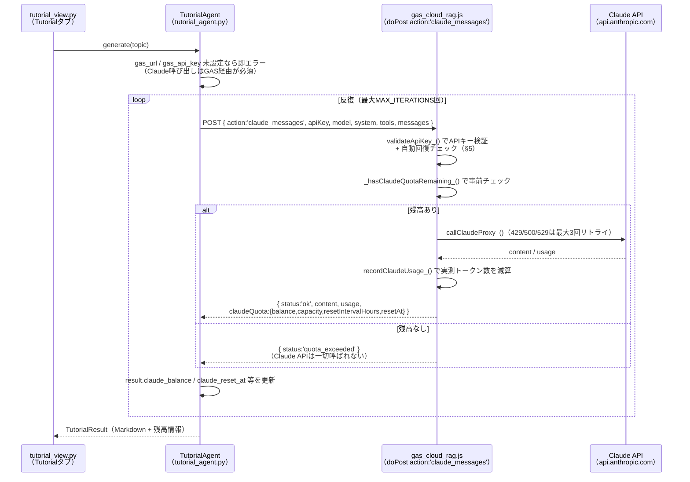
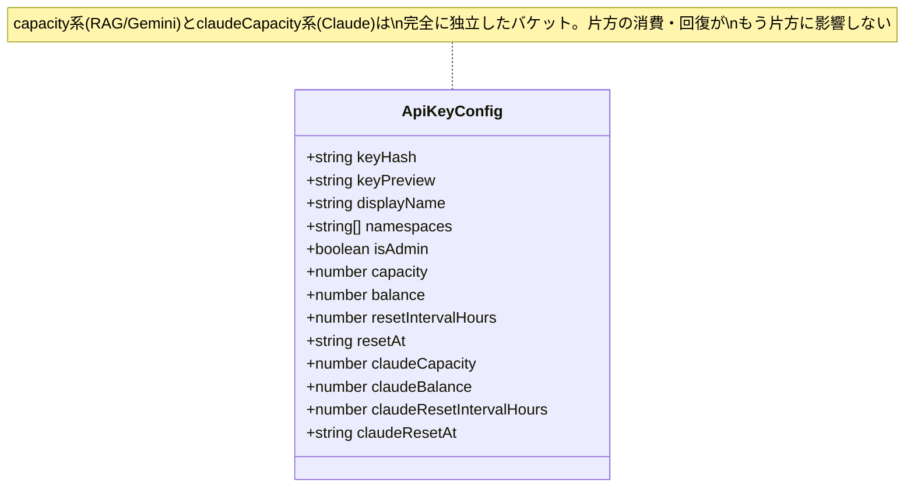
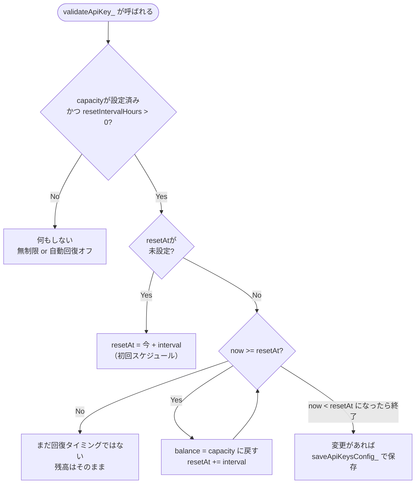
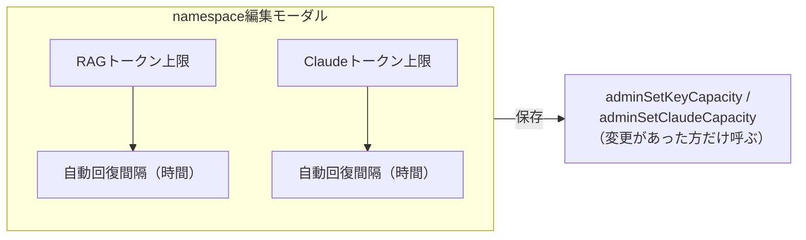
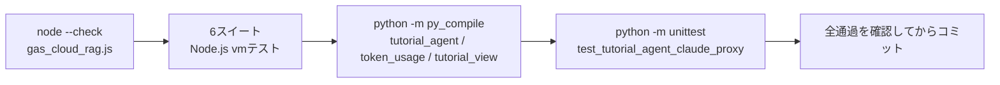

# Claude API トークンセキュリティ強化 — GAS二重予算制・自動回復レポート

**作成日:** 2026-07-25
**対象機能:** houdini21チュートリアル自動生成（[tutorial_agent.py](../houdini/python_panels/tutorial_agent.py)）が使うClaude API呼び出し全体
**位置づけ:** 技術資料。実証実験（外部・非技術者を含む対象者）を控え、Claude APIの不正使用・大量使用をクライアント側で迂回できない構成に作り替えた設計・実装・テストの記録。

---

## 目次

1. [概要](#1-概要)
2. [背景にあった問題](#2-背景にあった問題)
3. [アーキテクチャ全体像](#3-アーキテクチャ全体像)
4. [二重トークン予算（RAG／Claude独立バケット）](#4-二重トークン予算ragclaude独立バケット)
5. [自動回復（resetIntervalHours / resetAt）](#5-自動回復resetintervalhours--resetat)
6. [管理画面UI](#6-管理画面ui)
7. [Houdini側の表示](#7-houdini側の表示)
8. [テスト](#8-テスト)
9. [変更ファイル一覧](#9-変更ファイル一覧)
10. [運用上の注意・今後の改善事項](#10-運用上の注意今後の改善事項)

---

## 1. 概要

houdini21チュートリアル自動生成のClaude API呼び出しを、**必ずGAS（`gas_cloud_rag.js`）経由**にする構成へ移行した。これにより、クライアント（Houdini）は生の`ANTHROPIC_API_KEY`を一切保持せず、APIキーごとのトークン利用上限は常にGAS側が唯一の正として強制する。加えて、RAG（Gemini）用とは独立したClaude専用の予算バケットを追加し、管理画面から上限設定・チャージ・**自動回復間隔の設定**ができるようにした。



---

## 2. 背景にあった問題

以前はHoudiniクライアントが`ANTHROPIC_API_KEY`をOS環境変数として直接保持し、Claude APIを直接呼んでいた。トークン消費の「予算」は`token_usage.py`側のローカル数値・ログでしか管理されておらず、これは単なる目安表示に過ぎなかった。つまり：

- ユーザーがローカル設定やログファイルを書き換えれば、実質無制限に使える
- 上限は「サーバー側で強制」されておらず、クライアントの自己申告に依存していた
- 実証実験の対象者には非技術者も含まれるため、悪意がなくても誤操作で大量消費するリスクがあった



---

## 3. アーキテクチャ全体像



ポイントは、**GASのAPIキー検証（`validateApiKey_`）が全リクエストの唯一の関所**になっていること。ここを通らない限りAnthropicへのリクエストは発生しないため、クライアント側でどのようにHoudiniの設定・ログファイルを書き換えても上限を迂回できない。

---

## 4. 二重トークン予算（RAG／Claude独立バケット）

`API_KEYS_CONFIG`（スクリプトプロパティ、JSON配列）に、既存のRAG（Gemini）用フィールドと構造的に対称なClaude専用フィールドを追加した。

| バケット | 上限 | 残高 | 回復間隔 | 次回回復予定 |
|---|---|---|---|---|
| RAG（Gemini） | `capacity` | `balance` | `resetIntervalHours` | `resetAt` |
| Claude | `claudeCapacity` | `claudeBalance` | `claudeResetIntervalHours` | `claudeResetAt` |

- 2つのバケットは**完全に独立**して消費・チャージ・上限設定ができる（RAG検索を大量に使ってもClaudeの残高は減らない、逆も同様）
- `capacity`/`claudeCapacity`が`null`のキーは「無制限」として扱われ、消費もチェックもスキップされる
- 管理画面「🔑 APIキー管理」タブでは、キーごとに2つの円ゲージ（RAG用・Claude用）を独立して表示・編集できる



---

## 5. 自動回復（resetIntervalHours / resetAt）

管理者が上限を設定する際、任意で「自動回復間隔（時間）」を指定できる。指定すると、その時間ごとに残高が上限まで自動で満タンに回復する。空欄のままなら自動回復オフ（手動チャージのみ、`adminChargeKeyBalance`/`adminChargeClaudeBalance`）。

### 5.1 実装方式：時間トリガーではなくプル型

GASの時間主導トリガー（`ScriptApp.newTrigger`等）は使っていない。かわりに、全リクエストが通る唯一の関所である`validateApiKey_()`が、呼ばれるたびに「このキーの`resetAt`はもう過ぎているか？」をチェックし、過ぎていればその場で残高を戻す（`_applyScheduledReset_`）。



`Loop`のループ構造がポイントで、**複数回分のインターバルを取りこぼしていても（=長時間誰も呼ばなかった場合）**、過ぎている分だけ`resetAt`を進めながら残高を満タンにし続け、最終的に必ず「未来の時刻」に`resetAt`を再設定してから終了する（1回だけ進めて未来に届かない、という取りこぼしが起きない）。

### 5.2 遅延特性（重要な運用上の注意）

プル型のため、**誰も呼ばないキーはresetAtを過ぎても実際には残高が回復しない**。次にそのキーが使われた瞬間（Claude呼び出し、または管理画面のキー一覧表示）にまとめて反映される。GASの定期実行トリガー枠（実行時間・実行回数のクオータ）を消費しない代わりに、この特性がある。管理画面のキー一覧（`adminListKeys()`）も表示時に同じ回復処理を通すため、実運用では「管理画面を開けば最新残高が見える」ため実害は小さい。

### 5.3 レスポンス・表示への反映

`claude_messages`のレスポンス、`adminListKeys()`の返り値の両方に、消費後の残高と回復タイミングを含めて返す。

```json
{
  "status": "ok",
  "content": [...],
  "usage": {"input_tokens": 1000, "output_tokens": 500},
  "claudeQuota": {
    "balance": 8500,
    "capacity": 10000,
    "resetIntervalHours": 24,
    "resetAt": "2026-07-26T00:00:00.000Z"
  }
}
```

---

## 6. 管理画面UI

「🔑 APIキー管理」タブのキー編集モーダルに、RAG用・Claude用それぞれの上限入力欄と「自動回復間隔（時間）」入力欄を追加した。空欄なら自動回復オフ。



キー一覧テーブルのミニ円ゲージ（`conic-gradient`のCSSで描画、残量15%以下で赤に変化）の下に、`renderResetInfo_()`が「次回回復: 2026-07-26 09:00（24時間毎）」または「自動回復なし（手動チャージ）」を小さく表示する。

---

## 7. Houdini側の表示

`token_usage.py`のパネルは、**GASが返した実際の残高をそのまま表示するだけ**で、上限の判定には一切使わない（判定は毎回GAS側で行う）。表示ロジックは3パターン：

| 状態 | 表示例 |
|---|---|
| 無制限キー | 「無制限」 |
| 上限あり・残量十分 | 「8,500 / 10,000」＋「次回自動回復: 2026-07-26 09:00（24時間毎）」 |
| 上限あり・自動回復オフ | 「8,500 / 10,000」＋「自動回復は設定されていません（管理者にチャージを依頼してください）」 |

直近の値は`logs/houdini_claude_quota_cache.json`にキャッシュし、Houdini再起動直後もパネルが空にならないようにするだけで、許可/拒否の判定には使わない。

以前のクライアント側で編集可能だった「トークン予算」数値フィールド（Settingsタブ）は削除済み。上限調整は管理画面（GAS Admin UI）が唯一の変更経路になっている。

---

## 8. テスト

Node.js `vm`モジュールでGAS環境（`PropertiesService`/`CacheService`/`SpreadsheetApp`/`UrlFetchApp`等）をモックし、`gas_cloud_rag.js`を関数単位でテストする既存の6ファイル構成に、今回の変更に対応するアサーションを追加・拡張した。

| ファイル | 対象 |
|---|---|
| `test_gas_apikey.js` | APIキーのハッシュ化・レート制限 |
| `test_gas_token_usage.js` | RAGトークン使用量・予算ライフサイクル |
| `test_gas_namespace_mgmt.js` | namespace CRUD |
| `test_gas_hybrid_health.js` | ハイブリッド検索・ヘルスアラート |
| `test_gas_rollback_version.js` | ロールバック・versionエンドポイント |
| `test_gas_claude_proxy.js` | **Claudeプロキシ・二重予算・自動回復（今回拡張）** |

`test_gas_claude_proxy.js`に追加した自動回復のケース：

- 初回の`adminSetClaudeCapacity(..., 1)`（1時間間隔）で`resetAt`が即座にスケジュールされる
- `resetAt`を過去に書き換えてから`validateApiKey_`を呼ぶと、残高が満タンに戻り`resetAt`が未来に進む
- `resetAt`が未来のままなら、残高は回復しない（早すぎる回復が起きない）
- 5.5時間分（複数インターバル）取りこぼした状態から呼んでも、1回のチェックでキャッチアップして満タン＋`resetAt`が未来に更新される
- 無制限キー（`claudeCapacity=null`）は回復ロジックの影響を受けない
- `adminListKeys()`単体を呼ぶだけでも回復が反映される（キーが実際に使われるのを待たなくてよい）

Python側（`tutorial_agent.py`のユニットテスト）にも、`claudeQuota`に`resetIntervalHours`/`resetAt`が含まれる場合／含まれない場合の両方で`TutorialResult`に正しく伝播することを確認するテストを追加した。



---

## 9. 変更ファイル一覧

| ファイル | 変更内容 |
|---|---|
| [scripts/gas_cloud_rag.js](../scripts/gas_cloud_rag.js) | Claudeプロキシ（`callClaudeProxy_`）・二重予算バケット・自動回復（`_applyScheduledReset_`/`_applyScheduledResets_`）・管理画面UI（ゲージ・編集モーダル・回復タイミング表示） |
| [houdini/python_panels/tutorial_agent.py](../houdini/python_panels/tutorial_agent.py) | Claude呼び出しをGAS経由に変更、`claude_balance`/`claude_capacity`/`claude_reset_interval_hours`/`claude_reset_at`を`TutorialResult`に追加、`COST_LIMIT_USD`を$0.50→$5.00に緩和（フェイルセーフ位置づけを明記） |
| [houdini/python_panels/token_usage.py](../houdini/python_panels/token_usage.py) | サーバー残高＋回復タイミングの表示・キャッシュロジック |
| [houdini/python_panels/tutorial_view.py](../houdini/python_panels/tutorial_view.py) | 生成完了時に回復タイミング情報もキャッシュへ保存 |
| [houdini/python_panels/rag_chatbot.py](../houdini/python_panels/rag_chatbot.py) | クライアント側の「トークン予算」編集フィールドを削除 |
| [docs/cloud-rag.md](cloud-rag.md) §8.14 | アーキテクチャ・自動回復方式の技術資料としての記述 |
| [docs/content-generation.md](content-generation.md) | モデル参照・コスト上限の記述更新 |
| [README.md](../README.md) | Settingsタブの必須設定手順の更新 |

---

## 10. 運用上の注意・今後の改善事項

| # | 項目 | 内容 |
|---|---|---|
| 1 | `COST_LIMIT_USD`の位置づけ変更 | $0.50→$5.00に緩和。これはネットワーク断・GAS未応答等の異常時に暴走を防ぐためのローカル側フェイルセーフに過ぎず、**実際の利用上限は常にGAS側の`claudeCapacity`が唯一の正**。実証実験の参加者ごとに`adminSetClaudeCapacity()`で妥当な上限を設定すること |
| 2 | 自動回復の遅延特性 | プル型のため、長期間使われないキーは`resetAt`を過ぎても即座には回復しない。管理画面を開けばその場で反映される（§5.2） |
| 3 | 上限変更時の残高リセット | `adminSetKeyCapacity`/`adminSetClaudeCapacity`は、上限そのものを変更していなくても呼ぶと残高が満タンにリセットされる仕様（既存挙動を維持）。回復間隔だけを変更したい場合も同様に残高が満タンになる点に注意 |
| 4 | 参加者ごとのキー発行 | 実証実験では参加者ごとに個別のAPIキーを発行し、RAG・Claude両方の上限・回復間隔を個別に設定することを推奨する |

---

*関連ドキュメント: [docs/cloud-rag.md](cloud-rag.md) §8.14 / [docs/content-generation.md](content-generation.md)*
