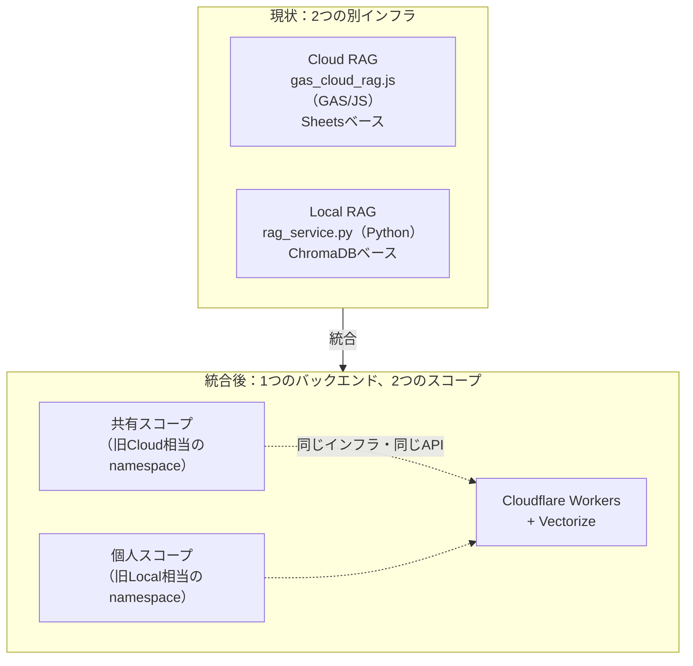
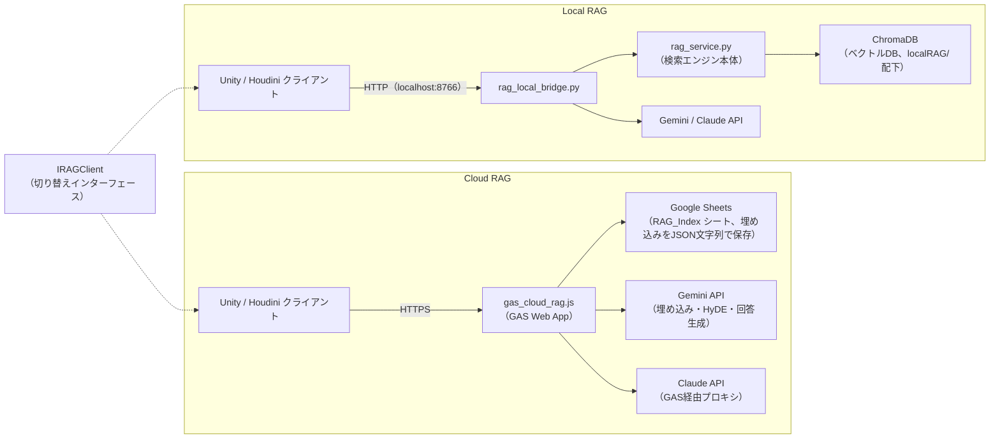
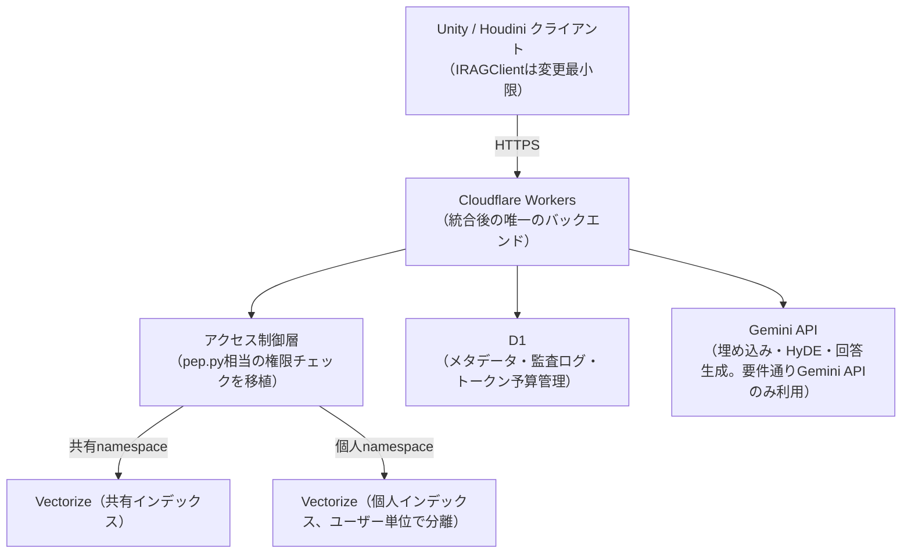
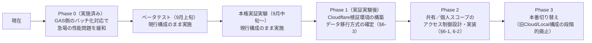

# Cloud/Local RAG 統合方針 — 現状整理と移行設計

**作成日:** 2026-08-22
**対象:** [scripts/gas_cloud_rag.js](../scripts/gas_cloud_rag.js)（Cloud RAG）/ [scripts/rag_local_bridge.py](../scripts/rag_local_bridge.py)・[scripts/rag_service.py](../scripts/rag_service.py)（Local RAG）
**位置づけ:** 技術資料。現状のCloud/Local 2層構成の本来の設計理由を整理した上で、「最終的にバックエンドは1つに統合しつつ、参照範囲（見るもの）の区分けは維持する」という新方針の実現案をまとめる。ホスティング先の候補（[docs/model-strategy-report.md](model-strategy-report.md)で検討済み）としてはCloudflareを想定。

---

## 目次

1. [結論（先に）](#1-結論先に)
2. [現状：なぜCloud/Localの2層構成なのか](#2-現状なぜcloudlocalの2層構成なのか)
3. [現状の技術構成](#3-現状の技術構成)
4. [新方針：バックエンドは統合し、区分けはデータ側で維持する](#4-新方針バックエンドは統合し区分けはデータ側で維持する)
5. [統合後のアーキテクチャ案（Cloudflare想定）](#5-統合後のアーキテクチャ案cloudflare想定)
6. [移行時に決めるべき論点と推奨案](#6-移行時に決めるべき論点と推奨案)
7. [段階移行プラン](#7-段階移行プラン)
8. [技術設計の詳細（Cloudflare側・設計のみ）](#8-技術設計の詳細cloudflare側設計のみ実装は実証実験後)

---

## 1. 結論（先に）

- Cloud/Local分離の本来の理由は「オンライン/オフライン」ではなく、**「チームに公開してよい情報」と「個人情報」の物理的な分離**（README §設計思想）
- この区分け自体は今後も維持すべき設計判断であり、変えるべきは**「2つの別々のコードベース・別々のインフラで実装している」という技術的な二重管理**の方
- 統合後は、**1つのバックエンド（Cloudflare想定）の中に「共有スコープ」と「個人スコープ」という2つの論理的な区分けを持たせる**形にすることで、「最終的に1つにし、それぞれで見るものが違う」というご要望をそのまま実現できる
- 既存の`IRAGClient`抽象化（Unity/Houdini側の切り替え口）はこの移行と相性が良く、クライアント側の変更を最小限にできる見込み



---

## 2. 現状：なぜCloud/Localの2層構成なのか

README（設計思想）に明記されている本来の理由は以下の通り：

> すべての情報を1か所に集めると、個人のチャット履歴や未公開メモがチームメンバーに見えてしまう。逆に、チームで共有すべきツール仕様や設計書をローカルだけに置くと、他のメンバーが参照できない。

| 区分 | 内容 | 現状の置き場所 |
|---|---|---|
| **クラウドに入れるもの**（チームで共有する情報） | Unity/Houdini/DirectX12等のツール仕様、ゲーム設計書・共有ドキュメント、精査済み技術記事、ゼミ資料・議事録 | `gas_cloud_rag.js`（Notion/Drive → Sheetsに集約） |
| **ローカルに入れるもの**（個人情報・外に出せない情報） | AIとのチャット履歴、Houdiniチュートリアルの生成結果、個人のObsidianノート・進捗メモ、共有できない草稿 | `rag_service.py`（ChromaDB、`localRAG/`配下） |

つまりこの分離は**アクセス制御・情報公開範囲の設計**であり、接続方式（オンライン/オフライン）の都合ではない。この前提は統合後も変わらず重要——「個人のチャット履歴が誤ってチーム共有スコープに紛れ込む」ことは、統合後も絶対に避けなければならない。

---

## 3. 現状の技術構成



**問題点（性能・保守性の限界）**：

| 項目 | 内容 |
|---|---|
| ベクトル検索の実装が2つ存在 | Cloud側はSheetsのセルに埋め込みをJSON文字列で保存し、毎回全行を読み出して総当たりでコサイン類似度計算（`loadIndexFromSheet_`）。Local側はChromaDBという専用ベクトルDBを使用。同じ「ベクトル検索」という機能を、性能もアーキテクチャも異なる2通りの方法で実装・保守している |
| コードベースが言語ごと・実装ごとに分岐 | Cloud側はGAS(JS)、Local側はPython。HyDE・ハイブリッド検索（BM25+RRF）等のロジックも独立して実装されており、片方に機能追加すると、もう片方にも手動で移植しない限り機能差が生まれる |
| Cloud側のスケール限界 | Sheetsはドキュメント量が増えるほど「毎回全行スキャン」のコストが線形に増加する。GASの実行時間上限（6分）とも相まって、大規模化に弱い |

---

## 4. 新方針：バックエンドは統合し、区分けはデータ側で維持する

「最終的には1個にし、それぞれで見るものが違うという形で分けておきたい」というご要望は、**インフラ（実行環境・コードベース）を1つに統合し、アクセス境界（誰が何を見られるか）はデータの区分けとして残す**、という設計で実現できる。

これは実は、既存のnamespace設計（`tool_docs`/`game_info`/`research`/`team_notes`等の共有namespaceと、`localRAG/`配下の個人namespace）の考え方をそのまま踏襲できる。**「Cloud」「Local」という2つの実行環境の違いを、「共有namespace」「個人namespace」という1つの実行環境内でのデータ区分けに変換する**、という整理になる。

| 現状 | 統合後 |
|---|---|
| Cloud＝別インフラ（GAS）＋共有情報 | 共有スコープ＝同じインフラ内の共有namespace群 |
| Local＝別インフラ（Python/ChromaDB）＋個人情報 | 個人スコープ＝同じインフラ内の個人namespace群（アクセス制御で分離） |

アクセス制御は、既存の`pep.py`（ロールごとのnamespace権限制御）の考え方を、統合後のバックエンド側にそのまま移植すればよい。

---

## 5. 統合後のアーキテクチャ案（Cloudflare想定）



- **ベクトル検索は`Vectorize`に一本化**。Sheetsでの力技実装、ChromaDBでの別実装という二重管理を解消し、性能面のボトルネックだった「毎回全行総当たり」から専用ANN検索に切り替わる
- **共有／個人の区分けは、Vectorizeのインデックスを分ける（またはメタデータフィルタで論理分離する）ことで実現**。物理的に分けるか論理的に分けるかは§6で検討
- **RAGに必要なのはGemini APIのみ**という要件を踏まえ、Claude API連携（チュートリアル生成等）・Notion/Drive同期・Google純正サービス連携（Calendar/Gmail/Maps）は、この統合の対象外とする（維持する場合は別途検討）
- D1（軽量SQLite）でメタデータ・監査ログ・トークン予算管理を担う。現状の「Sheetsを疑似DBとして使う」実装から、本来のDB相当のものに置き換わる

---

## 6. 移行時に決めるべき論点と推奨案

以下は実装前にすり合わせが必要な論点。**現時点での推奨案**を併記する（推奨案はあくまで設計上の一次案であり、実装着手前にユーザー本人の最終確認を要する）。

| # | 論点 | 検討の観点 | 推奨案 |
|---|---|---|---|
| 1 | 共有／個人の分離は物理分離（別インデックス）か論理分離（同一インデックス+アクセス制御）か | 物理分離の方が「個人情報が絶対に共有スコープへ漏れない」という保証を作りやすい。論理分離は運用がシンプルだが、アクセス制御のバグが即座に情報漏洩に直結するリスクがある | **物理分離を推奨**。Vectorizeインデックスを「共有用」1つ＋「個人用」ユーザーごとに1つ、の構成にする。個人情報が誤って共有インデックスに書き込まれる経路自体をコードレベルで作らないようにする（アクセス制御のロジックミス1つで漏洩する論理分離より安全） |
| 2 | 個人スコープのユーザー単位分離をどう設計するか | 現状のLocal RAGは「ローカルマシン上で完結」しているため実質1ユーザー。統合後にクラウド上へ個人データを置く場合、ユーザーごとの認証・アクセス制御の設計が新たに必要になる | 既存のAPIキー単位トークン予算管理の仕組み（GAS側で実装済み）を流用し、**APIキー＝ユーザーIDとして扱う**。D1の`users`テーブルにAPIキーのハッシュを保存し、Vectorizeの個人用インデックス名またはメタデータの`owner_user_id`をAPIキーのハッシュ値に紐付ける |
| 3 | 既存データ（Sheetsの埋め込み・ChromaDBのベクトル）の移行方法 | 再埋め込み（Gemini APIで再計算）か、既存ベクトルをそのまま移すか。埋め込みモデルが同一であれば移送で済むが、精度検証は必要 | **全件Gemini APIで再埋め込みを推奨**。現状Cloud RAGはGemini embedding、Local RAGはmultilingual-e5-large（次元数が異なる）を使っており、Vectorizeは単一インデックス内で埋め込み次元を統一する必要があるため、両者を混在させることはできない。「RAGはGemini APIのみで良い」という要件とも整合するため、この機会にGemini embeddingへ一本化する。件数（houdini21DBの約7,810ファイル相当）を踏まえ、再埋め込みのAPIコストとバッチ処理時間を移行実施前に見積もる |
| 4 | Claude API連携・Notion/Drive同期・Google純正サービス連携の扱い | 今回の統合スコープ外とするなら、いつ・どのように整理するかを別途決める（当面併存させるなら現状のGASを残す判断もあり得る） | **今回の統合スコープからは完全に除外**。チュートリアル生成（Claude API）・Notion/Drive同期・Calendar/Gmail/Maps連携は、既存のGAS（`gas_cloud_rag.js`のうち当該機能）をそのまま残し、RAG検索機能のみをCloudflareへ切り出す。混ぜて移行すると影響範囲が読めなくなるため |
| 5 | ITリテラシーが高くないユーザーへの影響 | 統合作業自体はバックエンドの話なので、UI（Unity/Houdiniパネル）側の見た目は変えない方針で進めるべき。実証実験（9月〜）に影響を出さないためのスケジュール調整が必要（§7参照） | `IRAGClient`インターフェースと既存の`:8766`相当のHTTP契約（`/search`・`/query`のリクエスト/レスポンス形式）を**完全互換のまま**新バックエンドでも提供する。UI側の変更ゼロで切り替えられることを移行完了の条件とし、問題発生時は旧構成へ即時ロールバックできるようDNS/エンドポイント切り替え方式で導入する |

---

## 7. 段階移行プラン

実証実験（ベータ9月上旬・本格実証9月中旬〜）のスケジュールを踏まえ、**実証実験期間中は現行のCloud/Local構成を維持し、統合作業と並行させない**ことを推奨する。



実証実験期間中にバックエンドを差し替えると、ITリテラシーが高くないユーザーが不具合の切り分けに巻き込まれるリスクが大きい。**統合は実証実験が一区切りついてから着手する**のが安全と考える。

---

## 8. 技術設計の詳細（Cloudflare側・設計のみ、実装は実証実験後）

実装着手前の設計メモ。すべて「案」であり、Phase 1着手時に見直す前提。

### 8.1 D1スキーマ案

```sql
-- ユーザー（APIキー単位。既存のGAS側トークン予算管理と対応させる）
CREATE TABLE users (
    user_id TEXT PRIMARY KEY,       -- APIキーのSHA-256ハッシュ
    display_name TEXT,
    role TEXT NOT NULL,             -- 'admin' | 'member' | 'guest' 等、既存pep.py準拠
    created_at INTEGER NOT NULL
);

-- namespace定義（共有／個人の両方をここで管理）
CREATE TABLE namespaces (
    namespace_id TEXT PRIMARY KEY,  -- 例: 'shared:tool_docs', 'personal:<user_id>'
    scope TEXT NOT NULL,            -- 'shared' | 'personal'
    owner_user_id TEXT,             -- scope='personal'の場合のみ設定（usersへのFK）
    vectorize_index TEXT NOT NULL   -- 対応するVectorizeインデックス名
);

-- トークン予算（既存GAS実装の二重管理をD1に一本化）
CREATE TABLE token_budgets (
    user_id TEXT NOT NULL,
    budget_type TEXT NOT NULL,      -- 'rag' | 'claude'
    limit_tokens INTEGER NOT NULL,
    used_tokens INTEGER NOT NULL DEFAULT 0,
    reset_at INTEGER,
    PRIMARY KEY (user_id, budget_type)
);

-- 監査ログ（既存RAGAuditLoggerのJSONL出力をD1テーブルへ）
CREATE TABLE audit_log (
    id INTEGER PRIMARY KEY AUTOINCREMENT,
    user_id TEXT NOT NULL,
    namespace_id TEXT NOT NULL,
    query_hash TEXT NOT NULL,       -- SHA-256、既存仕様を踏襲
    difficulty TEXT,                -- basic|applied|advanced（Phase1レベリング機能との連携）
    created_at INTEGER NOT NULL
);
```

### 8.2 Vectorizeインデックス設計案

- `shared-index`：共有スコープの全namespace分を1インデックスに集約し、メタデータ`namespace_id`でフィルタして検索範囲を絞る（共有情報同士は同一ユーザー種別が見るため、物理分離までは不要と判断）
- `personal-<user_id-hash>`：個人スコープはユーザーごとに独立したインデックスを作成（§6-1の物理分離方針）。ユーザー数が少ない現段階（開発チーム＋実証実験参加者程度）ではインデックス数の増加は運用上問題にならない
- メタデータには既存の`difficulty`（basic/applied/advanced）・`cited`相当のフィールドをそのまま引き継ぎ、既存の`/search`レスポンス契約を壊さない

### 8.3 Workers API契約案（既存契約と後方互換）

```jsonc
// POST /search — 既存のrag_local_bridge.py契約と同一形式を維持
{ "query": "スキャッター基礎", "limit": 6, "namespaces": ["houdini21"], "level": "basic" }

// レスポンス（既存フィールド・型を変更しない）
{ "texts": ["..."], "sources": [{ "file": "...", "difficulty": "basic", "cited": true }], "status": "ok" }
```

Workers側は「認証（APIキー→user_id解決）→ アクセス制御（要求されたnamespaceがuser_idからアクセス可能か検証）→ Vectorize検索 → D1に監査ログ記録」という順で処理する。この順序自体が§6-1の物理分離方針を実装レベルで担保する（アクセス制御を通過しない限り、そもそも個人用Vectorizeインデックスに到達できない）。

### 8.4 コスト概算（設計判断の参考、実測ではない）

Cloudflare Workers・Vectorize・D1はいずれも無料枠＋従量課金。開発チーム＋実証実験参加者規模（数十人・月間クエリ数千件オーダー）であれば、無料枠内〜数百円/月程度に収まる見込み。現行のGAS運用（実質無料）からの増分コストは小さいと想定されるが、実証実験後の移行判断時にVectorizeのクエリ数・保存ベクトル数の実測値で再見積もりする。

### 8.5 検証環境（`cloudflare-rag-poc/`）で実際に判明した点

上記の設計をそのまま実装し、Cloudflareへ実際にデプロイして`/ingest`→`/search`が通ることまで動作確認した（2026-08-23）。その過程で以下が判明し、設計を一部修正した：

| # | 判明した点 | 対応 |
|---|---|---|
| 1 | Vectorizeバインディングはwrangler設定に静的に書く必要があり、ユーザーごとに動的なインデックス作成・バインドはできない | §6-1の「個人スコープ＝ユーザーごとに別インデックス（物理分離）」は撤回。個人スコープも1本の共通インデックスにし、`owner_user_id`メタデータを書き込み・検索の両方で必須フィルタにすることで、物理分離に近い安全性を論理分離で実現する方式に変更（詳細は`cloudflare-rag-poc/README.md`） |
| 2 | `text-embedding-004`はGoogle側で既に廃止されており404が返る | `gemini-embedding-001`に切り替え。ただしこのモデルは次元数を指定しないと3072次元で返るため、`outputDimensionality`パラメータで768次元を明示指定する必要がある |
| 3 | Vectorizeはmetadataでのフィルタ検索を行う前に、そのプロパティ用の「メタデータインデックス」を明示作成する必要があり、**しかもインデックス作成後に投入されたベクトルにしか効かない**（既存ベクトルは遡って対象にならない） | 移行手順の順序を「①メタデータインデックス作成 → ②データ投入」に固定する。既存データを先に投入してしまった場合は削除して再投入するしかない。本番移行時のデータ移行手順（§6-3の再埋め込み作業）でも、この順序を厳守すること |

---

*関連ドキュメント: [docs/model-strategy-report.md](model-strategy-report.md)（ホスティング先の比較検討） / [docs/local-rag.md](local-rag.md) / [docs/cloud-rag.md](cloud-rag.md)*
