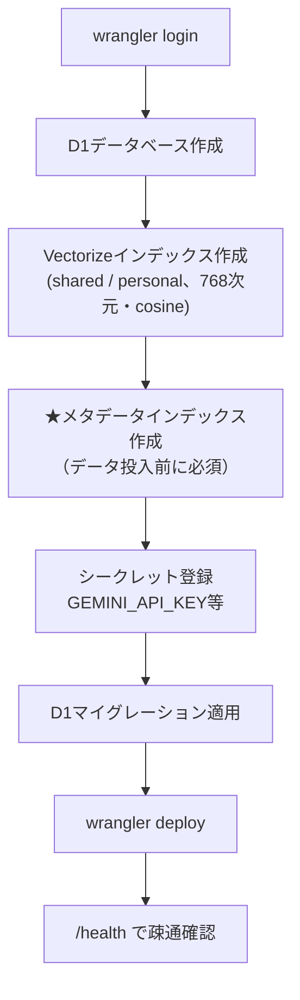
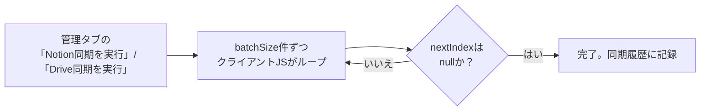
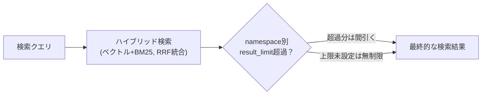
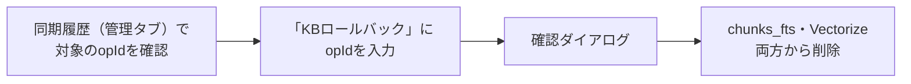
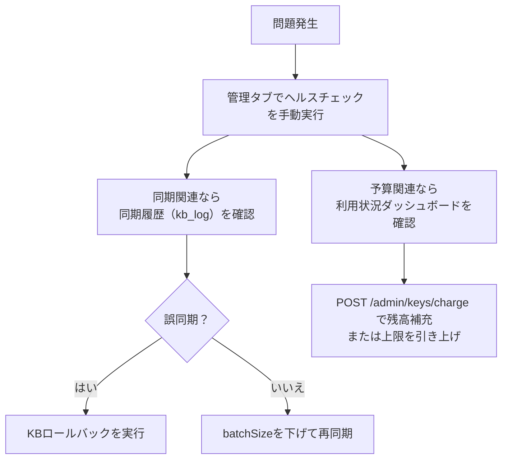

# Cloudflare RAG POC 運用手順書

**作成日:** 2026-08-26
**対象:** [cloudflare-rag-poc/](../cloudflare-rag-poc/)
**位置づけ:** 初期セットアップと日常運用の手順を、実際にこの検証環境を構築・運用した手順に沿ってまとめたもの。設計・アーキテクチャの説明は[技術解説書](cloudflare-rag-technical-report.md)を参照。

---

## 目次

1. [初期セットアップ](#1-初期セットアップ)
2. [知識ベースの追加・同期](#2-知識ベースの追加同期)
3. [APIキー・namespaceの管理](#3-apiキーnamespaceの管理)
4. [検索精度のチューニング](#4-検索精度のチューニング)
5. [ヘルスチェック・アラートの運用](#5-ヘルスチェックアラートの運用)
6. [バックアップとロールバック](#6-バックアップとロールバック)
7. [Houdiniチュートリアル生成をCloudflare経由に切り替える](#7-houdiniチュートリアル生成をcloudflare経由に切り替える)
8. [障害対応の基本フロー](#8-障害対応の基本フロー)

---

## 1. 初期セットアップ

詳細なコマンドは[README.mdのセットアップ手順](../cloudflare-rag-poc/README.md#セットアップ手順)を参照。特に**手順Dのメタデータインデックス作成を飛ばすと、データを投入した後でも`/search`が常に0件を返す**という分かりにくい不具合になるため注意（実際にこの順序で1度失敗している）。

## 2. 知識ベースの追加・同期

### 2.1 同期元の登録

管理タブの「知識ベース同期」、または`POST /admin/kb/set-source`で、namespaceごとにNotionデータベースID・Google DriveフォルダIDを登録する。

### 2.2 同期の実行

**batchSizeの目安**（実機検証で判明した値）：

| 同期元 | 内容 | 推奨batchSize |
|---|---|---|
| Notion | テキストのみ、変換処理なし | 5（既定） |
| Google Drive（テキスト/Googleドキュメント中心） | 変換処理が軽い | 3〜5 |
| Google Drive（PDF/PPTX/音声動画が混在） | Gemini呼び出しを伴う変換処理が重い | **1**（既定をこれに変更済み） |

batchSizeが大きすぎると、1リクエストが100秒を超えてブラウザ/プロキシのタイムアウトに引っかかり、`Unexpected token '<'`というJSON解析エラーになる（実機で確認済み、[技術解説書§8](cloudflare-rag-technical-report.md#s8)参照）。

### 2.3 対応形式

| 形式 | 対応方法 |
|---|---|
| Notionページ本文 | そのまま取得 |
| Googleドキュメント・テキスト・Markdown | そのまま取得 |
| PDF | Geminiのネイティブ文書理解（18MB以下はインライン、超えるとFile API） |
| Word（.docx）・PowerPoint（.pptx） | 自前のZIPパーサでXML本文を抽出 |
| 音声・動画ファイル | Gemini File APIにアップロードして文字起こし |
| YouTube URL | `POST /admin/kb/import-youtube`（ダウンロード不要） |
| 任意のWebページURL | `POST /admin/kb/import-url`（HTMLRewriterでテキスト抽出） |
| QAペアのCSV | `POST /admin/kb/import-qa-csv`（question, answer列が必要） |

20MBを超えるPPTX・非常に大きい動画ファイルは、Workersのメモリ・実行時間制約により登録できない場合がある（同期結果の`skipped`欄で確認できる）。

## 3. APIキー・namespaceの管理

- **APIキー発行**：管理タブ「新しいAPIキーを発行」、または`POST /admin/keys/create`。**生キーはこの応答でしか取得できない**ため、発行時に必ず控える
- **namespaceアクセス制御**：新規発行キーは、`namespaces`を明示的に指定しない限りどのshared namespaceも見えない（2026-08-24以降の挙動）。キーごとに`key_namespace_grants`で許可リストを管理する
- **個人用namespace**：各キー発行時に`personal:<userId>`が自動作成される。チャットUIの個別DB選択ドロップダウンでは「🔒 個人用（自分専用）」と表示される

## 4. 検索精度のチューニング

### 4.1 個別DBに絞った検索

チャットUIのヘッダーにある検索対象ドロップダウンで、「🌐 全DB横断検索」（既定）と個別のnamespaceを選べる。無関係なnamespaceの結果が紛れ込んで回答の質が下がる場合に有効（実際に「SOPとは」という質問で無関係なcedecnotesの資料が上位に混ざる事例で導入した）。

### 4.2 namespace別の検索件数上限

管理タブ「namespace管理」で、namespaceごとに検索結果の採用件数上限（`result_limit`）を設定できる。複数DBを横断検索する際、特定のDBが結果を占有しすぎるのを防ぐのに使う。

### 4.3 出典引用率の確認

回答ごとに表示される「出典引用率（extractionRate）」が低い場合、提示した参考情報が実際には根拠として使われていない＝ハルシネーションの可能性がある。個別DB検索や`level`フィルタ（basic/applied/advanced）と組み合わせて確認する。

## 5. ヘルスチェック・アラートの運用

30分ごとのCron Triggerで、D1接続・直近1時間のKB同期エラー・トークン予算の枯渇間近を自動チェックし、設定済みのSlack/Gmailへ通知する。

- **手動実行**：管理タブ「ヘルスチェックを実行」、または`POST /admin/health/check`
- **通知先の疎通確認**：管理タブ「テスト通知を送信」、または`POST /admin/health/test-alert`
- **セットアップ**：[README.mdのセットアップ手順](../cloudflare-rag-poc/README.md#ヘルスチェックアラート通知のセットアップslack--gmail)を参照。GmailはGoogle Workspace限定のDomain-Wide Delegationではなく、個人アカウントのOAuthリフレッシュトークン方式を採用している

## 6. バックアップとロールバック

### 6.1 設定バックアップ

管理タブ「設定バックアップ」→「エクスポート」で、users/namespaces/kb_sources/token_budgets/key_namespace_grantsのJSONスナップショットをダウンロードできる。チャット履歴本文やベクトルデータは対象外（D1の自動バックアップに任せる方針）。

### 6.2 KBロールバック

誤ったデータを同期してしまった場合、同期履歴（`POST /admin/kb/history`）に記録された`opId`を使ってロールバックできる（`POST /admin/kb/rollback`）。**埋め込み前の生データは保持していないため、取り消し後に再度使いたい場合は再同期が必要。**

## 7. Houdiniチュートリアル生成をCloudflare経由に切り替える

`houdini/python_panels/tutorial_agent.py`は、既定でGAS経由でClaude API・RAG検索を呼ぶ。Cloudflare経由に切り替える場合：

1. Cloudflare側で`ANTHROPIC_API_KEY`シークレットを設定済みであることを確認する
2. HoudiniのRAGチャットパネル → Settingsタブで以下を設定する：
   - チュートリアル生成: Claude呼び出し先 → `cloudflare`
   - チュートリアル生成: RAG検索先 → `cloudflare`（空欄のままなら従来の設定に追随）
   - Cloudflare RAG WebApp URL → デプロイ済みのWorker URL
   - Cloudflare RAG APIキー → 発行済みのAPIキー
3. 設定を保存し、通常通りチュートリアル生成を実行する

**既定値は変更していないため、これらの設定を触らなければ従来通りGAS経由で動作する。** 切り替えた場合、Claude呼び出しのトークン消費は`token_budgets`の`budget_type='claude'`で管理される（`POST /admin/keys/set-capacity`で上限設定可能）。

## 8. 障害対応の基本フロー

原因の切り分けに使う主な情報源：

| 症状 | 確認先 |
|---|---|
| 検索結果がおかしい・引用率が低い | チャットUIの出典一覧、個別DB検索で切り分け |
| 同期が失敗する | 管理タブ「同期履歴」の`status`/`detail`列 |
| JSON解析エラー（`Unexpected token '<'`） | batchSizeを下げて再試行（[§2.2](#22-同期の実行)参照） |
| 予算超過（429） | 利用状況ダッシュボード、`POST /admin/keys/charge`で補充 |
| Slack/Gmail通知が来ない | `POST /admin/health/test-alert`で疎通確認 |

---

*関連ドキュメント: [cloudflare-rag-poc/README.md](../cloudflare-rag-poc/README.md) / [docs/cloudflare-rag-technical-report.md](cloudflare-rag-technical-report.md) / [docs/gas-feature-parity.md](gas-feature-parity.md)*
