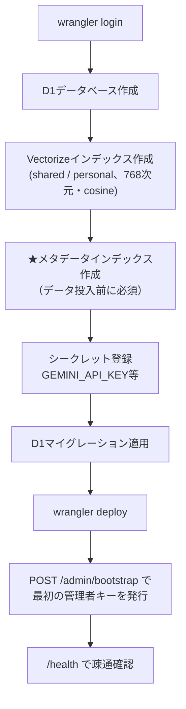
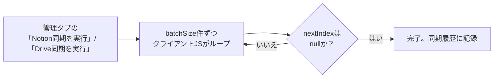
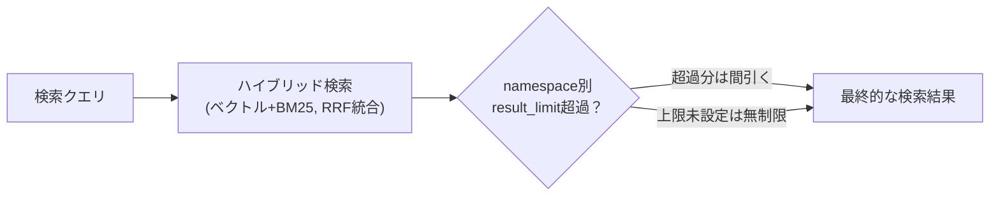
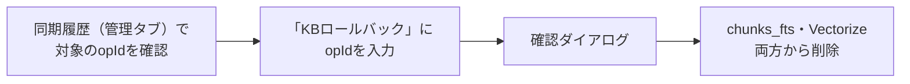
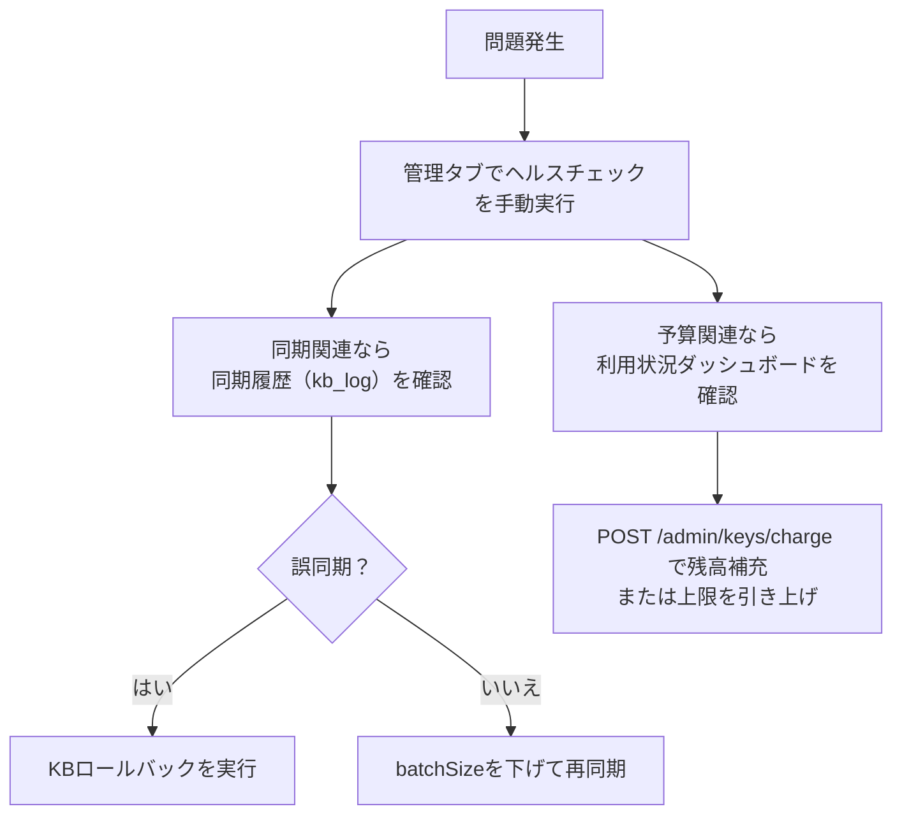

# Cloudflare RAG POC 運用手順書

**作成日:** 2026-08-26
**対象:** [cloudflare-rag-poc/](../cloudflare-rag-poc/)
**位置づけ:** 初期セットアップと日常運用の手順を、実際にこの検証環境を構築・運用した手順に沿ってまとめたもの。設計・アーキテクチャの説明は[技術解説書](cloudflare-rag-technical-report.md)を参照。

---

## 目次

1. [初期セットアップ](#1-初期セットアップ)
2. [知識ベースの追加・同期](#2-知識ベースの追加同期)
3. [APIキー・namespaceの管理](#3-apiキーnamespaceの管理)
4. [検索精度のチューニング](#4-検索精度のチューニング)
5. [ヘルスチェック・アラートの運用](#5-ヘルスチェックアラートの運用)
6. [バックアップとロールバック](#6-バックアップとロールバック)
7. [Houdiniチュートリアル生成をCloudflare経由に切り替える](#7-houdiniチュートリアル生成をcloudflare経由に切り替える)
8. [障害対応の基本フロー](#8-障害対応の基本フロー)

---

## 1. 初期セットアップ



詳細なコマンドは[README.mdのセットアップ手順](../cloudflare-rag-poc/README.md#セットアップ手順)を参照。特に**手順Dのメタデータインデックス作成を飛ばすと、データを投入した後でも`/search`が常に0件を返す**という分かりにくい不具合になるため注意（実際にこの順序で1度失敗している）。

### 1.1 最初の管理者キーを発行する

Admin APIは管理者キーを持っていることが前提だが、初回セットアップ時点ではそのキー自体が存在しないという鶏卵問題がある。これまでは`wrangler d1 execute`で直接INSERTして凌いでいたが、専用のブートストラップ用エンドポイントを用意した（2026-08-27追加）。

```bash
curl -X POST https://<デプロイ先>/admin/bootstrap \
  -H "content-type: application/json" \
  -d '{"displayName":"管理者"}'
```

**管理者ロールのユーザーが1人でも既に存在する場合は403で拒否される**（GAS版の`bootstrapFirstAdminKey`と同じ安全策）。つまりこのエンドポイントは初回セットアップの一度きりしか使えず、認証をバイパスできる抜け穴にはならない。2回目以降の管理者キー発行は通常通り管理タブ（`POST /admin/keys/create`）から行う。

## 2. 知識ベースの追加・同期

### 2.1 同期元の登録

管理タブの「知識ベース同期」、または`POST /admin/kb/set-source`で、namespaceごとにNotionデータベースID・Google DriveフォルダIDを登録する。

### 2.2 同期の実行



**batchSizeの目安**（実機検証で判明した値）：

| 同期元 | 内容 | 推奨batchSize |
|---|---|---|
| Notion | テキストのみ、変換処理なし | 5（既定） |
| Google Drive（テキスト/Googleドキュメント中心） | 変換処理が軽い | 3〜5 |
| Google Drive（PDF/PPTX/音声動画が混在） | Gemini呼び出しを伴う変換処理が重い | **1**（既定をこれに変更済み） |

batchSizeが大きすぎると、1リクエストが100秒を超えてブラウザ/プロキシのタイムアウトに引っかかり、`Unexpected token '<'`というJSON解析エラーになる（実機で確認済み、[技術解説書§8](cloudflare-rag-technical-report.md#s8)参照）。

### 2.3 対応形式

| 形式 | 対応方法 |
|---|---|
| Notionページ本文 | そのまま取得 |
| Googleドキュメント・テキスト・Markdown | そのまま取得 |
| PDF | Geminiのネイティブ文書理解（18MB以下はインライン、超えるとFile API） |
| Word（.docx）・PowerPoint（.pptx）（Drive同期） | 自前のZIPパーサ＋HTTP Rangeで、ファイル全体をダウンロードせず本文XMLだけを取得（2026-08-27〜、事実上ファイルサイズ無制限） |
| Word（.docx）・PowerPoint（.pptx）（手動アップロード`/admin/kb/upload-doc`） | base64でリクエストボディに載せる方式のため、こちらは約20MBまで |
| 音声・動画ファイル | Gemini File APIにアップロードして文字起こし |
| YouTube URL | `POST /admin/kb/import-youtube`（ダウンロード不要） |
| 任意のWebページURL | `POST /admin/kb/import-url`（HTMLRewriterでテキスト抽出） |
| QAペアのCSV | `POST /admin/kb/import-qa-csv`（question, answer列が必要） |
| FAQ1件だけ登録 | `POST /admin/kb/add-faq`（管理タブ「FAQ単発登録」。`alsoWriteToNotion`指定でnamespaceの同期先Notion DBにもページ作成、2026-08-27追加） |

PDF・音声・動画ファイルはGeminiに実データを渡す必要があるため、Drive同期でもダウンロード自体は避けられず、Workersのメモリ上限（128MB）に対する安全マージンとして約90MBの上限がある（超えると同期結果の`skipped`欄に理由が出る）。DOCX/PPTXはこの制約を受けない（上表参照）。

## 3. APIキー・namespaceの管理

- **APIキー発行**：管理タブ「新しいAPIキーを発行」、または`POST /admin/keys/create`。**生キーはこの応答でしか取得できない**ため、発行時に必ず控える。画面上の表示は「コピー」ボタンでの取得を想定しており、60秒後の自動非表示・「隠す」ボタン・管理タブを離れた時点でのクリアのいずれかで画面から消える（ページを再読み込みしない限り表示され続けていた不具合の対策、2026-08-27）
- **namespaceアクセス制御**：新規発行キーは、`namespaces`を明示的に指定しない限りどのshared namespaceも見えない（2026-08-24以降の挙動）。キーごとに`key_namespace_grants`で許可リストを管理する
- **個人用namespace**：各キー発行時に`personal:<userId>`が自動作成される。チャットUIの個別DB選択ドロップダウンでは「🔒 個人用（自分専用）」と表示される

## 4. 検索精度のチューニング

### 4.1 個別DBに絞った検索

チャットUIのヘッダーにある検索対象ドロップダウンで、「🌐 全DB横断検索」（既定）と個別のnamespaceを選べる。無関係なnamespaceの結果が紛れ込んで回答の質が下がる場合に有効（実際に「SOPとは」という質問で無関係なcedecnotesの資料が上位に混ざる事例で導入した）。

### 4.2 namespace別の検索件数上限

管理タブ「namespace管理」で、namespaceごとに検索結果の採用件数上限（`result_limit`）を設定できる。複数DBを横断検索する際、特定のDBが結果を占有しすぎるのを防ぐのに使う。



### 4.3 出典引用率の確認

回答ごとに表示される「出典引用率（extractionRate）」が低い場合、提示した参考情報が実際には根拠として使われていない＝ハルシネーションの可能性がある。個別DB検索や`level`フィルタ（basic/applied/advanced）と組み合わせて確認する。

### 4.4 複数出典の貢献度確認

出典が2件以上引用された回答では、参照した情報源の一覧の上に「引用の内訳（実際に引用された回数の比率）」バーが表示される（2026-08-27追加）。回答文中の`[n]`の出現回数で重み付けしており、「引用された/されていない」だけでなく、どの出典がどれだけ重く使われたかを確認できる。

### 4.5 質問への画像添付（マルチモーダルクエリ）

チャット入力欄の📎ボタンから画像（8MBまで）を添付できる（2026-08-27追加）。添付画像は検索・埋め込みには使わず、最終回答生成時にRAGコンテキストと一緒にGeminiへ渡すだけなので、「この画像に写っているノードは何ですか」のような質問に使う。

## 5. ヘルスチェック・アラートの運用

30分ごとのCron Triggerで、D1接続・直近1時間のKB同期エラー・トークン予算の枯渇間近を自動チェックし、設定済みのSlack/Gmailへ通知する。

- **手動実行**：管理タブ「ヘルスチェックを実行」、または`POST /admin/health/check`
- **通知先の疎通確認**：管理タブ「テスト通知を送信」、または`POST /admin/health/test-alert`
- **セットアップ**：[README.mdのセットアップ手順](../cloudflare-rag-poc/README.md#ヘルスチェックアラート通知のセットアップslack--gmail)を参照。GmailはGoogle Workspace限定のDomain-Wide Delegationではなく、個人アカウントのOAuthリフレッシュトークン方式を採用している

## 6. バックアップとロールバック

### 6.1 設定バックアップ

管理タブ「設定バックアップ」→「エクスポート」で、users/namespaces/kb_sources/token_budgets/key_namespace_grantsのJSONスナップショットをダウンロードできる。チャット履歴本文やベクトルデータは対象外（D1の自動バックアップに任せる方針）。

### 6.2 KBロールバック



誤ったデータを同期してしまった場合、同期履歴（`POST /admin/kb/history`）に記録された`opId`を使ってロールバックできる（`POST /admin/kb/rollback`）。**埋め込み前の生データは保持していないため、取り消し後に再度使いたい場合は再同期が必要。**

### 6.3 D1データを直接確認する

管理タブのAPI経由では見えない生データ（テーブル中身そのもの）を確認したい場合、`wrangler d1 execute`でSQLを直接実行できる。`cloudflare-rag-poc/`ディレクトリで実行する。

```bash
# 本番（--remote、Cloudflare上の実データ）に対して実行
npx wrangler d1 execute rag-poc-db --remote --command "SELECT * FROM namespaces;"

# ローカルの開発用DB（wrangler devが使うSQLiteファイル、本番とは別データ）に対して実行する場合は --remote を外す
npx wrangler d1 execute rag-poc-db --command "SELECT * FROM namespaces;"
```

`--remote`の有無を間違えると「ローカルの空DBを見て『データが無い』と勘違いする」事故につながりやすいので、本番データを見たい時は必ず`--remote`を付けること。

よく使う確認クエリ：

| 確認したいこと | クエリ例 |
|---|---|
| namespace一覧と検索件数上限 | `SELECT namespace_id, scope, result_limit FROM namespaces;` |
| 直近の同期履歴（エラーのみ） | `SELECT * FROM kb_log WHERE status='error' ORDER BY id DESC LIMIT 20;` |
| あるnamespaceに登録済みのチャンク数 | `SELECT namespace, COUNT(*) FROM chunks_fts GROUP BY namespace;` |
| APIキーに紐づくnamespace許可 | `SELECT * FROM key_namespace_grants WHERE user_id='<user_idの先頭数文字>...';` |
| トークン予算の消費状況 | `SELECT user_id, budget_type, used_tokens, limit_tokens FROM token_budgets;` |
| 監査ログ（誰がいつ何を検索したか） | `SELECT user_id, namespace_id, tokens_used, latency_ms FROM audit_log ORDER BY id DESC LIMIT 20;` |
| namespaceごとのDriveフォルダ/Notion DB設定 | `SELECT * FROM kb_sources;` |

JSON形式で結果が欲しい場合は`--json`オプションを付ける（スクリプトから加工したい場合に便利）。テーブル定義そのものを確認したい場合は`migrations/`配下の各SQLファイル、または[技術解説書§4データモデル](cloudflare-rag-technical-report.md#4-データモデル)のER図を参照。

Cloudflareダッシュボード（[dash.cloudflare.com](https://dash.cloudflare.com) → Workers & Pages → D1 → `rag-poc-db`）からもブラウザ上でSQLを実行・閲覧できる。CLIでのアドホックな確認にはwrangler、繰り返し見る・共有したい場合はダッシュボードが向いている。

## 7. Houdiniチュートリアル生成をCloudflare経由に切り替える

`houdini/python_panels/tutorial_agent.py`は、既定でGAS経由でClaude API・RAG検索を呼ぶ。Cloudflare経由に切り替える場合：

1. Cloudflare側で`ANTHROPIC_API_KEY`シークレットを設定済みであることを確認する
2. HoudiniのRAGチャットパネル → Settingsタブで以下を設定する：
   - チュートリアル生成: Claude呼び出し先 → `cloudflare`
   - チュートリアル生成: RAG検索先 → `cloudflare`（空欄のままなら従来の設定に追随）
   - Cloudflare RAG WebApp URL → デプロイ済みのWorker URL
   - Cloudflare RAG APIキー → 発行済みのAPIキー
3. 設定を保存し、通常通りチュートリアル生成を実行する

**既定値は変更していないため、これらの設定を触らなければ従来通りGAS経由で動作する。** 切り替えた場合、Claude呼び出しのトークン消費は`token_budgets`の`budget_type='claude'`で管理される（`POST /admin/keys/set-capacity`で上限設定可能）。

## 8. 障害対応の基本フロー



原因の切り分けに使う主な情報源：

| 症状 | 確認先 |
|---|---|
| 検索結果がおかしい・引用率が低い | チャットUIの出典一覧、個別DB検索で切り分け |
| 同期が失敗する | 管理タブ「同期履歴」の`status`/`detail`列 |
| JSON解析エラー（`Unexpected token '<'`） | batchSizeを下げて再試行（[§2.2](#22-同期の実行)参照） |
| 予算超過（429） | 利用状況ダッシュボード、`POST /admin/keys/charge`で補充 |
| Slack/Gmail通知が来ない | `POST /admin/health/test-alert`で疎通確認 |

---

*関連ドキュメント: [cloudflare-rag-poc/README.md](../cloudflare-rag-poc/README.md) / [docs/cloudflare-rag-technical-report.md](cloudflare-rag-technical-report.md) / [docs/gas-feature-parity.md](gas-feature-parity.md)*
