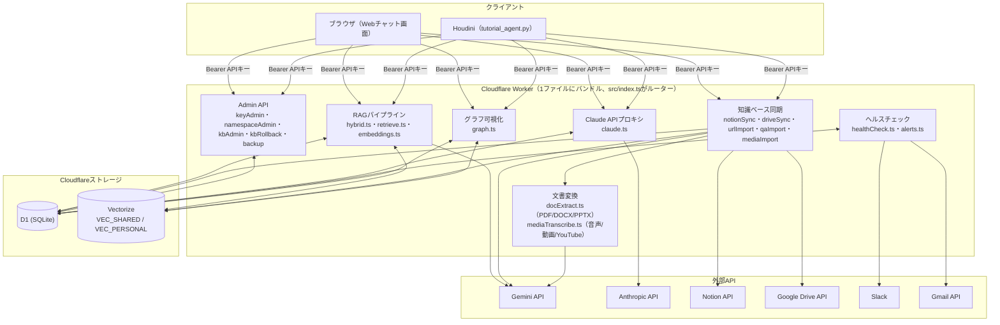
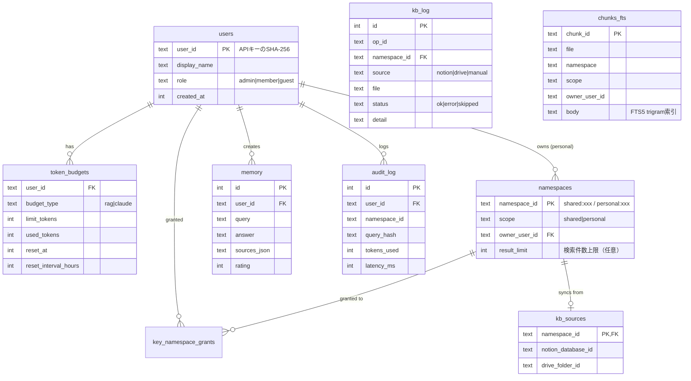
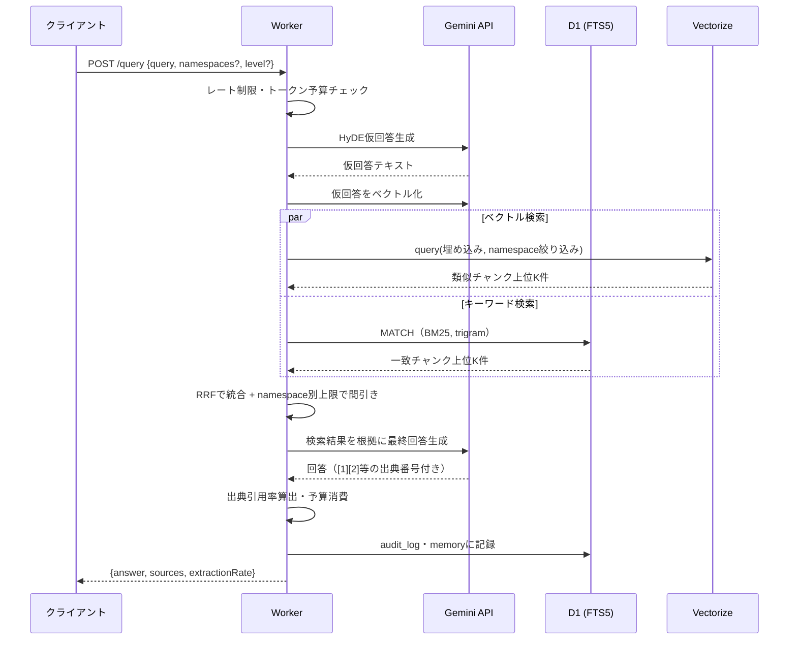
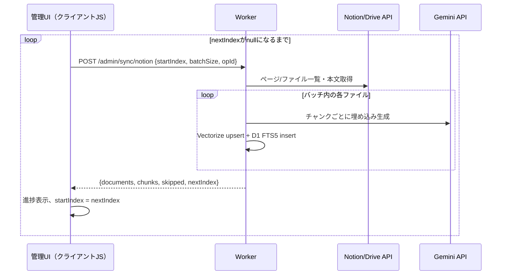
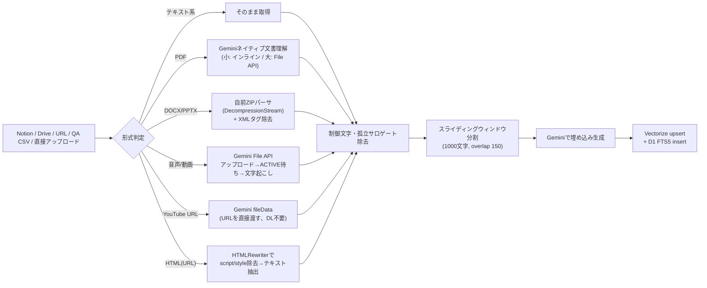

# Cloudflare RAG POC 技術解説書

**作成日:** 2026-08-26
**対象:** [cloudflare-rag-poc/](../cloudflare-rag-poc/)（Cloudflare Workers + D1 + Vectorize によるRAG基盤の検証実装）
**位置づけ:** 既存の本番システム（`scripts/gas_cloud_rag.js`＝Google Apps Script + Google Sheets/ChromaDB、`scripts/rag_local_bridge.py`＝ローカルRAGブリッジ）を置き換える候補として、Cloudflareのサーバーレス基盤上に同等以上の機能を実装し、実データで検証した記録。本番システムには一切影響しない、独立した検証環境である。

---

## 目次

1. [概要](#1-概要)
2. [なぜCloudflareか](#2-なぜcloudflareか)
3. [システム全体構成](#3-システム全体構成)
4. [データモデル](#4-データモデル)
5. [主要フロー](#5-主要フロー)
6. [セキュリティ・アクセス制御](#6-セキュリティアクセス制御)
7. [知識ベース取り込みパイプライン](#7-知識ベース取り込みパイプライン)
8. [実装上の技術的な工夫と、実際に発見・修正したバグ](#8-実装上の技術的な工夫と実際に発見修正したバグ)
9. [GAS版との機能対応表（サマリ）](#9-gas版との機能対応表サマリ)
10. [今後の課題](#10-今後の課題)

---

## 1. 概要

GAS版（`gas_cloud_rag.js`、約3,450行・100関数超）が持つRAG機能一式を、Cloudflare Workers上でTypeScriptにより再実装した。方針は「どんどん機能を入れて最終的にGASと同等以上にする」で、単なる技術検証にとどまらず、実際のNotionデータベース・Google Driveフォルダを使った実データでの動作確認を継続的に行いながら開発した。

この過程で、実データ・実運用でしか顕在化しない複数のバグ（Vectorizeのベクトル長・件数上限、Cloudflareのサブリクエスト数上限、Workersのメモリ上限など）を発見し、その都度対処してきた。詳細は[README.mdのトラブルシューティング](../cloudflare-rag-poc/README.md#トラブルシューティング実際に遭遇したエラーと対処)を参照。

## 2. なぜCloudflareか

既存の検討資料（[docs/cloud-local-unification-plan.md](cloud-local-unification-plan.md)）が示す「Cloud RAG（Google Apps Script）とLocal RAG（Python + ChromaDB）の二重運用を統合したい」という課題に対し、Cloudflareを選んだ理由：

- **エッジで完結するサーバーレス**：Workers（compute）・D1（SQLite互換DB）・Vectorize（ベクトルDB）が単一プラットフォームに揃っており、GASのような「実行時間・呼び出し回数の制約が読みにくい」問題を避けられる
- **GASからの移行コストの低さ**：GASも「サーバーサイドでAPIキーを隠蔽し、クライアントに直接外部APIを叩かせない」という設計思想を持つため、Workersでも同じ構造（クライアント→Worker→外部API）をそのまま踏襲できる
- **明示的な制約が事前にわかる**：GASの「実行時間6分」「同時実行数」のような曖昧な制約と異なり、Workersの制約（後述のサブリクエスト数上限・CPU時間・メモリ128MB）はドキュメント化されており、対策を設計に織り込みやすい

ただし実装を進める中で、Workers特有の制約（Vectorizeバインディングを実行時に動的生成できない、サブリクエスト数上限、npm依存関係がedge-compatibleである必要がある等）も明らかになった。詳細は[§8](#8-実装上の技術的な工夫と実際に発見修正したバグ)、および[Firebaseで実装した場合との比較資料](cloudflare-vs-firebase-comparison.md)を参照。

## 3. システム全体構成

**設計判断：個人スコープの論理分離**（設計書§6-1からの変更点）。当初案の「ユーザーごとに物理的に別インデックス」は、Vectorizeバインディングが`wrangler.jsonc`に静的記述する必要があり実行時に動的生成できないため断念。代わりに個人スコープ用インデックスを1本（`VEC_PERSONAL`）にまとめ、`owner_user_id`メタデータでの厳格なフィルタを書き込み・検索の両方で強制することで、実質的に物理分離に近い安全性を確保した。

## 4. データモデル

`chunks_fts`（D1 FTS5仮想テーブル）はキーワード検索専用で、実際の本文全文とメタデータは**Vectorize側にも**メタデータとして重複して持たせている（`ChunkMetadata`：file/namespace/scope/chunk_index/text/source/size/ingested_at）。ベクトル検索・キーワード検索を1回のリクエストで独立に行い、結果をアプリケーション層でRRF統合する設計のため、両ストアが同じチャンクIDで対応付けられている必要がある。

## 5. 主要フロー

### 5.1 RAGクエリ（`/query`）

**出典引用率（`extractionRate`）**は、回答文中に実際に出現した`[n]`番号を検出し、提示した参考情報のうち何割が実際に根拠として使われたかを表す。GAS版の`parseExtractionRate_`と同じ考え方で、「もっともらしいが根拠のない回答」を検知するハルシネーション対策指標として使っている。

### 5.2 知識ベース同期（バッチ処理パターン）

Cloudflare Workersの「1回の呼び出しあたりのサブリクエスト数上限」に対応するため、**1回のHTTPリクエストで全件を処理せず、クライアント側がループしてバッチを送り続ける**設計にしている（`startIndex`/`batchSize`/`opId`/`nextIndex`）。この設計は実際にHoudini21データベース（80ページ）の同期でサブリクエスト数上限エラーに遭遇したことから導入した。PDF/PPTX/音声動画の変換が絡むDrive同期はNotion同期よりさらに重いため、`batchSize`をより小さく（実運用では1）する必要があることも実機検証で判明している。

## 6. セキュリティ・アクセス制御

- **APIキー認証**：生キーは発行時にしか表示されず、以後はSHA-256ハッシュのみをDBに保持する
- **namespace RBAC**：`key_namespace_grants`テーブルで「どのキーがどのshared namespaceを見られるか」を明示的に管理。adminロールは無条件に全shared namespaceを閲覧可能、それ以外は許可リストに無いnamespaceには一切アクセスできない
- **個人スコープの二重強制**：`personal:<userId>`への書き込み・検索は、リクエスト元ユーザー自身のnamespace以外を拒否する（他ユーザーの個人データへの越権アクセスを防止）
- **レート制限**：既存の`audit_log`の直近件数を数える固定ウィンドウ方式（60秒30回）。専用テーブルを追加せずに実現
- **トークン予算**：`token_budgets`（`budget_type`が`rag`/`claude`で分離）。呼び出し前にチェックし、呼び出し後に実測トークン数で消費する。予算超過は429で拒否
- **秘密情報の保持**：Gemini/Notion/Google/Anthropic/Slack/GmailのAPIキー・トークンはすべてWorkerのシークレット（`wrangler secret put`）にのみ保持し、クライアントには一切渡さない

## 7. 知識ベース取り込みパイプライン

DOCX/PPTXの変換は、外部ライブラリを追加せず**ZIP形式を自前でパース**する実装にしている（Workers組み込みの`DecompressionStream('deflate-raw')`でDEFLATE展開）。PDFは専用パーサを実装する代わりに**Geminiのマルチモーダル文書理解に丸ごと渡す**方式を採った。これによりレイアウト崩れに強く、実装コストも抑えられる一方、Gemini呼び出しの追加コスト・レイテンシが発生する点はトレードオフとして認識しておく必要がある。

## 8. 実装上の技術的な工夫と、実際に発見・修正したバグ

開発を通じて、ローカル検証だけでは見つからない実運用特有のバグを複数発見した。代表的なもの：

| 症状 | 原因 | 対処 |
|---|---|---|
| `VECTOR_UPSERT_ERROR: id too long` | Vectorizeのベクトル ID は64バイト上限。日本語の長いタイトルをそのままIDに使うと超過 | ハッシュベースの固定長ID（`sha256(namespace+file)`の先頭40文字＋チャンク番号）に変更 |
| `Too many subrequests by single Worker invocation` | Notion/Drive同期で1ページごとに複数回の外部API呼び出しが積み重なる | `startIndex`/`batchSize`/`opId`によるバッチ処理化（クライアント側ループ） |
| `VECTOR_QUERY_ERROR: max top K is 50` | `returnMetadata:"all"`時のtopK上限を、候補プール拡大ロジックの二重乗算で超過 | 一箇所で`Math.min(limit*3, 50)`を計算し共有 |
| `getByIds(): too many ids` | Vectorizeの`getByIds()`は1回20件までしか受け付けない（`upsert`とは別の上限） | 20件ずつのチャンクに分割して複数回呼ぶ |
| `Memory limit exceeded before EOF` | 大きいPPTXファイルのダウンロード・ZIP展開でWorkers isolateのメモリ上限（128MB）に到達 | 応急処置としてダウンロード前に`Content-Length`で足切りしていたが、chunked転送で`Content-Length`が無いケースでは素通りしてしまう不備があった。最終的にはDOCX/PPTXについて「ファイル全体をダウンロードしない」設計に変更（下記参照） |
| PPTX/DOCXが20MB（後に約90MB）を超えると同期できない | 上記対策のダウンロード上限は、ファイル容量の大半を占める埋め込み動画・画像も含めた「ファイル全体」に対する足切りだった。抽出対象は実際には`word/document.xml`・`ppt/slides/slideN.xml`という小さなXMLのみ | HTTP RangeリクエストでZIPのEnd of Central Directory・central directory・対象XMLエントリだけを個別に取得する方式に変更（`docExtract.ts`の`ByteRangeSource`、`driveSync.ts`の`driveRangeSource`）。ファイル全体を一度もメモリに載せないため、実質的にファイルサイズの上限が無くなった（2026-08-27）。PDF・音声・動画はGeminiに実データを渡す必要がある性質上この手法は使えず、約90MBの上限が残る |
| 管理UIで`Unexpected token '<'`（JSON解析エラー） | Drive同期がPDF/PPTX変換込みで1リクエスト115秒かかり、ブラウザ/プロキシ側がタイムアウトしHTMLエラーページを返す | 管理UIのDrive同期ボタンの`batchSize`を1に縮小、非JSON応答時に分かりやすいエラーメッセージを表示 |
| GCPの`iam.disableServiceAccountKeyCreation`でサービスアカウントキーが作れない | Google Workspaceの「セキュアなデフォルト」ポリシーが個人プロジェクトにも自動適用 | プロジェクト単位でポリシーを無効化。Gmail送信は個人アカウント特有の制約（Domain-Wide Delegation不可）のため別途OAuthリフレッシュトークン方式に切り替え |

これら以外にも、Windows/Git-Bash環境での日本語文字化け、PowerShellの`curl`エイリアス、workers.devドメインへのボット対策403など、開発環境特有の問題にも多数遭遇した。詳細と対処法は[README.mdのトラブルシューティング](../cloudflare-rag-poc/README.md#トラブルシューティング実際に遭遇したエラーと対処)に集約している。

## 9. GAS版との機能対応表（サマリ）

詳細な機能単位の対応表は[docs/gas-feature-parity.md](gas-feature-parity.md)を参照。2026-08-26時点のサマリ：

- ✅ 完了：コア検索・回答生成、Admin API、Notion/Drive同期（PDF/DOCX/PPTX/音声動画/YouTube/URL/QA CSV含む）、UI（タブ構成・3Dグラフ・ブラウザ内Admin）、利用統計・評価統計、レート制限、期限切れ履歴の自動削除、バックアップ、ヘルスチェック・アラート（Slack/Gmail）、Claude APIプロキシ（Houdiniチュートリアル生成の移行先）
- 🚧 保留：チャット履歴検索のRAG統合（ユーザー判断により保留）
- 🚫 対象外：Houdiniチュートリアル生成専用のClaude呼び出しは、当初「RAGには不要」として対象外にしていたが、後に`tutorial_agent.py`のGAS依存を移行する目的で追加した経緯がある

## 10. 今後の課題

- Google Drive・Claude APIプロキシとも実データでの動作確認は済んだが、**Houdini実機での`tutorial_agent.py`統合テストは未実施**（開発環境にHoudiniが無いため）
- 大きいPPTX/DOCXは、ファイル全体をダウンロードせずHTTP Rangeで本文XMLだけ取得する方式に切り替え（2026-08-27）、事実上サイズ上限が無くなった（[§8](#8-実装上の技術的な工夫と実際に発見修正したバグ)参照）。ただしPDF・音声・動画はGeminiに実データを渡す必要がある性質上、引き続きダウンロード自体が必要で、Workersのメモリ上限（128MB）に対する安全マージンとして約90MBの上限が残っている
- チャット履歴を検索コンテキストとして再利用する機能（`searchMemory_`相当）は設計判断が必要なため保留中
- 利用統計ダッシュボードがGemini/Claude両方のトークン消費を合算表示しており、budget_type別の内訳表示は今後の改善候補

---

*関連ドキュメント: [cloudflare-rag-poc/README.md](../cloudflare-rag-poc/README.md) / [docs/gas-feature-parity.md](gas-feature-parity.md) / [docs/cloudflare-rag-operations-manual.md](cloudflare-rag-operations-manual.md) / [docs/cloudflare-vs-firebase-comparison.md](cloudflare-vs-firebase-comparison.md)*
