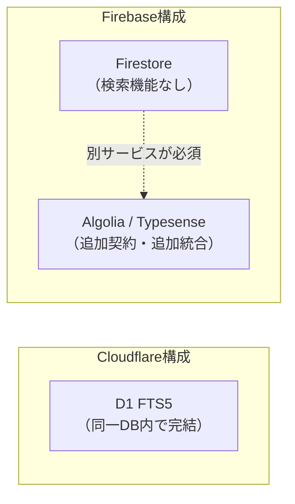

# Cloudflareで作った場合とFirebaseで作った場合の違い

**作成日:** 2026-08-26
**位置づけ:** [cloudflare-rag-poc/](../cloudflare-rag-poc/)は実際にCloudflare Workers + D1 + Vectorizeで実装したが、「同じことをFirebase（Cloud Functions + Firestore等）でやっていたら同じやり方で済んだか」という疑問に対する検証・比較資料。**結論を先に言うと、機能的には同等のものを作れるが、やり方は大きく異なる。** 特に「フルテキスト検索」「ベクトル検索」「Cloudflare特有の制約回避策（バッチ処理化・自前ZIPパーサ等）」の3点で、設計そのものが変わる。

---

## 目次

1. [結論](#1-結論)
2. [コンポーネント対応表](#2-コンポーネント対応表)
3. [違いが設計に直結する3つのポイント](#3-違いが設計に直結する3つのポイント)
4. [逆にFirebaseの方が簡単になる点](#4-逆にfirebaseの方が簡単になる点)
5. [コスト構造の違い](#5-コスト構造の違い)
6. [総合的にどちらが向いていたか](#6-総合的にどちらが向いていたか)

---

## 1. 結論

**「同じやり方」ではない。** 今回Cloudflareで実装した際に生まれた設計上の工夫（D1 FTS5でのキーワード検索、サブリクエスト数上限を避けるためのバッチ処理化、自前のZIPパーサ、JWTの手動署名）は、いずれもCloudflare Workers特有の制約が理由で必要になったものであり、Firebase（Cloud Functions）で作る場合はこれらの制約自体が存在しない、または別の形で存在する。

一方で、Firebaseには「Cloudflareには無いが必要になるもの」もある（Firestoreにはフルテキスト検索機能が無いため外部サービスが必須、ベクトル検索も専用サービスの構築が必要、など）。**トータルで見ると「Cloudflareは3サービスに機能が凝縮されている分シンプル、Firebaseはより自由度が高い分、複数のGCPサービスを組み合わせる設計力が必要」**という違いになる。

## 2. コンポーネント対応表

| 役割 | Cloudflare（今回採用） | Firebase/GCPで代替する場合 | 備考 |
|---|---|---|---|
| コンピュート | Workers（V8 isolate、エッジ実行） | Cloud Functions for Firebase（内部的にはCloud Run） | 実行モデルが根本的に異なる（後述） |
| リレーショナルDB | D1（SQLite互換） | Cloud SQL、またはFirestore（NoSQL） | Firestoreを使う場合はSQL的な操作（JOIN等）を諦める必要がある |
| フルテキスト検索（BM25） | D1 FTS5（trigramトークナイザ） | **Firestoreにはネイティブ機能が無い**。Algolia / Typesense / Elasticsearch等の外部サービスが必須 | 今回の設計の根幹（ハイブリッド検索）に直結する最大の違い |
| ベクトル検索 | Vectorize（ネイティブ統合） | Vertex AI Vector Search（要インデックスエンドポイントのデプロイ） | Vertex AI側はセットアップがかなり重く、常時起動コストもかかる |
| スケジュール実行 | Cron Triggers（`wrangler.jsonc`に1行） | Cloud Scheduler + Pub/Sub（`firebase-functions`の`onSchedule`が内部でラップ） | Firebase側もAPIとしては簡単だが、裏で複数のGCPリソースが動く |
| シークレット管理 | `wrangler secret put` | Google Secret Manager（`firebase functions:secrets:set`） | 使い勝手はほぼ同等 |
| Google API認証（Drive/Gmail） | サービスアカウントJWTを`crypto.subtle`で自前署名（`googleAuth.ts`約90行） | Application Default Credentials（`google-auth-library`）がそのまま使える | Firebase側が圧倒的に簡単（後述） |
| ファイル処理（PDF/DOCX/PPTX） | 自前ZIPパーサ・Geminiのネイティブ文書理解 | `pdf-parse`・`mammoth`・`officeparser`等の成熟したnpmライブラリがそのまま使える | Firebase側の方が実装が楽で堅牢 |
| HTMLパース（URL登録機能） | Workers組み込みの`HTMLRewriter` | `cheerio`・`jsdom`等のnpmライブラリ | どちらも実用上は十分 |
| エッジ配信 | 自動（300都市以上） | 単一リージョン（マルチリージョン構成は別途設計が必要） | グローバルなレイテンシに影響 |

## 3. 違いが設計に直結する3つのポイント

### 3.1 フルテキスト検索：D1 FTS5 vs Firestoreに検索機能が無い

今回のハイブリッド検索（ベクトル検索＋BM25キーワード検索をRRFで統合）は、D1がSQLiteベースでFTS5仮想テーブルをネイティブサポートしているからこそ、**追加サービス無しで**実現できた。

Firestoreに乗り換えた場合、Firestore自体にはBM25のようなキーワード検索機能が一切無いため、**Algolia・Typesense・Elasticsearchのような外部の検索サービスを別途契約・統合する必要がある**。これは設計・運用コストの両方を押し上げる。「D1 FTS5で日本語をtrigramトークナイザで検索できるようにした」という今回の工夫（[技術解説書](cloudflare-rag-technical-report.md)参照）は、Firebase構成では丸ごと別サービスに置き換わる。

### 3.2 ベクトル検索：Vectorize vs Vertex AI Vector Search

Vectorizeは「インデックスを作ってupsert/queryするだけ」で使えるサーバーレスなベクトルDBで、アイドル時のコストも掛からない。

Vertex AI Vector Search（Firebase/GCP側の対応サービス）は機能的には同等だが、**インデックスを「デプロイ」してエンドポイントを常時起動しておく必要があり、使っていない時間も課金される**。セットアップの手順もVectorizeよりかなり複雑（インデックス作成→デプロイ→エンドポイント作成→デプロイ、の多段階）。小規模な検証用途では、Vectorizeの方が圧倒的に着手しやすい。

### 3.3 Cloudflare Workers特有の実行制約が生んだ「バッチ処理化」という設計

今回、Notion/Drive同期を「1リクエストで全件処理」ではなく「`startIndex`/`batchSize`/`opId`でクライアントがループする」設計にしたのは、**Cloudflare Workersの「1回の呼び出しあたりのサブリクエスト数上限」**（外部API呼び出しの累計回数に対する制限）に実際に遭遇したためだった。

Cloud Functions（Firebase）にはこの種の「サブリクエスト数」という制限は無い。実行時間の上限はあるが（2nd genで最大60分、メモリも最大32GBまで設定可能）、Workersよりずっと緩やかで、**80ページのNotionデータベースや335ファイルのDriveフォルダを1回の関数呼び出しで最後まで処理しきれた可能性が高い**。つまり、今回実装した「バッチループ・進捗表示・opIdでの継続」という一連の仕組みは、Firebase構成であればそもそも不要だった可能性がある。

一方で、Cloud Functionsにも「タイムアウトに達したら処理が失敗する」というリスク自体は残るため、大規模なデータセットに対しては何らかの分割実行の仕組みは結局必要になる可能性はある（Cloud Tasksでのキュー化等）。「不要になる」というより「必要になる規模の閾値が大きく後退する」という表現が正確。

## 4. 逆にFirebaseの方が簡単になる点

### 4.1 Google API認証

今回`googleAuth.ts`で実装したサービスアカウントのJWT署名（`crypto.subtle`でRS256署名を自前実装、約90行）は、**Cloudflare WorkersがGCPネイティブな実行環境ではない**ために必要になった回避策だった。

Firebase（Cloud Functions）はGCP上で動くため、**Application Default Credentials**がそのまま使え、`google-auth-library`の`GoogleAuth()`を数行呼ぶだけでDrive/Gmail APIの認証が完了する。今回発生した「GCPの`iam.disableServiceAccountKeyCreation`組織ポリシーでサービスアカウントキーが作れない」という問題（[技術解説書§8](cloudflare-rag-technical-report.md#s8)参照）自体も、Cloud Functions側であればサービスアカウントの「キー」を発行する必要が無く（実行環境に紐づくデフォルトのサービスアカウントか、キーレスなワークロードIDが使えるため）、根本的に発生しなかった可能性が高い。

### 4.2 バイナリ文書の変換

Cloudflare Workersは（`nodejs_compat`フラグはあるものの）完全なNode.js環境ではなく、ネイティブバインディングを持つnpmパッケージや一部のNode組み込みAPIに依存するライブラリが動かないことがある。今回PDF変換にGeminiのマルチモーダル理解を、DOCX/PPTX変換に自前のZIPパーサを実装したのは、この制約を回避するためだった。

Cloud Functionsは完全なNode.js/Pythonランタイムのため、`pdf-parse`・`mammoth`（DOCX→テキスト）・`officeparser`（PPTX含む各種Office形式）のような成熟したライブラリがそのまま使え、実装量・堅牢性の両面で有利だったと考えられる。

## 5. コスト構造の違い

| 項目 | Cloudflare | Firebase/GCP |
|---|---|---|
| コンピュート課金単位 | リクエスト数＋CPU時間 | 呼び出し回数＋実行時間×メモリ量 |
| DB課金単位 | D1: 読み書き行数＋ストレージ | Firestore: ドキュメント読み書き削除数 |
| ベクトルDBのアイドルコスト | なし（サーバーレス） | あり（Vertex AI Vector Searchはエンドポイント常時課金） |
| フルテキスト検索の追加コスト | なし（D1に内包） | あり（Algolia等の別サービス契約が必要） |
| コールドスタート | ほぼ無い（V8 isolate） | 発生しうる（min-instances設定で緩和可能、追加コスト） |

小〜中規模のRAG用途では、Cloudflareの方が**追加サービスを増やさずに済む分、月額コストの見通しが立てやすい**。Firestore＋Vertex AI Vector Search＋Algolinaの組み合わせは、機能的には同等でも運用するサービス数が増え、それぞれに個別のコスト・監視が発生する。

## 6. 総合的にどちらが向いていたか

今回のような「ハイブリッド検索（ベクトル＋キーワード）を中核に据えたRAGシステムを、複数の外部サービスと連携させながら小〜中規模で運用する」という要件には、**Cloudflareの方が構成要素が少なく済み、着手のハードルが低かった**と評価できる。特にD1のFTS5がSQLite標準機能としてタダで使えた点は、Firebase構成では代替コストが大きい部分だった。

逆に、**Google Workspaceのエコシステムに深く統合する必要がある場合**（社内向けで、既にGCP/Workspace管理下にあるサービスアカウント・IAMを流用したい等）や、**巨大なファイル・大規模なバッチ処理を頻繁に行う**ことが分かっている場合は、Cloud Functionsの緩やかな実行制約とGCPネイティブな認証の恩恵の方が大きく、Firebase/GCP構成に軍配が上がった可能性がある。

今回のプロジェクトが実際に遭遇した問題（Vectorizeの各種上限、サブリクエスト数上限、GCPの組織ポリシーでのサービスアカウントキー作成不可）を踏まえると、**「Cloudflareを選んだことで得たシンプルさ」と「Cloudflare特有の制約への対処に費やした工数」はトレードオフの関係にあり、どちらが正解というよりは要件次第**というのが実装を通じての実感である。

---

*関連ドキュメント: [docs/cloudflare-rag-technical-report.md](cloudflare-rag-technical-report.md) / [cloudflare-rag-poc/README.md](../cloudflare-rag-poc/README.md)*
