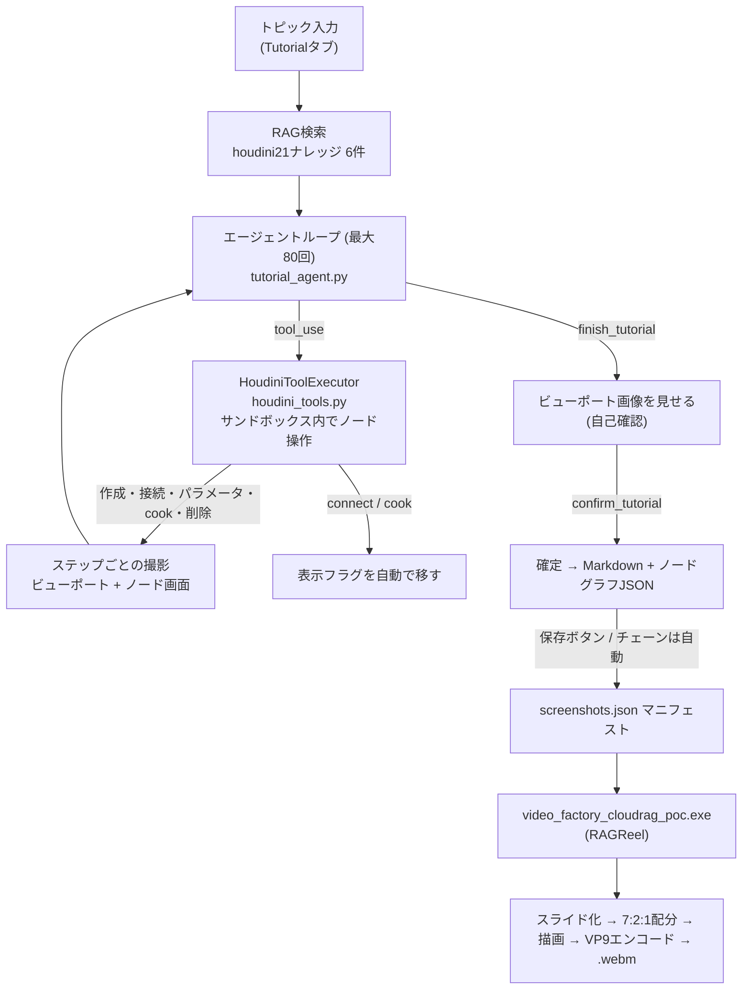
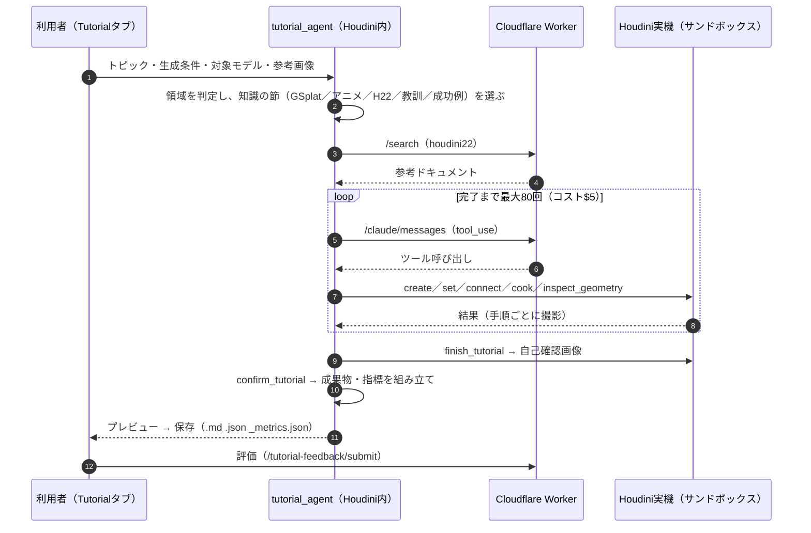
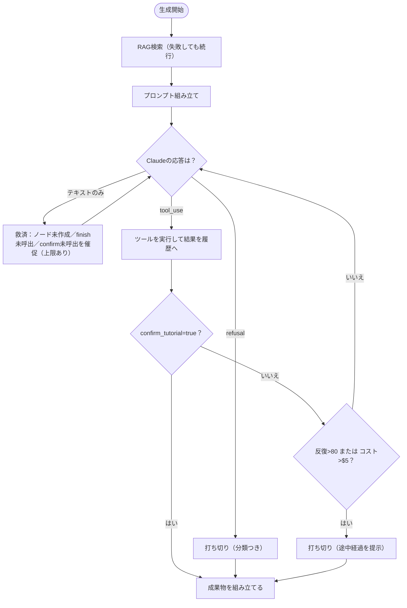
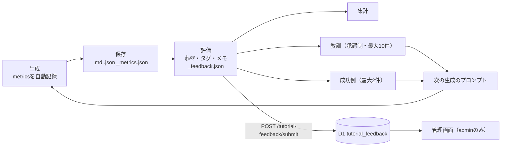

# コンテンツ動的生成 — 設計ドキュメント

**ステータス:** houdini21は実装済み・実機検証済み（2026-07-23、[検証レポート](houdini21-tutorial-gen-report.md)。以降の実機不具合対応は本ファイル2.6/2.8節、および検証レポートの追加検証節を参照）／BrainTQは設計中（実装未着手）
**更新日:** 2026-06-30（2.6/2.8節のみ2026-09-20時点の実装に合わせて更新）

> LocalRAG／CloudRAGを使ったチャットボット機能の次段階として、RAGで取得した知識をもとに**コンテンツを動的に生成**する機能群。houdini21（Houdiniチュートリアル自動生成）とBrainTQ（ミニゲーム動的生成）の2つを「コンテンツ動的生成」という1つのトピックにまとめて扱う。アーキテクチャ・セットアップは [docs/local-rag.md](local-rag.md) / [docs/cloud-rag.md](cloud-rag.md) を前提とする。

---

## 目次

1. [概要](#1-概要)
2. [houdini21 — Houdiniチュートリアル自動生成](#2-houdini21--houdiniチュートリアル自動生成)
   - 2.7. [Goal・完成条件・委任範囲](#27-goal完成条件委任範囲)
   - 2.8. [動画生成連携とその不具合対応](#28-動画生成連携とその不具合対応2026-09-20時点)
   - 2.9. [生成からスクリーンショット・動画までの全体の流れ](#29-生成からスクリーンショット動画までの全体の流れ2026-09-26)
   - 2.11. [動画素材の改善と検索ナレッジの選択](#211-動画素材の改善と検索ナレッジの選択2026-10-04)
   - 2.12. [参考画像つきの生成（テキスト＋画像）](#212-参考画像つきの生成テキスト画像2026-10-05)
   - 2.13. [使えるモデルと料金（Sonnet 5.5 / Opus 5.5対応）](#213-使えるモデルと料金sonnet-55--opus-55対応2026-10-05)
3. [BrainTQ — ミニゲーム動的生成](#3-braintq--ミニゲーム動的生成)（Phase 1 設計確定 / Phase 2 ロードマップ）
4. [共通の設計判断](#4-共通の設計判断)
5. [権利・ライセンスの取り扱い](#5-権利ライセンスの取り扱い)

---

## 1. 概要

これまでのRAGチャットボットは「質問 → 検索 → 回答」の1往復で完結していた。コンテンツ動的生成はこれを発展させ、RAGで取得した知識をもとに**LLMが実際にツールを操作しながら検証済みの成果物を作る**エージェントループに踏み込む。

| | houdini21 | BrainTQ |
|---|---|---|
| 生成対象 | Houdiniノードグラフ＋ステップバイステップのチュートリアル | Phase 1: 既存ミニゲーム向け問題コンテンツ／Phase 2: ミニゲームのScript・Prefab・GameControl.cs分岐 |
| 操作対象 | Houdini（`hou`モジュール） | Phase 1: なし（データ生成のみ）／Phase 2: Unity Editor |
| 検証手段 | cookエラーの自己修正ループ | Phase 1: スキーマ・範囲・重複バリデーション／Phase 2: 未構築（自動テスト基盤が現状ゼロ） |
| 状態 | 実装済み・実機検証済み（Local/Cloud RAG両対応） | Phase 1 設計確定・実装着手前／Phase 2 ロードマップとして文書化 |

両者に共通する設計判断（モデル選定・コスト管理・検証フロー）は[4章](#4-共通の設計判断)にまとめる。

---

## 2. houdini21 — Houdiniチュートリアル自動生成

> 実装・実機検証は完了済み。Cloud RAG対応の経緯とHoudini実機での検証結果は [houdini21-tutorial-gen-report.md](houdini21-tutorial-gen-report.md)（技術資料・mermaid図解付き／[HTML版](houdini21-tutorial-gen-report.html)）、講義資料は [lecture/houdini21-tutorial-gen-lecture.html](../lecture/houdini21-tutorial-gen-lecture.html) を参照。

### 2.1 全体構成

```
Houdiniチャットパネル（rag_chatbot.py）に「チュートリアル生成」モード追加
  │
  ├─ ① RAG検索: houdini21 namespace から関連ドキュメント取得
  │     Settingsタブのモード設定に従い取得先を切り替える:
  │       - local: rag_local_bridge.py の /search
  │       - cloud: gas_cloud_rag.js を mode:'raw' 呼び出し
  │                （最終回答生成をスキップし検索結果のみ取得）
  │     いずれのモードでも取得後に db=="houdini21" 以外を除外し、
  │     ホワイトリスト方針をクライアント側でも強制する
  │
  ├─ ② エージェントループ（MODEL定数のClaudeモデル + Tool Use）
  │     - houdini_tools.py（hou モジュールのラッパー）
  │     - サンドボックスサブネット内でのみノード操作
  │     - cookエラーを自己修正ループにフィードバック（最大MAX_ITERATIONS回）
  │     - プロンプトキャッシュ：システムプロンプト＋ツール定義＋RAGコンテキストを
  │       cache_control で固定し、繰り返しコストを抑制
  │     - Claude API呼び出しは必ず gas_cloud_rag.js 経由（action:'claude_messages'）。
  │       Houdiniクライアントは生のANTHROPIC_API_KEYを持たず、GAS側がAPIキーごとの
  │       Claude専用トークン予算（claudeCapacity/claudeBalance）を強制する。
  │       rag_mode="local"でもこの呼び出し自体はCloud（GAS）経由（docs/cloud-rag.md §8.14）
  │
  ├─ ③ 生成完了後、ノード構成を NodeGraphAsset 形式の JSON にエクスポート
  │     （hou.node()を辿ってnodes/edges/params/positionを抽出）
  │
  ├─ ④ チャット上でMarkdownチュートリアルをプレビュー → ユーザーが保存確認
  │
  └─ ⑤ 保存先：
        localRAG/tutorials/<slug>_<date>.md   （チュートリアル本文）
        localRAG/tutorials/<slug>_<date>.json （ノードグラフ、可視化用）
```

### 2.2 新規コンポーネント

| ファイル | 役割 |
|---|---|
| `houdini/python_panels/houdini_tools.py` | `hou`モジュールのラッパー。`create_node`・`set_parameter`・`connect_nodes`・`cook_node`（エラー検知）・`delete_node`・`list_available_node_types`・`get_node_info`・`finish_tutorial`をAnthropic tool-use形式のスキーマで定義 |
| `houdini/python_panels/tutorial_agent.py` | RAG検索→エージェントループ→Markdown保存のオーケストレーター |
| `rag_chatbot.py`への追加 | 「チュートリアル生成」モード／`/tutorial`コマンド。進行状況（どのツールを呼んでいるか）をリアルタイム表示 |
| ノードグラフJSONエクスポーター | 完成したノード構成を NodeGraphAsset 互換のJSONへ変換 |
| Houdiniパネルの「過去のチュートリアル」タブ | 保存済みチュートリアルの一覧 → 選択するとノードグラフを`QGraphicsView`で表示 |
| `houdini/python_panels/token_usage.py` | チュートリアル生成の累積トークン消費量を`logs/houdini_token_usage.jsonl`に永続化し、Tutorialタブ上部に「残量ドーナツゲージ」（`QPainter`直描画）として可視化。予算はSettingsタブの「トークン予算」で変更可能（既定500,000トークン） |

### 2.3 ツールスキーマ（houdini_tools.py）

| ツール | 役割 |
|---|---|
| `create_node` | サンドボックス内にノード作成 |
| `set_parameter` | パラメータ設定 |
| `connect_nodes` | ノード間接続 |
| `cook_node` | 実行してエラー/警告を取得（自己修正の起点） |
| `list_available_node_types` | 正確なノードタイプ名を検索（Claudeの記憶違い防止。例: `mountain` vs `mountain::2.0`） |
| `get_node_info` | 既存ノードの状態確認 |
| `delete_node` | クリーンアップ用 |
| `finish_tutorial` | 完了案の下書きを提出（即確定はしない。`sources_used`でRAG参考ソース番号も報告。`next_steps`で応用・発展アイデアを3〜5個報告 — 手順の要約に終始せず「自分のプロジェクトでどう使えるか」の手がかりを持たせるための追加、実機で生成物が「概要と手順しかなくロードマップとして弱い」と指摘されたための対応） |
| `confirm_tutorial` | `finish_tutorial`直後に送られるビューポート画像を確認したうえで、`looks_correct=true`なら完了確定・`false`なら`finish_tutorial`からやり直し |

`list_available_node_types`を入れている理由：Houdiniのノードタイプ名はバージョン依存の正確な文字列が必要で、Claudeが記憶だけで呼ぶと失敗しやすい。houdini21のRAGドキュメントと組み合わせて精度を上げる。実機検証で反復予算の30%超をこのツールの呼び出しが消費していたことが分かったため（[検証レポート](houdini21-tutorial-gen-report.md)）、システムプロンプトに頻出ノードタイプ一覧を埋め込み（プロンプトキャッシュされるため追加コストはほぼ無い）、既知のタイプ名については毎回の確認を不要にしている（`tutorial_agent.py`の`_COMMON_NODE_TYPES_BLOCK`）。

**完了フロー（視覚的自己検証）：** `finish_tutorial`は呼ばれた時点では下書き（`pending_finish`）として保持されるだけで、`TutorialResult`は確定しない。その回のtool_resultにビューポートのスクリーンショットが画像コンテンツブロックとして添付され（`houdini_tools.py`の`_capture_finish_screenshot`→`tutorial_agent.py`の`_run_loop`）、Claude自身が見た目を確認してから`confirm_tutorial(looks_correct=true)`を呼ぶことで初めて完了が確定する（`looks_correct=false`なら`pending_finish`はクリアされ、`finish_tutorial`からやり直しになる）。

**RAGソース帰属：** `finish_tutorial`の`sources_used`（実際に参考にしたソース番号の配列）を、生成完了後に`_apply_rag_attribution`が`result.sources`の各エントリの`cited`フラグと`result.rag_extraction_rate`（引用率）に変換し、生成Markdownの「## 参考」節に「✅ 引用済み / ⬜ 未引用」として表示する。Cloud RAGチャットの`parseExtractionRate_()`と同じ考え方のHoudini生成版で、RAGがチュートリアル生成にどれだけ実際に寄与したかを示す研究データとして使う。`_apply_rag_attribution`は`completed`（`finish_tutorial`まで到達したか）も受け取り、打ち切り時は`sources_used`自体が一度もモデルに尋ねられていないため`rag_extraction_rate`を`None`のまま据え置く。「引用0/N件」と「未計測」を区別しないと、実際には評価していないのに"モデルが検討した末に1件も使わなかった"ように誤読される（実機で確認済みの混乱）。

### 2.4 エージェントループ（疑似コード）

```python
sandbox = create_sandbox_subnet()  # /obj/ai_tutorial_<timestamp>　既存シーンを保護
rag_context = query_rag(namespace="houdini21", query=user_request)

messages = [system_prompt(rag_context, sandbox_path), user_request]
step_log = []

for i in range(MAX_ITER):  # 80回（2026-10-05に40から変更）
    response = anthropic.messages.create(
        model="claude-sonnet-5", tools=HOUDINI_TOOLS, messages=messages
    )
    if tool_use_blocks:
        for block in tool_use_blocks:
            result = execute_tool(block.name, block.input, sandbox)  # houdini_tools.py
            step_log.append({tool, input, result})
            if block.name == "finish_tutorial" and executor.last_screenshot_b64:
                result = [text_block(result), image_block(executor.last_screenshot_b64)]  # 視覚的自己検証
            messages.append(tool_result(block.id, result))
        if near_iteration_or_cost_limit() and not grace_warned and still_in_progress():
            messages[-1].content.append(text_block(GRACE_NUDGE_TEXT))  # グレースフル終了
    elif text_only_response:
        break
    if executor.finish_data is not None:  # confirm_tutorial(looks_correct=true)で確定
        break

apply_rag_attribution(finish_data, result)  # sources_used → cited/引用率
tutorial_md = assemble_markdown(step_log, claude_explanation, rag_sources)
show_preview_in_chat(tutorial_md)  # ユーザーが「保存」を押したら localRAG/tutorials/ へ
node_graph_json = export_node_graph(sandbox)  # NodeGraphAsset形式
```

### 2.5 ノードグラフビュー

`Node-Management`（`GameDevelopment\Graduation\Node-Management`、Blenderノードグラフの保存・可視化ツール）の設計を転用する。

| Node-Management（Blender） | Houdini版への転用 |
|---|---|
| `types/nodeGraph.ts`のNodeGraphAsset（nodes/edges/params/position） | ほぼそのままHoudini版スキーマとして使う（`kind`=`node.type().name()`、`params`=`node.parms()`） |
| `blender-addon/exporter.py`（手動でクリップボードエクスポート） | `tutorial_agent.py`が生成完了後に自動でJSON化（手動操作不要） |
| `GraphViewer.tsx`（React Flow、color_tagでヘッダー色分け） | Houdiniパネル（PySide6）の新タブで`QGraphicsView`を使い、同じ配色思想で実装（既存の`graph_view.py`が文書関係グラフで`QGraphicsView`を使っているため実装パターンを流用可能） |
| SQLite + Webアプリ | 不要。生成のたびに`localRAG/tutorials/<slug>_<date>.json`として保存するだけで十分 |

**Cloud RAG対応（Graphタブ）：** `graph_view.py`の`GraphFetchWorker`はRAGモード（local/cloud）を見て、cloudの場合は`gas_cloud_rag.js`の`action:'graph'`エンドポイント（新規追加、`validateApiKey_`→`isRateLimited_`→`buildGraphData_`の標準パターン）へPOSTする。従来のlocal RAGブリッジへのGETのみに固定されていた制約を解消し、Cloud RAG使用時でも文書関係グラフが表示できるようになった。

**グラフレイアウトの不具合修正（実機で確認）：** Cloud RAGの`buildGraphData_`（gas_cloud_rag.js）はノードにx/y座標を付与せずに返す設計だったため、`RAGGraphScene.build()`の`nd.get("x", 0.5)`フォールバックにより全ノードが`(0.5, 0.5)`の同一点に重なって表示されていた（「グラフビューのレイアウトがひどい」として報告）。`graph_view.py`にクライアント側の`_spring_layout()`（`rag_graph_export.py`のLocal RAG用アルゴリズムをPython側に移植）を追加し、x/yが1つでも欠けていればレイアウトを計算して補うようにした。Local RAG（常にx/yを提供）の既存動作は変わらない。

**接続状態ランプ：** Cloud（GAS URL）/ Local（ブリッジ`/health`）への疎通を色（緑=OK/赤=接続なし/黄=確認中）とテキストで表示するランプ。当初はTutorialタブの中だけに表示していたが、他のタブを開いていると確認できず不親切なため、`rag_chatbot.py`側で`QTabWidget.setCornerWidget()`を使いタブバーの右端に移動し、どのタブを操作していても常時表示されるようにした（`_ConnectionLamp`/`_ConnectionCheckWorker`）。バックグラウンドスレッドで20秒ごとに自動再確認し、モード切替・設定保存・チュートリアル生成失敗の直後にも即時再確認する。

**Historyタブのグラフ・テキスト表示改善：** 生成されたHoudiniノードグラフ（数十〜200ノード規模）がそのままだと見づらい問題に対応するため、`tutorial_graph_simplify.py`（Qt非依存の純粋関数）で「線形ノード（分岐/合流せず、他ノードのparentでもないノード）の連鎖」を1つの集約ノードに折り畳む簡易表示アルゴリズムを実装し、ノード数30超では自動的に簡易表示（`tutorial_view.py`の「簡易/詳細」切り替え）を選ぶ。「Mermaidとしてコピー」ボタンで`graph_to_mermaid()`によるMermaid記法への変換・クリップボード出力もできる。生成テキスト側（Markdown表示）もフォント・行間・見出し等のスタイリングを追加して可読性を上げた（Markdown構造自体は変更なし）。

### 2.6 サンドボックス化・安全設計

- ユーザーの既存シーンを壊さないよう、`/obj/ai_tutorial_<timestamp>` のような専用サブネット内でのみノード作成・操作を行う
- 生成完了後もサンドボックスは残す（ユーザーが結果を直接確認できるように）。明示的に「削除」操作をチャット上で選べるようにする
- 反復上限は80回（コスト・暴走防止。2026-10-05に40から引き上げ。パーティクル・シミュレーション系は`dopnet`内のノードが多く、cookのたびに複数フレームを評価して直す往復が増えるため、40回では仕上げの前に打ち切られやすかった。`finish_tutorial`/`confirm_tutorial`に到達すればそこで終わるので、簡単な題材のコストは増えない。コスト上限$5は据え置き）。超えたら「途中までの状態」を提示して打ち切り（初期値25回だったが、実機検証で反復消費が想定より多いタスクがあったため40回に調整。経緯は[検証レポート](houdini21-tutorial-gen-report.md) §4参照）
- **打ち切り時のグレースフル終了：** 反復上限の残り5回以内（3から変更）、またはコスト上限の85%を超えた時点（`GRACE_ITERATIONS`/`GRACE_COST_FRACTION`、`tutorial_agent.py`）で、まだ`finish_tutorial`/`confirm_tutorial`が済んでいなければ「今の状態のまま仕上げてください」という一度だけのシステム通知（`_GRACE_NUDGE_TEXT`）を差し込む。ハード打ち切りで未完成のまま終わる代わりに、多少粗くても完結したチュートリアルになる可能性を上げる
- **シミュレーションノードの複数フレームcook：** pyro/DOP/cloth/particle/flip/RBD等のノードタイプ名（`_SIMULATION_TYPE_HINTS`、部分文字列マッチ）を検出した場合、`cook_node`は単一フレームではなく現在フレームから10フレーム分（`_SIM_COOK_FRAME_COUNT`）を順次evaluateしてから復元する（`houdini_tools.py`の`_cook_simulation_frames`）。シミュレーションは前フレームの結果に依存するため、時間発展する挙動を1フレームだけでは検証できないことへの対応
- **検索連打・空振り終了対策（実機で確認された不具合）：** `list_available_node_types`を3回以上連続で呼んでも`create_node`を呼ばない場合、一度だけ「検索を止めて作成を試して」と促す（`_SEARCH_LOOP_NUDGE_TEXT`、`create_node`が呼ばれるとストリークが解除され再度検索連打があれば再度促す）。電子パーティクル等のPOP/DOP系トピックで検索が過剰発生していたため、`_COMMON_NODE_TYPES_BLOCK`にPOPノード（popforce/popdrag/popwrangle等）も追加した
- **「完了扱い」の誤判定対策（3段階の救済ロジック、2026-09-20時点で3種類を確認・対応済み）：** モデルが`tool_use`無しのテキストのみで応答を終えようとした際、以下の順で状態を判定し、真に何もすべきことが無くなった場合以外は一度だけ再開を促してから打ち切る（`tutorial_agent.py`の`_run_loop`）：
  1. ノードを1つも作っていない → `_EMPTY_HANDED_NUDGE_TEXT`（2回まで救済。1回目より2回目の方が「完璧な再現より基本形状の組み合わせで妥協してよい」と具体的に譲歩する内容に強めてある）
  2. `finish_tutorial`は呼んだが`confirm_tutorial`をまだ呼んでいない（下書きが`pending_finish`のまま） → `_UNCONFIRMED_FINISH_NUDGE_TEXT`（1回まで救済）
  3. ノードは作成済みだが`finish_tutorial`自体を一度も呼んでいない（上記1・2のどちらにも該当しない中間ケース。実装当初はこのケースの救済が漏れており、ノードは正しく組み上がっているのにMarkdownがタイトルだけの汎用フォールバックになる欠陥があった） → `_UNFINISHED_WORK_NUDGE_TEXT`（1回まで救済）
- **`cook_node`の偽陽性対策：** `node.cook(force=True)`が例外を送出した場合、従来は`except Exception: pass`で握りつぶし`node.errors()`だけを見て判定していた。Houdiniのcook失敗は通常`errors()`にも反映されるが、稀に反映されないまま例外だけが飛ぶケースがあり得るため、`errors()`が空でも例外があれば合成のエラー行として結果に含めるようにし、「cook成功（エラー・警告なし）」という誤報でモデルが壊れた状態のまま先に進んでしまうリスクを塞いだ（`houdini_tools.py`の`_tool_cook_node`）
- **サンドボックス削除時のHoudiniフリーズ対策：** `HoudiniToolExecutor.destroy_sandbox()`は`hdefereval.executeInMainThreadWithResult()`でメインスレッドへディスパッチする実装だが、「サンドボックス削除」ボタンのクリックハンドラ（既にメインスレッド）から直接呼ぶと自分自身へのディスパッチ待ちでデッドロックしてHoudiniが固まる（実機で確認済み）。`tutorial_view.py`の`_on_delete_sandbox`を`_DestroySandboxWorker`（QThread）経由の呼び出しに変更して解消
- 保存先ファイル名は `localRAG/tutorials/<slug>_<日付>.md`

### 2.8 動画生成連携とその不具合対応（2026-09-20時点）

保存直後、`tutorial_view.py`の`_on_save`（単発生成）・`_on_chain_done`（3段階連続生成）は`video_factory_bridge.py`経由でLearningQt側の動画生成エンジン（外部exe、`video_factory_cloudrag_poc.exe`）を非同期起動する。各ツール呼び出し直後にビューポート／ネットワークエディタのスクリーンショットを撮影する仕組み（`houdini_tools.py`の`_capture_step_screenshot`、実体は`screen_capture.py`）が、動画の各スライドの素材になる。

- **打ち切り生成の動画化防止：** `result.completed=False`（`confirm_tutorial`まで到達しなかった打ち切り）のまま無条件に動画生成まで進めると、Markdown本文の「> 注意: 打ち切られました」という警告バナーがそのまま動画のナレーション対象になり、見た目には正常な解説動画と区別がつかない不具合が実機で報告された。単発生成（`_on_save`）は確認ダイアログ（既定で動画生成をスキップ）を挟むよう修正済みだったが、3段階連続生成（`_on_chain_done`、確認なしで自動保存する設計のため同じダイアログは出せない）には同じガードが漏れており、チェーンモード経由でのみ同じ不具合が再現する状態だった。`result.completed`を見て自動的に動画生成をスキップする形で、チェーンモードにも同じ安全側デフォルトを適用した
- **動画再生がQtWebEngine/Houdini間のGPUコンテキスト競合で止まる不具合：** Houdini埋め込みのQtWebEngineプレイヤーで動画が「再生中（一時停止アイコン）」のまま0:00から進まない事例が報告された。ffmpeg単体でのデコードは正常なため、ファイル破損ではなくHoudini本体（自前のOpenGLビューポートを持つ）とQtWebEngine（自前のGPUプロセスを持つChromium）のGPUコンテキスト競合が原因と判断。`QTWEBENGINE_CHROMIUM_FLAGS=--disable-accelerated-video-decode`を試みたうえで、常にOS標準の動画プレイヤー（Houdiniとは別プロセス、GPUコンテキスト競合の影響を受けない）で開ける「外部プレイヤーで開く」ボタンを保険として追加した
- **【致命的不具合】動画生成直後にパネル全体が操作不能になる不具合：** 上記の対策後もなお、動画生成完了直後にRAGChatBotパネル全体が異常に横長になり、保存を含む一切の操作ができなくなる不具合が報告された。原因は`VideoLibraryPanel`（保存済み動画の一覧・再生タブ）が、動画一覧でアイテムが選択されるたびに**埋め込みのQtWebEngineビューを自動的にアクティブ化**していたこと。動画生成完了時に`on_video_ready`コールバック経由でこの選択が自動発生するため、ユーザーがどのタブを見ていても動画生成完了の瞬間に必ずトリガーされていた。単発プレビュー用の`QDialog`ベースの埋め込み再生（`_on_preview_video`）も同じ機構だったため、両方から埋め込みQtWebEngineを完全に撤去し、動画再生は常に前項の外部プレイヤー経由に統一した。以降、`houdini/python_panels/`配下からQtWebEngineの埋め込み利用はゼロになっている

**動画生成が遅い問題（2026-09-26）**: 実機で519秒の動画の生成に約17分かかっていた。内訳は音声合成3秒、描画・エンコード993秒で、描画・エンコードの約3/4がlibvpx（VP9）のエンコードだった（同一入力を単独実行したときは約38fps、Houdiniと同時に動かした実機では約16fpsと約2倍遅かった）。エンコード設定を速度優先（`deadline=realtime`・`cpu-used=6`・`row-mt=1`）にし、フレームレートを30→15fpsにしたところ、同一入力で64.5秒に短縮した。動画の長さ（519秒）は音声の長さで決まるため変わっておらず、さらに縮めたい場合はナレーションの分量を減らす必要がある。詳細は RAGReel の `docs/technical-reference.md` を参照。

**パネルのレイアウトが広がる問題（2026-09-26）**: 動画生成を始めると、保存・動画生成の状態を表示する長い1行のQLabel（折り返しなし）が「文字列全体の幅」を最小幅として要求し、Houdiniのペインが横に押し広げられていた。ステータス表示用のラベルを、折り返し有効・水平方向のサイズヒント無視（`token_usage.fit_label()`）にして解消した。

**動画の時間配分（2026-09-26）**: ノード画面7割・ビューポート2割・その他1割を目標に、動画エンジン側（RAGReel）が種別ごとに表示時間を配分するようにした。詳細は RAGReel の `docs/technical-reference.md` を参照。

### 2.9 生成からスクリーンショット・動画までの全体の流れ（2026-09-26）



**撮影**: ノード操作が成功するたび（create/set_parameter/connect/cook/delete）に、(1) ビューポート（`hou.SceneViewer.flipbook()`、cook_nodeでは連番クリップも）と、(2) ノード画面を撮る。ノード画面は、`qtScreenGeometry()`で画面上のペイン矩形を切り出す方法を先に試し、Houdiniがアクティブでない・自分のパネルが重なっている・結果が単色、のいずれかなら自前で描いたネットワーク図にフォールバックする（§8.5参照）。撮影対象は、触ったノードを内包するネットワーク（geoの内部）。

**動画**: スライドは「手順ごとに1枚（ツール結果テキスト＋画像）」と「概要・ハマりポイント・参考などのMarkdownの節」から成る。ナレーションはチュートリアル本文全体を読み上げた1本の音声で、その長さが動画の長さを決める（スライドの切替とは同期していない）。表示時間は種別ごとの目標比率（ノード70%／ビューポート20%／その他10%）で配分する。

### 2.10 Houdini 22への導入（2026-09-26）

Houdini 22.0.429（Python 3.13.10 / PySide6 6.8.3。21.0.700は Python 3.11.7 / PySide6 6.5.3）に対応した。配置は `python houdini/deploy_panels.py 22.0 --pypanel`（`--check`で差分だけ確認、上書き前は自動バックアップ）。hython（実物のHoudini）で、ツール実行・表示フラグの自動移動・ネットワーク図の描画が21・22の両方で同じ結果になることと、パネルUIが22のPySide6で構築できることを確認済み。`hou.NetworkEditor.qtScreenGeometry()`・`setVisibleBounds()`・`hou.BoundingRect`・`SceneViewer.flipbook()`も22に存在する。

- システムプロンプトの「よく使うノードタイプ」に、21・22のどちらにも存在しない名前（`noise::2.0`・`attribrandomize::2.0`・`volumetrim`・`popnet`・`pythonscript`等）が混ざっていたため、実在する名前（`attribnoise::2.0`・`attribrandomize`・`python`等）に直した。POP系はDOPノードで、SOP直下には作れない（`dopnet`の中に作る）点も明記した。
- `.pypanel`のCDATAは、スクリプトのUTF-8バイト列を1バイト=1文字（Latin-1）として読み替えた文字列をUTF-8のXMLとして保存する形式で、日本語や「§」をそのまま書くとHoudiniが読み込み時に壊し、`SyntaxError: (unicode error) 'utf-8' codec can't decode byte 0xa7`になる（2026-09-27に実機で発生。hythonの`hou.pypanel.installFile()`＋`interfaceByName().script()`で再現・修正後にリポジトリの`rag_chatbot.py`と完全一致することを確認）。`deploy_panels.py --pypanel`はこの形式で書く。
- ナレッジ（RAG）は現状`houdini21`のみ。22の新機能・変更点に関する質問への精度を上げるには、22のドキュメントを別namespaceとして同期する必要がある（生成機能が参照するnamespaceは`tutorial_agent.py`の`RAG_NAMESPACES`/`CLOUDFLARE_RAG_NAMESPACES`）。

**ノード画面の撮影が難しかった理由**: (1) Houdiniはペインからウィジェットへの直接参照を公開せず、Python Panelの実行コンテキストからはHoudini本体のウィンドウ階層がたどれない（`hou.qt.mainWindow()`もトップレベルウィンドウ列挙も本体を返さなかった）、(2) 画面座標を返すAPI（`qtScreenGeometry()`）の存在に気づかず、ローカル座標の`screenBounds()`で試して外れた、(3) ペインはタブ切替式で、非表示のタブは描画されない、(4) 実機のPythonコードが手動コピーで、リポジトリの修正が届いていなかった、(5) 撮影対象がgeoの外（サンドボックス直下）だった、という要因が重なった。画面切り出しは「今画面に見えているもの」をそのまま撮るため、他のウィンドウが手前にあると誤った画像になる点も本質的な制約である。

### 2.7 Goal・完成条件・委任範囲

#### Goal（何ができたら完成か）

ユーザーの自然言語リクエストから、Houdiniのノードグラフを実際に組み立て、cookエラーのない状態のチュートリアル（Markdown + ノードグラフJSON）が自動生成される。

#### 完成の条件

| 項目 | 基準 |
|------|------|
| 成功率 | パイロット3〜5トピック（難易度違い）で **80%以上**が反復上限（25回）内に cookエラーなしで収束 |
| 成果物形式 | `localRAG/tutorials/<slug>_<date>.md` ＋ 同名 `.json`（NodeGraphAsset形式）のペアが必ず生成される |
| プレビュー | チャット上でMarkdownがプレビューされ、ユーザーが明示的に「保存」を押すまでファイル書き込みしない |
| 安全性 | 生成過程で `/obj/ai_tutorial_<timestamp>` 以外のノードに一切触れていないことをログで確認できる |
| コスト上限 | 1回の生成が **$5.00 を超えたら自動打ち切り**（ローカル側フェイルセーフ。実際の利用上限はGAS側の`claudeCapacity`が唯一の正で、管理画面から調整する）、ユーザーに途中経過を提示 |
| 知識還流 | 生成物が `localRAG/` 配下に置かれ watchdog が自動インデックス化することを確認済み |

#### 委任範囲

| 判断 | 実装担当の裁量 |
|------|-----------------|
| `houdini_tools.py` のツール実装・プロンプト設計 | 任せてよい |
| 反復上限・サンドボックス命名規則などの実装細部 | 任せてよい（本章の設計方針内） |
| モデル変更（Sonnet→Opus等）の**提案**まで | 任せてよい（実測データを揃えて提案） |
| モデル変更の**実行**（コストが変わる） | 要確認 |
| サンドボックス外のノード・既存シーンに触れる変更 | 絶対不可。設計上の制約であり、逸脱時は即報告 |
| 生成コンテンツを商用配布物に含める判断 | 要確認（[5章](#5-権利ライセンスの取り扱い)の権利問題に直結） |
| houdini21DB（RAGコーパス）への新規ドキュメント追加 | 要確認（出典検証が必要なため。詳細は[5章](#5-権利ライセンスの取り扱い)） |

---

## 3. BrainTQ — ミニゲーム動的生成

**対象リポジトリ:** `GameDevelopment\Enterprises\AXTechCare\BrainTQ_Chatbot\Assets\Scripts`
**BrainTQの正体:** 自社（AXTechCare）の脳トレ・認知トレーニングアプリ。Gemini Live APIによる音声相談チャットボット（TIPI-J/HHIE-S/MMSE等の医療系認知スクリーニングを実施）とミニゲーム群で構成される。

### 3.1 既存コードベース調査結果（設計の前提）

houdini21と同じ「LLMがツールを呼んでゼロから成果物を組み立てる」モデルをそのまま適用することは**現実的ではない**。実際のコードを精査した結果、以下の制約が判明した。

| 観点 | 調査結果 |
|---|---|
| ミニゲーム数 | 約150個のC#スクリプト |
| 基底クラスの一貫性 | `MiniGameBaseClass`（タイマー・一時停止・結果表示の共通フレームワーク）を継承しているのは150個中**14個のみ**。大半は同じパターンを手書きで再実装した独立`MonoBehaviour` |
| オーケストレーター | `GameControl.cs`（1653行）が`switch(gameID)`の巨大分岐でプレハブをInstantiate。`InGameControl.cs`（4705行）が全ゲーム共通UI（タイマー・結果画面・コイン報酬・脳年齢計算等）を一元管理 |
| プレハブ依存 | 各ミニゲームはUnity Editorで手作業ワイヤリングされた専用プレハブが必須。`[SerializeField]`参照（ボタン・スプライト・プレハブスロット等）は設計時バインドであり、**コードだけでは動くゲームにならない** |
| コンテンツ生成方式 | 調査対象（`CalculateFormulaControl.cs`）は問題を**完全に手続き的（ランダム生成）**に作っており、外部データを読み込む仕組みが存在しない |
| チャット連携 | チャットボット（`ChatBotControler.cs`等）とミニゲームシステムは完全に独立しており、両者を繋ぐ仕組みは一切存在しない |
| 自動テスト | ゼロ。NUnit/PlayModeテストは存在せず、品質保証は完全に人手のプレイテスト |
| 設計ドキュメント | プロジェクトルートやAssets配下にREADME・設計ドキュメントは存在しない |

これらの制約から、**2段階のロードマップ**として設計する。

### 3.2 Phase 1（着手対象）— コンテンツ生成パイプラインの実証

ミニゲームの「機構」そのものではなく、**既存テンプレートに流し込む「問題コンテンツ」をRAGで動的生成する**ことに絞る。スクリプト生成もプレハブ生成も不要なため、houdini21より大幅に小さいスコープで実装できる。

```
① パイロット対象の選定: Calculation（計算力）系ゲームを対象とする
   （CalculateControl.cs / CalculateFormulaControl.cs の構造を調査済み）

② 外部コンテンツ注入口の追加（最小限のコード改修）
   CalculateFormulaControl.Init() は現状ランダム生成のみ。
   List<CalculateControl.CalculateQuestion> を受け取るオーバーロードを追加し、
   外部コンテンツがあればそれを使用、なければ従来のランダム生成にフォールバック

③ RAG検索 → コンテンツ生成
   RAG検索（AXTechCareの文脈・トピック指定、例:「認知症予防に関連した計算問題」）
   → Claudeが CalculateQuestion 互換のJSON（choices[] / correctChoiceIndex）を構造化生成
   → バリデーション（数値範囲・難易度・重複チェック）
   → コンテンツパックJSONとして保存

④ Unity側がコンテンツパックJSONを読み込んでプレイ
```

この段階では **GameControl.cs の分岐にもプレハブにも触れない**。RAG→コンテンツ→Unityというパイプライン自体の実証が目的。

### 3.3 Phase 2（将来目標）— フルミニゲーム生成

Script・Prefabの型・`GameControl.cs`の分岐追加までを自然言語指定とドキュメントから自動生成する最終形。Phase 1の実証を経てから着手する。

| 要素 | 内容 |
|---|---|
| **ミニゲームDocumentマニュアル** | `MiniGameBaseClass`の契約（`SetInGameControl`/`StartGame`/イベントフック）・`InGameControl`が提供するAPI・`GameType`8分類（記憶力/計算力/空間認識/言語能力/予知処理/論理思考/集中力/視覚認識）・`GameDetails`登録形式・`GameControl.cs`の分岐パターンを整理し、RAG資産として整備する。これがhoudini21における houdini21DB（Notion RAGドキュメント）に相当する役割を持つ |
| **Script生成** | 規約に沿った新規C#スクリプトをLLMが生成。`MiniGameBaseClass`継承を必須として強制し、150個中14個しか使っていない一貫性のないパターンを新規生成では踏襲させない方針とする |
| **Prefab生成（最大の技術的障壁）** | Unityプレハブは手作業ワイヤリング前提であり、YAMLを直接生成させるのは非現実的。2つの方向性を検討： (a) 再利用可能なUIプリミティブ（ボタングリッド・タイマースライダー・テキスト表示等）のライブラリを用意し、実行時に手続き的に組み立てる方式（既存パターンからの逸脱が大きい） (b) Unity Editor拡張をLLMがツール呼び出しで操作し、GameObject階層を構築してプレハブとして保存する方式（Houdiniの`hou`モジュール操作と同型のアーキテクチャ） |
| **GameControl.cs分岐追加** | `switch(gameID)`への新規case追加＋`AllGames`静的リストへの`GameDetails`エントリ登録。スコープが明確な機械的改修であり、houdini21の`create_node`のような独立ツールとして実装しやすい |
| **検証基盤（現状ゼロから構築）** | 自動テストが存在しないため、houdini21の`cook_node`に相当する自己修正ループの土台がない。Unity Editorバッチモードでのコンパイルチェック＋生成プレハブをInstantiateして例外なく動作するか確認する簡易PlayModeテストを新規構築する必要がある |

### 3.4 Phase 1 → Phase 2 の橋渡し

Phase 1で構築する「RAG検索→構造化コンテンツ生成→バリデーション」のパイプラインは、Phase 2でもそのまま再利用できる（Script/Prefab生成の入力として使う問題コンテンツの生成自体は変わらないため）。また、Phase 1の改修作業（既存ゲームの構造を読み解き、外部注入口を設計する過程）そのものが、3.3の「ミニゲームDocumentマニュアル」の最初の素材になる。

---

## 4. 共通の設計判断

### 4.1 モデル選定

ツール呼び出しを伴うエージェントループには、単発チャット（現状Haiku使用）より高度な推論が必要なため **Claude Sonnet 5**（`tutorial_agent.py`の`MODEL`定数）を使用する。

### 4.2 コスト見積もり（houdini21の試算、参考値）

| 構成要素 | 概算トークン数 |
|---|---|
| システムプロンプト＋ツール定義8個 | 約1,300 |
| RAG検索コンテキスト（1トピック分） | 約2,000 |
| 1ツール呼び出し往復（Claude応答＋ツール結果） | 約250〜500 |

15ステップ程度の生成タスクで、**プロンプトキャッシュなしの場合は概算8万トークン・$0.25〜0.35/回**程度（Sonnet 4.6: $3/$15 per 1M tokens換算）。会話履歴を毎ターン再送する構造上、ステップ数に対してほぼ線形〜やや超線形に増える。

**プロンプトキャッシュ（`cache_control`）は必須。** 固定部分（システムプロンプト・ツール定義・RAGコンテキスト）をキャッシュすれば、2回目以降のターンはこの部分が約1/10のコストになる。

> **2026-08-08 追記（実機で1生成$3超を確認）：** 上記の「固定部分だけキャッシュ」では、反復のたびに伸びていく**会話履歴そのもの**（ツール結果・アシスタント応答の蓄積）が毎ターン通常入力価格（$3/M）で再送信され続けることを見落としていた。固定部分（〜数千トークン）に対して会話履歴は反復数に比例して数万トークンまで伸びるため、実質的にはコストの大半がキャッシュされていなかったことになる（1生成あたり反復回数のほぼ2乗でコストが増える構造）。`tutorial_agent.py`の`_run_loop`で、直前のターンまでの会話の末尾に`cache_control`を付け直す「ローリングキャッシュ」（Anthropicの4breakpoint制限内に収まるよう、古い位置のマーカーは毎ターン外す）を追加し、会話履歴もキャッシュ読み込み価格で再利用できるようにした。長い生成ほど削減効果は大きくなるはずだが、実測での検証が必要。

> 上記はいずれも設計段階の見積もりであり、実測値ではない。実装後にパイロット実行で検証すること（[4.3](#43-検証フロー)参照）。

### 4.3 検証フロー

実装が一通り動いたら、難易度の異なる2〜3個の生成タスクでパイロット実行し、以下を同時に確認する：

1. **トークン消費の実測値**（見積もりとの乖離を確認）
2. **生成品質**（houdini21の場合：ノードグラフが実際に正しく動くか／cookエラーなく完成するか）
3. **自己修正ループの収束性**（cookエラーから何往復で収束するか。収束しないと反復上限に張り付いてコストだけ膨らむ）

この検証結果をもとに、モデル選定（Sonnet継続 or Opus検討）・反復上限・プロンプト設計を再調整する。

### 4.4 保存先と知識ベースへの還流

生成された成果物（houdini21のチュートリアル等）は`localRAG/`配下に保存することで、watchdogによる自動インデックス化の対象になる。つまり**生成したコンテンツがそのまま将来のRAG検索資産になる**という自己拡張するフィードバックループを持つ。BrainTQの設計でも同様の還流構造を検討する。

---

## 5. 権利・ライセンスの取り扱い

RAG機能自体の商用展開（Cloud RAGのチーム外提供等）に伴うライセンスリスクが、コンテンツ生成機能の**生成物**に混入しないよう、発生源で遮断する設計方針を取る。

**要点（詳細は [docs/license-compliance.md](license-compliance.md) 参照）:**

- RAGコーパスのうち生成機能から参照してよい namespace をホワイトリスト化する（houdini21DBは出典棚卸し後にのみ許可、`tool_docs`/`research`等の一般namespaceは生成機能からは参照しない）
- 生成直前に RAG チャンクとの n-gram 一致率チェックを行い、出典からの逐語コピーが混入していないか機械的に検証する
- 生成物（チュートリアル・ノードグラフ・ミニゲームコンテンツ）の著作権は生成を実行した顧客に帰属する方針とし、利用規約に明記する
- houdini21DBのように外部ツールの公式ドキュメントに由来しうるコーパスは、コピーではなく独自の要約・説明になっているか一度棚卸しする

houdini21DB（§2章の生成機能が参照するRAGコーパス）への新規ドキュメント追加が「要確認」（[2.7](#27-goal完成条件委任範囲)）とされているのは、この出典検証が理由である。

### 2.11 動画素材の改善と検索ナレッジの選択（2026-10-04）

Houdini 22での実機生成の結果から、次の4点を直した。

**1. 検索するナレッジがHoudini 21固定だった**: 設定画面の「DB」欄（`gas_db_key`）をhoudini22にしていても、チュートリアル生成は常に`shared:houdini21`を検索していた。「DB」欄はチャットタブ（GAS）用の設定で、チュートリアル生成は別の定数（`CLOUDFLARE_RAG_NAMESPACES`等）を見ていたため。Cloudflareの実データは`shared:houdini22`が8,747チャンク、`shared:houdini21`が144チャンクで、生成は薄い方のナレッジで動いていた。新しい設定`tutorial_rag_namespace`（Settingsタブの「検索するナレッジ」）で選べるようにし、空欄なら起動中のHoudiniのメジャーバージョンに自動で合わせる（Houdini 22なら`houdini22`）。ライセンス方針（参照してよいのはHoudini公式ドキュメント系のみ）を保つため、`houdini<数字>`以外の値は受け付けず自動判定に戻す。進捗表示・システムプロンプト・保存するMarkdownのタグ・動画のブランド表示（以前は常に「HOUDINI21」）・動画エンジンへ渡すDBキーも、すべて選んだナレッジに合わせた。検索結果が0件のときは、検索対象のnamespaceを明示して警告する。

**2. Houdini Consoleが動画のノード画面に写り込んでいた**: ログを`print()`していたため、Houdiniが標準出力への初出力時に「Houdini Console」ウィンドウを開き、それがネットワークエディタのペインの下半分に重なっていた。ログは`capture.log`にだけ書くようにした。あわせて、画面切り出しの前に、ペインの矩形内の複数の点で最前面のウィンドウを調べ、別のウィンドウ（コンソール等）や他アプリが重なっていれば撮らずに自前描画の図へ切り替える（中心1点だけの検査では一部だけに被さるウィンドウを見逃していた）。

**3. スライド左側の文章が意味不明だった**: ツールの結果文（「接続しました: A[out:0] → B[in:0]」）をそのまま出していたため。各ステップで学習者が行う操作を1〜2文で書くようにした（例: 「box_strip の出力を、bend_curve の入力につなぐ」「「Attribute Wrangle」ノード（attribwrangle）を作り、名前を bend_curve にする」「bend_curve を評価（cook）して、エラーが出ないことを確認する」）。元のツール結果は記録（マニフェスト）の`tool_result`に残る。

**4. パラメータの変更箇所が動画から分からなかった**: `set_parameter`のステップでは、ネットワーク画面の代わりに「パラメータカード」を撮る。変更したパラメータの表示名（Houdiniの画面と同じ「Size X」「Divisions Z」等）・内部名・旧値→新値を並べ、VEXなどのコード欄は等幅のコードブロックで見せる。同じノードへの連続した`set_parameter`は1枚のカードにまとめる（以前は7個の設定が7枚の似たスライドになっていた）。実画面のパラメータペインを撮らず描き直しているのは、どのパラメータを変えたかを強調でき、他のウィンドウの重なりにも影響されないため。動画エンジン側は、パラメータカードのステップをビューポートの画像に差し替えない（記録の`network_kind: "parameter"`で判別）。

### 2.12 参考画像つきの生成（テキスト＋画像）（2026-10-05）

テキストのトピックだけだと、ユーザーの求める完成イメージからズレることがある。Tutorialタブに「参考画像」の行を追加し、スクリーンショット・写真・ラフなどを最大4枚まで添えて生成できるようにした（「参考画像を追加…」でファイル選択、「クリップボードの画像」でコピー済み画像を貼り付け、「クリア」）。添付は生成を開始してもクリアされない（同じ画像で作り直せる）。3段階連続生成でも、3レベルすべてに同じ参考画像を渡す。

- **Claudeへの渡し方**: 最初のユーザーメッセージに、`[参考画像 N: ファイル名]`のラベルつきで画像ブロックを載せ、続けてトピックと「上の画像は完成イメージの参考」という指示を書く。画像は長辺1280pxに縮小しJPEGに再エンコードする（透明PNGは白背景に合成。Houdini同梱のQtでJPEGが書けない場合はPNG）。1枚あたり約1,200〜1,600トークン。GAS経由・Cloudflare経由のどちらも`messages`をそのままClaudeへ中継するので、追加の対応は要らない（`finish_tutorial`直後の自己確認画像が既に同じ経路を通っている）。
- **システムプロンプト**: 参考画像があるときだけ「参考画像について」の節を足す。作り始める前に特徴（形・構成・色・質感・密度）を3〜5点に整理すること、Houdiniで再現できる範囲に収めること、`finish_tutorial`直後のビューポート画像を参考画像と見比べて`confirm_tutorial`を判断すること、`steps`の冒頭に「参考画像から読み取った特徴」を書くこと、テキストと画像が食い違う場合はテキストを優先して`pitfalls`に書くこと、を指示する。画像が無いときのプロンプトは従来と完全に同じ。
- **保存**: チュートリアルのフロントマターに`reference_images: <枚数>`を記録する。
- **Cloudflare Worker側の見積もり修正**: `/claude/messages`の入力トークン見積もりが、画像のbase64文字列をそのまま文字数÷3で数えていたため、画像1枚で約10万トークンの過大見積もりになっていた（Claude予算を設定したキーでは、残りがあっても予約が通らなくなる）。画像はbase64を数えず1枚あたり1,600トークンの固定値で見積もるようにした（`estimateInputTokens`）。予算が未設定（無制限）のキーでは影響が無い。
- **今後**: 画像から特徴を読み取る処理はモデルに任せている。動画のイントロに参考画像を表示する、画像とのズレを数値で評価する、といった拡張は未着手。

### 2.13 使えるモデルと料金（Sonnet 5.5 / Opus 5.5対応）（2026-10-05）

Settingsタブの「チュートリアル生成モデル」で、次の4つから選べる。既定は変えていない（`claude-sonnet-5`）。

| モデル | 入力 / 出力（$ per 1Mトークン） | キャッシュ読み取り | 備考 |
|---|---|---|---|
| `claude-sonnet-5`（既定） | $2 / $10 | $0.20 | |
| `claude-sonnet-5-5` | $2 / $10 | $0.20 | Sonnet 5の後継、同価格 |
| `claude-opus-5-5` | $4 / $20 | $0.20 | Opus 5（$5 / $25）より安い。Opus 5.5だけキャッシュ読み取りが入力の0.05倍 |
| `claude-haiku-4-5` | $1 / $5 | $0.10 | 低コスト、品質は下がる場合がある |

出典は公式の料金ページ（2026-10-05確認）。1Mトークンの文脈でも割増は無い。バッチ（50%引き）はこのツールの用途（対話的なエージェントループ）では使えない。

**Sonnet 5の単価を$3/$15から$2/$10に修正**: 発売時は2026-08-31までの導入価格とされ、コードは「9/1から$3/$15に上がる」前提で$3/$15を使っていた。公式に「$2/$10が標準価格になり値上げは行わない」と改められたため、画面に出る生成コストが実際より約1.5倍高く出ていた。Cloudflare Workerの利用統計（`usageStats.ts`）の単価表も同じ値に直した（Worker側はデプロイ待ち）。

**実ログによる比較**: 直近12回の生成の実測トークン数（`houdini_token_usage.jsonl`）を各モデルの単価で再計算すると、1回あたりの平均はSonnet 5.5が約$0.67、Opus 5.5が約$1.26（Sonnet 5.5の約1.9倍）、Opus 5が約$1.67だった。トークンの内訳は、キャッシュ読み取りが65%、通常の入力が27%、出力が4%、キャッシュ書き込みが4%で、Opus 5.5のコストの内訳は通常の入力50%・出力34%・キャッシュ書き込み10%・キャッシュ読み取り6%。ただしモデルごとにトークン数（特に思考の量）は変わるため、実際のコストは上下する。

**5.5系モデルを使うために入れた対応**:
- 1ターンの出力上限（`MAX_TOKENS_PER_TURN`）を4096から16000に上げた。5.5系は常に思考が有効で、思考のトークンも`max_tokens`に数えられるため、4096だと思考だけで使い切って、長いコードを含むツール呼び出しが途中で切れる恐れがある。
- `stop_reason: "refusal"`（安全分類器による拒否。HTTP 200で返り、`content`は空や途中まで）を検知し、分類（`stop_details.category`）つきで打ち切る。以前はツール呼び出しが無いので「作業を終えた」と誤認し、救済の催促を重ねていた。出力上限（`max_tokens`）に達した場合は警告を出す。
- リクエストに、5.5系で400になるパラメータ（`thinking: disabled`、強制の`tool_choice`、`temperature`等）は含まれていない。`cache_control`の付け替え（ローリングキャッシュ）は、思考ブロックの履歴検査の対象となる「編集」に当たらない。

**effort（思考の深さ）は5.5系で`medium`（2026-10-05）**: Sonnet 5.5の既定は`high`だが、公式は多段のツール利用タスクの出発点として`medium`を勧めている（Anthropicの検証では、エージェント系のコーディングでSonnet 5.5の`medium`がSonnet 5の`high`を上回り、コストは5分の1未満）。`tutorial_agent.py`の`_MODEL_EFFORT`で`claude-sonnet-5-5`と`claude-opus-5-5`にだけ`medium`を送る（Opus 5.5は既定も`medium`だが明示する）。effortを受け付けないHaiku 4.5と、未検証のSonnet 5には送らない。Cloudflare Worker（`/claude/messages`）は`output_config`のうち`effort`だけを検証して中継する（`low`/`medium`/`high`/`xhigh`/`max`以外は黙って捨てる）。品質とコストへの効果は実測していないので、生成結果とコストを見て`_MODEL_EFFORT`を調整する。

**未着手**: サーバー側フォールバック（拒否時に別モデルで再試行）。

### 2.14 生成条件・対象モデル・GSplat／アニメーション対応（2026-10-05）

**生成タブの追加欄**
- 「生成条件」: 自由記述。トピックより優先され、システムプロンプトと最初のメッセージに「必須条件」として入る。満たせなかった場合は`pitfalls`に理由を書かせる。frontmatterに`requirements`として残る。
- 「対象モデルを選択…」: fbx / glb / gltf / usd / obj / bgeo / abc / ply。拡張子に応じた読み込みノード（`kinefx::fbxcharacterimport`の`fbxfile`、`gltfcharacterimport`の`gltffile`、`usdcharacterimport`の`usdfile`、それ以外はFile SOP）をプロンプトで指示する。ファイルは読み取り専用。frontmatterに`target_model`として残る。

**ガウシアンスプラット**: Houdini 22のGSplatは3DGS属性（`f_dc_0〜2`、`opacity`、`scale_0〜2`、`rot_0〜3`）を持つ**ポイント**。3DGS形式の`.ply`はFile SOPで読め、手続き生成（scatter → attribwrangle → `bakegsplat`）でも本物のGSplatになる（`bakegsplat`が`orient` / `scale` / `Cd` / `GS_Alpha`とKarma用の属性へ変換することをhythonで確認）。以前は「GSplat風」の代用で済ませていたため、トピック・条件に`gsplat` / `ガウシアン`等が含まれると、この知識の節をプロンプトに足す。

**アニメーション**: `set_parameter`が固定値しか設定できず、式を渡すと失敗していた。`expression`（Hscript）と`keyframes`（`interpolation`: bezier/linear/constant/ease）を追加し、設定後に3フレームの評価値を返す。不正な式は評価値が黙って0になるため、`node.errors()`を拾って返す。`cook_node`は時間依存ノードを10フレーム評価する。

**ノード種別の一覧**: `list_available_node_types`に`Cop`（Copernicus）・`Lop`・`Chop`を追加（`Cop2`は旧COP）。

### 2.15 ツールの強化とHoudini 22の新機能（2026-10-05）

Houdini 21と22の全ノードタイプを実機で比較し、22で増えた241ノード（COP 123 / SOP 75 / LOP 21 / VOP 11 / TOP 8 / ROP 2 / DOP 1）を、ツール経由で作成・cookして確認した（COPのレシピ245個はノードではないので対象外）。作成は全て成功。cookのエラーは入力未接続が原因で、ツールの不具合ではなかった。VOPの11個（MaterialX、`kma_*`）は`attribvop`の中には作れず、LOPの`materiallibrary`の中に`subnet`を作ればその中に作れる（`mtlxbuilder`というタイプは無い）。その過程で見つかった以前からの不具合・未対応を直した。

| 項目 | 以前 | 今 |
|---|---|---|
| ノードの中身の確認 | cookの成功しか分からず、点が0個・一定値の画像・属性の付け忘れに気づけなかった | `inspect_geometry`を追加。SOP: 点/プリム数・バウンディングボックス・属性（型と値の範囲）・グループ・GSplatの判定。COP: 解像度・チャンネル・最小/最大/平均・一定値の検出。LOP: プリム一覧 |
| ランプ（グラデーション・カーブ） | `value`に`"0 1"`を渡すとポイントが1個に潰れるのに「ok」と返っていた | `value`は拒否して案内を返し、`ramp`（`pos`と`value`の配列、色は`[r,g,b]`）で設定する |
| 入力の取り違え | 番号だけの接続。`turbnoise`の入力0は`pos`ではなく`type`なのに、つないでもcookが通る | `input_name` / `output_name`で指定でき、接続結果に入出力名を返す（`in:0 type`）。`get_node_info`も入力名を出す |
| TOPの`cook_node` | 作業項目が0件のまま「cook成功」 | 作業項目の**生成**までを行い、上流を含めた件数を返す。作業の**実行**（`pythonscript`・ファイル出力・プロセス起動）は、サンドボックスのノードパス制限では防げない副作用があるため行わない |
| プロンプト | SOP中心 | 共通ノード一覧にUV・マテリアル・Copernicus・LOP・TOP・CHOP・VOPを追加。Houdini 22で動いているときだけ、新機能の節（実在確認済みの名前41個）を足す |

**未対応**: APEXグラフの中身の編集、TOPの作業の実行、レンダリング・画像書き出し、フレーム範囲の設定、ノードのフラグ（バイパス等）、HDA化。

### 2.16 評価（good/bad）と、そこからの学習（2026-10-05）

生成されたチュートリアルに👍/👎・理由タグ・一言メモを付け、その内容を集計・プロンプトへ反映する。これは**モデルの重みを学習させるものではなく**、過去の評価を「設定選びの根拠」と「プロンプトへの入力」に使う仕組み（`tutorial_feedback.py`）。

**記録（生成物の隣のサイドカー）**
- `<名前>_metrics.json`: 生成時に**自動で**残す指標。モデル・レベル・領域（general / gsplat / animation / particles / simulation / copernicus / solaris / material / uv）・反復回数・cookエラー数・`confirm_tutorial`の差し戻し回数・ノード数・コスト・トークン・所要時間・打ち切りか・RAG利用率・条件/参考画像/対象モデルの有無・反映した教訓と成功例の件数。人手の評価が無くても傾向を集計できる。
- `<名前>_feedback.json`: 履歴タブで付けた評価（👍=1 / 👎=-1、理由タグ、メモ、評価時点の題名・トピック・概要・使ったノード）。

**反映（軽い順）**
1. **集計**（履歴タブ「評価の集計…」）: モデル・レベル・領域・理由タグ別の好評率、平均反復、平均コスト、平均cookエラー、打ち切り率。評価が少ないうちは参考程度。
2. **教訓**（履歴タブ「教訓…」、`localRAG/tutorial_lessons.json`）: 👎のメモからClaudeに「避けること」の候補を作らせる（1回の呼び出し）。候補は**未承認**で追加し、ユーザーが読んでチェックを入れたものだけをシステムプロンプトに入れる（最大10件）。生の失敗例をそのまま渡すとモデルが真似るため、一般化したルールの形にする。自分で書いて足すこともできる。
3. **成功例**: 新しい生成のとき、似たトピックで👍だった（かつ完走した）チュートリアルの題名・概要・使ったノードを最大2件、「構成の参考」として渡す（トピックの文字・単語の重なりで選ぶ軽い方式）。

**Cloudflareでの管理者限定の閲覧**: 評価を付けると`POST /tutorial-feedback/submit`へ送る（ベストエフォート。失敗してもローカルの評価は残り、状況は履歴タブに出る）。送るのは題名・トピック・概要の抜粋・評価・タグ・メモ・数値の指標だけで、チュートリアル本文は送らない。1ユーザー×1チュートリアルで1行（評価を付け直すと上書き、`rating:0`で取り消し）、他人の行は触れない。閲覧・集計は管理画面「利用状況・コスト」タブの「Houdiniチュートリアルの評価」（モデル/レベル/領域/タグ別、一覧、CSV）と`POST /admin/tutorial-feedback/list` / `stats`で、**adminロールのみ**（`requireAdmin`。非adminは403）。テーブルは`migrations/0017_tutorial_feedback.sql`。

**効果の測り方**: 指標に`lessons_used` / `examples_used`が残るので、「教訓を入れた生成」と「入れない生成」を同じ題材で比べられる。評価者が1人だと自分の好みへの最適化になるため、客観指標（cookエラー数・打ち切り率）と併せて見る。

### 2.17 図で見る全体像（2026-10-08）

ブラウザで見やすい版（色分けしたSVGの図・表）は [system-guide.html](system-guide.html) にある。ここではMermaidで同じ内容を示す。

**生成の流れ**



**エージェントループの判断**



**評価と学習のループ**



**ツールの追加分（2026-10）**

| ツール | 追加・変更 |
|---|---|
| `set_parameter` | `expression`・`keyframes`・`ramp`。ランプに`value`を渡すと拒否して案内 |
| `connect_nodes` | `input_name`／`output_name`。結果に入出力名を返す |
| `cook_node` | 時間依存ノードは10フレーム評価。TOPは作業項目の生成まで |
| `inspect_geometry` | 新規。SOP・COP・LOPの中身を数値で確認 |
| `list_available_node_types` | `Cop`・`Lop`・`Chop`を追加 |
