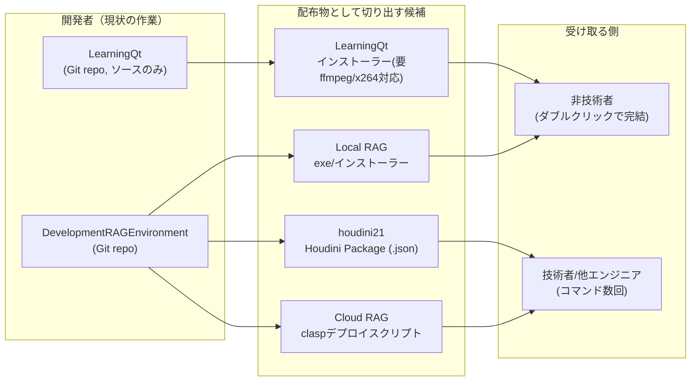
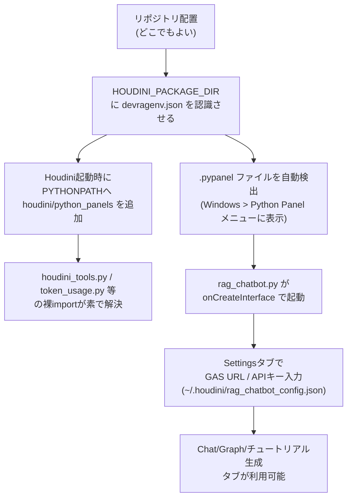

# 配布戦略調査・提案書（RAG本体 / 動画生成 / houdini21チュートリアル生成）

**対象:** DevelopmentRAGEnvironment（本リポジトリ）+ LearningQt（別リポジトリ、動画生成）
**位置づけ:** 調査・提案書。本ドキュメントはコード変更を行わない（新規ドキュメントファイルのみ）
**更新日:** 2026-08-06
**関連ドキュメント:** [docs/local-rag.md](local-rag.md) / [docs/cloud-rag.md](cloud-rag.md) / [docs/license-compliance.md](license-compliance.md)

> **重要な前提:** 本ドキュメントの§6（ライセンス実務下調べ）は pip/PyPI・GitHub 上の公開情報に基づく技術者としての一次調査であり、法的判断ではありません。特許出願の可否については別タスクで扱われているため本書では触れません。**MITライセンス化・商用配布に関する最終的な適法性判断は、必ず弁護士等の専門家に確認してください。**

---

## 目次

1. [概要と検討の前提](#1-概要と検討の前提)
2. [RAG本体（Local RAG）の配布](#2-rag本体local-ragの配布)
3. [RAG本体（Cloud RAG / GAS）の配布](#3-rag本体cloud-rag--gasの配布)
4. [LearningQt（動画生成）の配布](#4-learningqt動画生成の配布)
5. [houdini21チュートリアル生成の配布](#5-houdini21チュートリアル生成の配布)
6. [ライセンス実務下調べ（MIT化に向けた一次確認）](#6-ライセンス実務下調べmit化に向けた一次確認)
7. [全体比較と推奨優先順位](#7-全体比較と推奨優先順位)
8. [免責事項](#8-免責事項)

---

## 1. 概要と検討の前提

現状、3つのシステムはいずれも「開発者本人が手元で動かす」ことを前提に作られており、配布単位も方式もそれぞれ異なる。

| システム | 実体 | 現在の配布単位 | 現在の受け取り側の作業 |
|---------|------|--------------|----------------------|
| RAG本体・Local | Python（uv管理） | Gitリポジトリそのもの | `git clone` → `uv sync` → 環境変数設定 → インデックス化 |
| RAG本体・Cloud | GAS（Apps Script）+ Notion + Sheets | `scripts/gas_cloud_rag.js` のソース1本 | GASエディタにコピペ → スクリプトプロパティ9個設定 → デプロイ |
| 動画生成（LearningQt） | C++/Qt/CMake/vcpkgビルド | ソースリポジトリ（ビルド未配布） | CMake/vcpkgでフルビルド（開発者以外は非現実的） |
| houdini21チュートリアル生成 | Houdini Python Panel（.py 8ファイル） | `houdini/python_panels/*.py` | Python Panel Editorへの手動コピペ or ファイルコピー |

全システム共通で言えることは、**「配布」と「インストール手順書」の境界が今は存在しない**（配布物＝ソース、セットアップ手順＝ドキュメント頼み）という点である。以降の各章では、この境界をどこに引くか（＝どこまでを「配布物」としてパッケージ化するか）を軸に選択肢を比較する。

---

## 2. RAG本体（Local RAG）の配布

### 2.1 現状の「動かすために必要なもの」

`docs/local-rag.md` §3・`pyproject.toml` から確認した実態:

| 要素 | 内容 |
|------|------|
| OS | Windows 11（Docker/WSL2不要、2026-06-30の構成変更で解消済み） |
| Python管理 | uv（Python 3.13を自動管理） |
| 主要依存（`pyproject.toml`） | `chromadb>=1.5.9` / `sentence-transformers` / `sentencepiece` / `markitdown[all]` / `sudachipy>=0.6.11` / `sudachidict-core` / `rank-bm25>=0.2.2` / `watchdog>=6.0.0` / `numpy` / `pyyaml` / `requests` / `yt-dlp`（新規追加） |
| 別途手動インストール | `feedparser`（`rss_to_rag.py`用、pyprojectに未宣言）、`ffmpeg`（PATH、`youtube_transcribe.py`用） |
| モデルダウンロード | `intfloat/multilingual-e5-large`（約1.2GB、初回実行時にHugging Faceから自動取得） |
| 必須シークレット | `ANTHROPIC_API_KEY`（環境変数のみ、`.env`不使用方針） |
| 認証 | `auth_manager.py create-admin` で初回にAPIキーを1回だけ発行（`data/auth.db` SQLite） |
| 永続データ | `data/chroma/`（ベクトルDB）、`localRAG/`（Obsidian vault、gitignore対象）、`logs/rag_audit.jsonl` |
| 任意 | Obsidian（vault管理用、必須ではないがドキュメント運用フロー全体の前提） |

つまり「配布物」としては、①Pythonランタイム＋②上記ネイティブ依存（sudachipy・chromadbはビルド済みwheel前提）＋③初回モデルダウンロード＋④APIキー入力、の4点セットが必要になる。

### 2.2 配布方式の比較

| 方式 | 概要 | 非技術者への優しさ | 開発者の手間 | メンテコスト | 機密情報の扱い |
|------|------|-------------------|--------------|--------------|---------------|
| A. 現状維持（Git + `uv sync`） | 現行手順そのまま | 低（Git/uv操作が必須） | 最小（既にドキュメント化済み） | 低 | 環境変数、既存方針のまま |
| B. PyInstaller単一実行ファイル/onedir化 | `rag_local_bridge.py`と`auth_manager.py`をexe化 | 中〜高（exeダブルクリックのみ） | 中〜高（chromadb/sentence-transformers/sudachipyのネイティブ拡張をhookで確実に同梱する検証が必要。onefileは初回展開が遅いためonedir推奨） | 中（依存バージョン更新時に毎回リビルド） | インストーラー側でAPIキー入力欄を用意し`setx`等でユーザー環境変数へ（バイナリに埋め込まない） |
| C. pipパッケージ化（PyPI公開 or `pipx install`） | `uv sync`の代わりに`pipx install devragenv`のような1コマンド化 | 中（Python/pipxは必要だが他エンジニアには十分） | 低〜中（`pyproject.toml`はほぼそのまま流用可） | 低 | 環境変数方針は変更なし |
| D. Dockerコンテナ配布の改良 | 一度捨てたDocker/WSL2方式を配布用途だけ復活させる | 低（Docker Desktopのインストールが追加で必要） | 中 | 中（Windows専用モデルではなくなる分汎用性は上がる） | コンテナ環境変数で注入 |
| E. B＋インストーラー（Inno Setup等） | Bを土台に、初回ウィザードでvaultフォルダ選択・APIキー入力・admin作成まで自動化 | 最高 | 高 | 中〜高 | インストーラーがOS環境変数へ書き込むのみ、ファイルに残さない方針を維持 |

### 2.3 検討ポイント

- **Dockerへの回帰は非推奨。** `docs/local-rag.md` §2.1/§9.1にある通り、このプロジェクトは意図的にDocker/WSL2依存を解消してWindowsネイティブ構成に一本化した経緯がある。個人配布用途でDockerを復活させるのは設計方針への逆行になるため、方式Dは「社内共有サーバーとして複数人がアクセスするRAGを立てたい」といった別ユースケース向けの選択肢として保持するに留める。
- **モデルの1.2GBダウンロードはどの方式でも避けられない。** PyInstaller/インストーラー方式（B・E）ではこれをインストーラーに同梱するか初回起動時ダウンロードにするかの選択が必要。同梱すればインストーラーが1.5GB超になるが再現性は上がる。
- **APIキーの扱いは現行方針（環境変数のみ・`.env`不使用）をどの配布方式でも維持する。** インストーラー化する場合も「インストール時に入力してユーザー環境変数へ書き込む」までが役目で、バイナリやインストーラー自体に鍵を埋め込まない。

### 2.4 推奨方式と実装ステップ概要

**推奨: 短期はC（pipパッケージ化）を他エンジニア向けに整備、中期でB→Eのインストーラー化を非技術者向けに用意する2段構え。**

1. `pyproject.toml`に `[project.scripts]` を追加し、`rag_local_bridge.py`・`rag_cli.py`・`auth_manager.py`のエントリポイントを`devragenv-bridge`等のコマンドとして公開できるようにする（コード変更は最小、配布方式のみの変更）。
2. PyPIへの公開可否を判断（社内限定なら私設インデックス or GitHub Releasesのwheel添付でも十分）。
3. 非技術者向けには、上記コマンドをターゲットにPyInstaller onedirビルドを作成し、hookが必要なパッケージ（chromadb・sentence-transformers・sudachipy）を個別に動作検証する。
4. 検証が通ったらInno Setup等でラップし、インストール時ウィザードで①vaultフォルダ選択②`ANTHROPIC_API_KEY`入力③`auth_manager.py create-admin`相当の初回admin作成、を自動実行する。
5. モデルダウンロードは「インストーラー内蔵」と「初回起動時ダウンロード＋進捗表示」の両方を候補として、配布先のネットワーク環境（オフライン環境が想定されるか）で選ぶ。

---

## 3. RAG本体（Cloud RAG / GAS）の配布

### 3.1 現状の「動かすために必要なもの」

`docs/cloud-rag.md` §3の60〜90分セットアップから確認した実態:

| 要素 | 内容 |
|------|------|
| 実体 | `scripts/gas_cloud_rag.js` 1ファイル（GASエディタに全文貼り付け） |
| 外部サービス | Notion（8DB、または代替としてGoogle Drive）、Google Sheets（`RAG_Index`/`RAG_Memory`/使用量ログ）、Gemini API |
| 必須スクリプトプロパティ | `NOTION_API_KEY` / `GEMINI_API_KEY` / `SHEETS_ID` / `DB_*`（DB数分）/ `ANTHROPIC_API_KEY`（§8.14、Claudeプロキシ用）/ `API_KEYS_CONFIG`（自動管理） |
| デプロイ操作 | GASエディタから「新しいデプロイ」→ウェブアプリ、手動でUIをクリック |
| 初期化 | `bootstrapFirstAdminKey()`を1度だけ手動実行（管理者APIキーが1回だけ表示される） |
| 既知の運用上の課題 | §8.13「デプロイドリフト」— 複数のGASプロジェクトに手動コピペ運用すると更新漏れが起きる、と本文中に明記されている |

GASというプラットフォーム自体の性質上、「バイナリ配布」という概念がそもそも存在しない。配布単位は常に「ソース＋手順」であり、Cloud RAGの配布強化＝**手順の再現性をどこまでコード化するか**という問題になる。

### 3.2 配布方式の比較

| 方式 | 概要 | 非技術者への優しさ | 開発者の手間 | メンテコスト | 機密情報の扱い |
|------|------|-------------------|--------------|--------------|---------------|
| A. 現状維持（コピペ＋手順書） | `docs/cloud-rag.md`をそのまま渡す | 低（GASエディタ操作に不慣れだと詰まりやすい） | 最小 | 低（ただしデプロイドリフトのリスクは残る） | 手動入力なので流出リスクは低いが再現性がない |
| B. clasp（GAS公式CLI）でのデプロイスクリプト化 | `clasp create`/`clasp push`/`clasp deploy`をスクリプト化し、コード更新の反映漏れ（§8.13）を解消 | 中（それでもGoogleアカウント操作は必要） | 中（初回のclasp導入・OAuth設定が必要） | 低（以後は`clasp push && clasp deploy`で完結） | スクリプトプロパティの設定は依然手動 or 別途Apps Script API経由の補助関数が必要 |
| C. GASの「ライブラリ」機能として配布 | `gas_cloud_rag.js`本体をライブラリとして公開し、配布先には`doPost`/`doGet`だけの薄いテンプレートを渡す | 低〜中（ライブラリのバージョン番号を選ぶ操作は必要） | 高（内部呼び出しをすべて`Library.関数名()`形式に書き直す必要） | 中期的には低（中央でロジックを更新すれば配布済みプロジェクトはバージョン番号を上げるだけで追従できる） | 各配布先が自分のスクリプトプロパティを持つ点は変わらず、テナント分離は保たれる |
| D. Apps Scriptテンプレート化（コピー用テンプレプロジェクトの用意） | 「テンプレートから新規プロジェクト作成」をGoogle Workspace上で提供 | 中 | 低〜中 | 低 | 変更なし |
| E. Google Workspace Marketplace公開 | 正式なアプリとして配布 | 高 | 非常に高（Google審査・OAuthスコープ精査が必要） | 高 | — |

### 3.3 検討ポイント

- **§8.13で自己言及されているデプロイドリフト問題こそが、Cloud RAG配布の本質的な課題。** 複数の配布先に手動コピペを繰り返す運用を続ける限り、この問題は配布先が増えるほど深刻化する。claspによるスクリプト化（B）は、この既知の課題への直接的な解決策になる。
- **ライブラリ化（C）は「配布先ごとに個別カスタマイズしたい」需要とは相性が悪い。** 現状`gas_cloud_rag.js`はNAMESPACE_CONFIGやドメイン別HyDE重み付けなど配布先ごとに調整しうる設定が多く、ライブラリの内部関数呼び出しに固定してしまうと配布先側でのちょっとした改造がしづらくなる。複数配布先に同一ロジックを一括更新したい、というニーズが明確になった段階で検討するのが妥当。
- **スクリプトプロパティの設定は、claspだけでは自動化しきれない。** Apps Script API経由で`Properties Service`を直接操作するには追加のOAuthスコープと補助スクリプトが必要になるため、当面は「clasp pushで貼り付け作業をなくし、スクリプトプロパティ設定は手順書に従って手動」というハイブリッド運用が現実的。

### 3.4 推奨方式と実装ステップ概要

**推奨: B（clasp化）を優先。C（ライブラリ化）は将来の複数配布先運用が具体化した時点で再検討。**

1. `.clasp.json`のテンプレートと`appsscript.json`（マニフェスト）をリポジトリに追加する（現状GASプロジェクトのマニフェストはリポジトリ管理外）。
2. `scripts/`配下に `setup-gas.ps1`（または`.sh`）を新規追加し、`clasp login`→`clasp create --type webapp`→`clasp push`→`clasp deploy`の一連を実行するスクリプトにする（clasp自体のインストール確認も含める）。
3. スクリプトプロパティ設定は既存の`docs/cloud-rag.md` §3.5の表をそのまま「setup後に必ずやること」チェックリストとして流用する。
4. `bootstrapFirstAdminKey()`の実行と管理者キーの保存についても、claspの`clasp run bootstrapFirstAdminKey`で呼び出し可能にし、手動でGASエディタを開かずに初期化できるようにする。
5. 以後のコード更新は`clasp push && clasp deploy`のみで完結させ、§8.13の「デプロイバージョン確認」機能（`GAS_CODE_VERSION`）と組み合わせて反映漏れを検知する運用にする。

---

## 4. LearningQt（動画生成）の配布

### 4.1 現状の「動かすために必要なもの」

`LearningQt/CMakeLists.txt`・`vcpkg.json`・`docs/technical-reference.md`から確認した実態:

| 要素 | 内容 |
|------|------|
| ビルドシステム | CMake 3.24+ / Ninja / vcpkg（`VCPKG_TARGET_TRIPLET: x64-windows-release`、動的リンク） |
| 主要依存（`vcpkg.json`） | `qtbase` / `qtdeclarative`（QRhi・QQuickRenderControlによるヘッドレスレンダリング） / `ffmpeg`（`features: ["x264"]`指定） |
| OS依存API | Windows SAPI5（COM、`ISpVoice`/`ISpStream`）によるTTSナレーション。OS標準のためvcpkg依存なし |
| 出力 | `video_factory_cloudrag_poc.exe <topic> <dbKey>` というCLIバッチ実行形式。`.mp4`＋静的Webダッシュボード（`web/public/`、`manifest.json`更新） |
| 外部サービス | Cloud RAG GAS WebApp（本リポジトリ）へHTTPS POST。`CLOUD_RAG_URL`/`CLOUD_RAG_API_KEY`を環境変数で受け渡し（Unity/Houdiniクライアントと同方針） |
| 実行ファイル確認 | `build/engine/video_factory_cloudrag_poc.exe`・`video_factory_poc.exe`が既に生成済み（ビルド自体は通っている） |

CMake/vcpkgのフルビルドを非開発者に要求するのは明らかに不向きであり、これは配布方式の選定というより「ビルド済みバイナリ＋ランタイムをどう固めるか」の問題になる。

### 4.2 ライセンス上の重大な確認事項（配布方式より先に解決すべき）

調査の過程で、配布方式の検討に影響する重要な事実が見つかった。

**`vcpkg.json`が`ffmpeg`に`"features": ["x264"]`を指定している。** x264はGPLライセンスのH.264エンコーダであり、FFmpeg本体はLGPLだが、GPLコンポーネント（x264）を有効化してビルドしたFFmpegは全体としてGPLの条件が適用される、というのがFFmpeg公式のライセンス方針（ffmpeg.org/legal.html）およびx264.org（x264.org/licensing/）双方の一致した説明である。動的リンクであってもGPLコード自体を含むバイナリの組み合わせとして配布する場合はGPL条件が及ぶという解釈が一般的（LGPLの再リンク猶予とは別の話）。

これは「システム全体をMITライセンス化する」という検討中の方針と直接衝突する可能性がある。加えて、H.264エンコーダの商用配布にはGPL/著作権とは別に、MPEG-LA/Access Advance系のH.264特許ライセンス（別途ロイヤリティ）という論点も存在する（こちらは著作権ではなく特許の話で、本タスクで扱う特許出願検討とは無関係の一般的な業界慣行）。

この点は本ドキュメントの技術調査結果であり、最終的な対応方針（コーデックを変更するか、x264の商用ライセンスを別途取得するか、この部分だけ別ライセンスとして切り出すか）は法的判断を要するため、配布方式の実装に着手する前に決定しておくべき事項として明記する。

参考として実務上とられる典型的な回避策（判断は専門家確認の上で）:
- `x264`featureを外し、royalty-free/より制約の少ないコーデック（`libaom`/AV1、`libvpx`/VP9、Ciscoの`openh264`＝BSDライセンス等）に切り替える
- x264の商用ライセンスをMulticoreWare/x264.orgから別途取得する
- この部分（動画エンジン）だけをGPLとして切り出し、リポジトリ全体のMIT化から除外する

なお、Qt（`qtbase`/`qtdeclarative`）はLGPLv3ライセンスで、現在の動的リンク構成（`x64-windows-release`トリプレット）自体はLGPLの要件（再リンク可能性の確保）を満たしやすい形だが、配布時にはQtのライセンス表示義務が発生する。これは`docs/license-compliance.md` §3のPySide6（Houdini側）と同種の論点であり、同ドキュメントの整理をQt6/vcpkg側にも適用すればよい。

### 4.3 配布方式の比較（コーデック問題は解決済みという前提で）

| 方式 | 概要 | 非技術者への優しさ | 開発者の手間 | メンテコスト |
|------|------|-------------------|--------------|--------------|
| A. ポータブルフォルダ（xcopy配布） | ビルド出力フォルダをそのままzip化して配布 | 低〜中（DLL不足・QMLプラグイン欠落で起動しないリスク） | 低 | 低 |
| B. `windeployqt`相当のデプロイ処理＋zip | Qt公式のデプロイツールでプラットフォームプラグイン・QMLモジュールを確実に集める | 中 | 中 | 中 |
| C. インストーラー化（Inno Setup / NSIS） | Bを土台にProgram Filesインストール・スタートメニュー登録・環境変数（`CLOUD_RAG_URL`/`CLOUD_RAG_API_KEY`）のインストール時入力まで自動化 | 高 | 中〜高 | 中 |
| D. MSIX/AppXパッケージ | Windows公式パッケージ形式 | 高 | 高（署名・Windows App SDK対応） | 高 |
| E. winget/Scoopマニフェスト | 既存インストーラーの配布経路を追加するだけ | 中（コマンドライン操作前提） | 低（Cの後に追加するなら） | 低 |

### 4.4 推奨方式と実装ステップ概要

**推奨: まずffmpeg/x264のライセンス方針を確定 → B（windeployqt相当の確実なデプロイ）→ C（インストーラー化）の順。**

1. （最優先・ブロッカー）ffmpeg/x264のライセンス対応方針を決定する（§4.2の3案から選定、専門家確認を推奨）。
2. `vcpkg.json`のfeature変更が必要な場合はここで反映し、ビルドを再検証する（コード変更を伴うため、本調査の範囲外・別タスクとして切り出す）。
3. `windeployqt`（またはvcpkgの`x-package-deploy`的な仕組み）で実行フォルダに必要なDLL・QMLモジュール・プラットフォームプラグインが揃っているかを確認するチェックリストを作る。
4. CLIバッチツールという性質上、非技術者向けには「トピック入力→実行」を仲介する簡易ランチャー（バッチファイル、または最小限のGUI）を追加検討する。
5. Inno Setup等でインストーラー化し、インストール時に`CLOUD_RAG_URL`/`CLOUD_RAG_API_KEY`をユーザー環境変数へ書き込むウィザードを用意する（既存のUnity/Houdiniクライアントと同じ「環境変数のみ・ファイルに残さない」方針を踏襲）。
6. `web/public/`のダッシュボードテンプレートもインストーラーに同梱し、初回実行時に生成先フォルダとして自動設定する。

---

## 5. houdini21チュートリアル生成の配布

### 5.1 現状のファイル構成と依存関係

`houdini/python_panels/`配下の実ファイル（8ファイル、計3,624行）とimport文を確認した結果:

| ファイル | 行数 | 役割 | 他ファイルへの依存 |
|---------|------|------|-------------------|
| `rag_chatbot.py` | 854 | メインパネル（Chat/Graph/Settings） | `graph_view.py`・`tutorial_view.py`を`try/except ImportError`でフォールバック付きimport |
| `houdini_tools.py` | 708 | チュートリアル生成用ツール定義・実行 | なし（`hou`以外は標準ライブラリのみ） |
| `tutorial_agent.py` | 562 | 生成オーケストレーター | `from houdini_tools import HOUDINI_TOOLS, HoudiniToolExecutor`（裸のimport、sys.path依存） |
| `tutorial_view.py` | 527 | チュートリアル生成タブUI | `import token_usage` |
| `graph_view.py` | 360 | グラフタブUI | なし |
| `token_usage.py` | 288 | トークン残高ゲージUI | なし（PySide6/標準ライブラリのみ） |
| `screen_capture.py` | 241 | ビューポート/ネットワークエディタのスクリーンショット | `import hou`（Houdini専用） |
| `video_factory_bridge.py` | 84 | LearningQt exeの非同期起動 | なし |

`rag_chatbot.py`の重要な実装詳細（33〜45行目）: Houdini Python Panelはコードを文字列として実行するため`__file__`が未定義になり、通常の相対import解決ができない。そのため`NameError`をキャッチして`hou.homeHoudiniDirectory()`（≒`~/.houdini`）+ `"python_panels"`をsys.pathに手動追加するフォールバックが実装されている。これは**現在の配布方式（コピペ or ファイルコピー先が`~/.houdini/python_panels/`固定）を前提にした実装**であり、配布方式を変える場合はこの前提を意識する必要がある。

### 5.2 現状の配布方式の課題

`docs/cloud-rag.md` §6.3・`docs/local-rag.md` §5.3のセットアップ手順から:

- Python Panel Editorの「Interface」タブへの**手動全文コピペ**＋Entry Point欄への`onCreateInterface`の手入力が必須
- 派生パネル（`graph_view.py`）は`%USERPROFILE%\Documents\houdiniXX.X\python_panels\`への**ファイルコピー**が必要で、Houdiniのバージョンごとに別フォルダになるため多バージョン運用では都度コピーが要る
- コード更新時は「Python Panel Editorで再貼り付けしてApply」が必要（`docs/local-rag.md` §5.3の注記に明記の通り）→ 差分管理・バージョン管理ができない

### 5.3 配布方式の比較

| 方式 | 概要 | 非技術者への優しさ | 開発者の手間 | メンテコスト |
|------|------|-------------------|--------------|--------------|
| A. 現状維持（手動コピペ／ファイルコピー） | 現行の`docs/*.md`手順そのまま | 低（Python Panel Editor操作に不慣れだと詰まる） | 最小 | 低いが更新の度に手戻りが発生しやすい |
| B. Houdiniパッケージ化（`.json`パッケージ記述子＋`.pypanel`ファイル） | `HOUDINI_PACKAGE_PATH`経由でパネルとPYTHONPATHを自動読み込み | 高（パッケージjsonを1つ置くだけ、再コピペ不要） | 中（既存.pyを`.pypanel`XML形式に変換する一度限りの作業） | 低（git管理下のファイル更新がそのまま反映される） |
| C. Bを土台にした簡易インストーラー（PowerShellスクリプト） | パッケージjsonをユーザーのpackagesフォルダへコピー/シンボリックリンクし、GAS URL/APIキー入力も自動化 | 最高 | 中 | 低 |
| D. Houdiniの「Shelf Tool」/HDA形式へ全面移行 | ノードベースのツールとして再実装 | 中 | 非常に高（UIをPySide6パネルからHDAベースに作り直す必要） | 高 |

### 5.4 推奨方式と実装ステップ概要

**推奨: B（Houdiniパッケージ化）を採用。3システム中もっとも低コストで効果が高い。** コンパイル済みバイナリも新規インストーラーツールも不要で、Houdini公式が推奨する配布形式（`HOUDINI_PACKAGE_PATH`）にファイル構成を合わせるだけで済む。

1. `houdini/packages/devragenv.json` を新規作成し、以下を設定する方針とする:
   - `env`に`PYTHONPATH`の追記（`houdini/python_panels/`ディレクトリを追加）→ これにより`tutorial_agent.py`の`from houdini_tools import ...`のような裸importが、sys.pathハックなしで解決できるようになる
   - パッケージ変数（例: `$DEVRAGENV`）でリポジトリのルートパスを指し、配置場所に依存しない相対参照にする
2. `rag_chatbot.py`・`graph_view.py`・`tutorial_view.py`の3パネルについて、実際にHoudini上でPython Panel Editorから「Apply」して生成される`.pypanel`（XML）ファイルを`houdini/python_panels/`配下にコミットする（Entry Point=`onCreateInterface`は既存の設定をそのまま踏襲）。これにより「Windows > Python Panel」メニューにパネルが自動的に表示されるようになり、手動コピペが不要になる。
3. `rag_chatbot.py`冒頭の`try/except NameError`によるsys.pathフォールバック（33〜45行目）は、パッケージ経由でPYTHONPATHが通っている環境では通らなくなるが、**削除は不要**（旧来の手動コピペ運用を続けるユーザーへの後方互換として残しておける）。
4. 配布手順を「①どこかにリポジトリを配置 → ②`HOUDINI_PACKAGE_DIR`環境変数を`<repo>/houdini/packages`に設定（または当該jsonを`%USERPROFILE%\Documents\houdiniXX.X\packages\`にコピー）→ ③Houdini再起動」まで短縮できる。バージョンごとのフォルダコピー作業も、パッケージ記述子1つで解消される。
5. さらに非技術者向けの体験を上げるなら、上記②のコピー操作とGAS URL/APIキーの初期設定（`~/.houdini/rag_chatbot_config.json`への書き込み）を行う簡易PowerShellスクリプトを追加する（方式C）。GAS経由のClaude APIプロキシ化（`docs/cloud-rag.md` §8.14）により、Houdini側は`ANTHROPIC_API_KEY`を一切保持しなくてよくなっている点は配布上のリスクを下げる材料として明記しておく。
6. `video_factory_bridge.py`が参照する`video_factory_exe_path`（Settingsタブ）は、§4で決めるLearningQt側のインストール先パスをそのままユーザーが設定するだけで済み、両システムのインストーラーを結合する必要はない。

---

## 6. ライセンス実務下調べ（MIT化に向けた一次確認）

> 本章はpip/PyPI・GitHub上の公開ライセンス表記に基づく技術者としての一次調査であり、法的判断ではない。既存の[docs/license-compliance.md](license-compliance.md)がすでに同種の調査を行っているため、本章はそれを前提に**追加確認・差分**を報告する。

### 6.1 `pyproject.toml`依存パッケージの再確認

タスクで指名された依存を中心に、PyPI/GitHub公開情報を確認した結果は`docs/license-compliance.md`の既存整理と一致する。

| パッケージ | ライセンス | GPL/AGPL系か | 備考 |
|-----------|-----------|--------------|------|
| `chromadb` | Apache 2.0 | 否 | `docs/license-compliance.md`既記載 |
| `sentence-transformers` | Apache 2.0 | 否 | 同上 |
| `sudachipy` | Apache 2.0 | 否 | 同上 |
| `sudachidict-core` | Apache 2.0 | 否 | 辞書データ自体もApache 2.0 |
| `markitdown[all]`（Microsoft） | MIT | 否 | 同上 |
| `rank-bm25` | Apache 2.0 | 否 | 本調査でWebSearchにより再確認（PyPI/GitHub: dorianbrown/rank_bm25） |
| `watchdog` | Apache 2.0 | 否 | 同上 |
| `numpy` | BSD 3-Clause | 否 | 同上 |
| `sentencepiece` | Apache 2.0 | 否 | 同上 |
| `pyyaml` | MIT | 否 | 同上 |
| `requests` | Apache 2.0 | 否 | 同上 |
| `python-dotenv` | BSD 3-Clause | 否 | 未使用（互換目的のみ、`load_dotenv()`非呼び出し） |
| `yt-dlp`（新規追加、未記載） | **Unlicense（パブリックドメイン相当）** | 否 | 最も許容的なライセンス。**ただし注意点あり↓** |

**`yt-dlp`に関する追加の注意点:** yt-dlp本体（pipパッケージ・ソース）はUnlicenseだが、GitHub公式リポジトリの`LICENSE`注記によれば、**同梱のPyInstaller製リリース実行ファイル（公式配布バイナリ）にはGPLv3+のコードが含まれる**（PyInstaller自体やバンドルされる一部コンポーネントの都合）。本リポジトリは`yt-dlp`をpipライブラリとして`import`しているだけであり、yt-dlp公式のビルド済み実行ファイルを再配布するわけではないため、**現状の使い方（`pyproject.toml`経由のライブラリ利用）ではこの注意点は適用されない**。ただし将来的に「yt-dlpの公式exeを同梱して配布する」形に変える場合は再確認が必要。

**結論（既存`docs/license-compliance.md`の結論を再確認）:** `pyproject.toml`の直接依存にGPL/AGPL系ライセンスは**ゼロ**。全て許容的ライセンス（MIT/Apache 2.0/BSD/Unlicense）であり、ソース開示義務が発生する依存はない。

### 6.2 本調査で新たに確認できた懸念事項（既存ドキュメント未記載）

`docs/license-compliance.md`はDevelopmentRAGEnvironment単体（Python/GAS側）を対象にしているため、LearningQt側の依存はカバーされていない。本調査で確認した範囲では以下が新たな懸念点である。

| 項目 | ライセンス | 懸念内容 |
|------|-----------|---------|
| `ffmpeg`（vcpkg、`features: ["x264"]`指定） | x264部分はGPL | §4.2で詳述。**MIT化方針と衝突する可能性がある唯一の明確な問題点** |
| `qtbase`/`qtdeclarative`（Qt6、vcpkg経由） | LGPLv3 | `docs/license-compliance.md` §3のPySide6と同種の論点。動的リンクなら開示義務は限定的だが、ライセンス表示義務は残る |

これらはPythonパッケージのライセンス問題（コピーレフト汚染でソース開示義務が生じるかどうか）とは性質が異なり、**「配布するバイナリに組み込まれるコンポーネントのライセンス条件がそのままアプリ全体に及ぶかどうか」**という別種のリスクである。x264/GPLは特に、配布可否そのものに関わる可能性がある点で優先度が高い。

### 6.3 まとめ

- RAG本体（Python/GAS側）の依存関係には、MIT化を妨げるライセンス上の障害は見つからなかった。
- LearningQt（動画生成、C++/Qt側）には、`ffmpeg`のx264機能有効化というGPL由来の懸念が新たに見つかった。これは§4.2に記載の通り、配布方式の検討より先に方針決定が必要な事項である。
- 上記はいずれも公開情報に基づく一次調査であり、最終的な適法性の判断は専門家に確認すること。

---

## 7. 全体比較と推奨優先順位

| システム | 配布上のブロッカー | 推奨方式（近視眼） | 相対的な実装コスト | 優先度 |
|---------|-------------------|-------------------|-------------------|--------|
| houdini21チュートリアル生成 | なし | Houdiniパッケージ化（§5.4） | 低 | **1（最優先）** |
| RAG本体・Cloud RAG（GAS） | なし（デプロイドリフトという運用課題のみ） | clasp化（§3.4） | 中 | 2 |
| RAG本体・Local RAG | なし | pipパッケージ化→インストーラー化の2段構え（§2.4） | 中〜高 | 3 |
| LearningQt（動画生成） | **ffmpeg/x264のGPLライセンス方針が未決** | 方針決定が先、その後windeployqt→インストーラー化（§4.4） | 高（＋ライセンス判断待ち） | 4（方針決定がブロッカー） |

houdini21チュートリアル生成は、既存ファイルの再構成のみで完結し法的懸念もないため最も着手しやすい。Cloud RAGはGAS特有の制約の中でclasp化による再現性向上が現実的な次善手。Local RAGは技術的難易度はあるが法的ブロッカーがない分、じっくり進めればよい。LearningQtのみ、**配布方式を検討する前に解決しておくべき法務判断（x264ライセンス）がある**点を強調しておく。

---

## 8. 免責事項

本ドキュメントは、DevelopmentRAGEnvironment・LearningQtの各システムを「他者に配布しやすくする」ための技術的な調査・提案書であり、以下の点を明記する。

- §6のライセンス調査は、pip/PyPI・GitHub上の公開ライセンス表記に基づく技術者としての一次調査結果であり、法的助言ではない。
- 特許出願の可否（別タスクで検討中）については本書では一切扱っていない。
- **MITライセンス化・商用配布・第三者ライセンス（Qt/x264等）の取り扱いに関する最終的な適法性の判断は、必ず弁護士等の専門家に確認すること。** 本書の提案はあくまで「配布方式を検討するための技術的な下調べ」であり、実施の最終決定材料としてそのまま採用しないこと。
