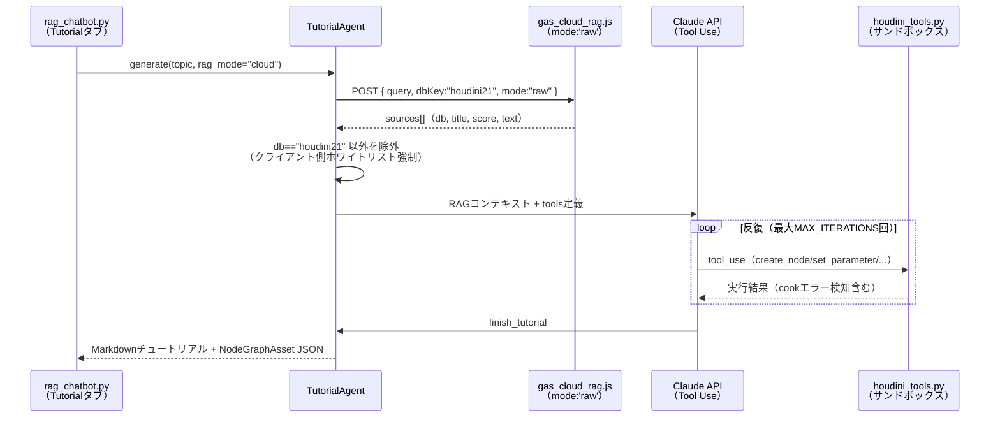
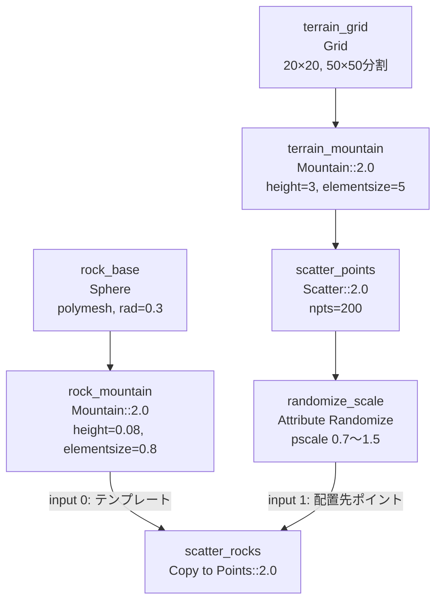

# houdini21チュートリアル自動生成 — Cloud RAG対応・実機検証レポート

**作成日:** 2026-07-23
**対象機能:** houdini21動的チュートリアル生成（[docs/content-generation.md](content-generation.md) §2）
**位置づけ:** 技術資料。実装したCloud RAG対応・チューニングと、Houdini実機での初回エンドツーエンド検証結果を記録する。

---

## 目次

1. [概要](#1-概要)
2. [実装内容](#2-実装内容)
3. [検証1回目：反復上限による打ち切り](#3-検証1回目反復上限による打ち切り)
4. [原因分析と修正](#4-原因分析と修正)
5. [検証2回目：生成成功](#5-検証2回目生成成功)
6. [Houdini実機での確認手順と結果](#6-houdini実機での確認手順と結果)
7. [わかったこと・今後の改善事項](#7-わかったこと今後の改善事項)

---

## 1. 概要

houdini21チュートリアル自動生成機能に **Cloud RAG（GAS WebApp経由）モード** を追加し、Houdini実機上で最初のエンドツーエンド検証を実施した。1回目の生成は反復上限に達して未完成のまま打ち切られたが、原因を特定してパラメータを調整した結果、2回目は完全なノードグラフ（地形生成 → 岩の散布 → 岩のコピー配置）を生成できた。生成結果はHoudini操作に不慣れなユーザー（初心者ロール）の視点で実際にネットワークエディタを操作し、視覚的に意図した通りの絵（地形上に散布された岩）が得られることを確認した。


---

## 2. 実装内容

### 2.1 Cloud RAG検索モードの追加（[tutorial_agent.py](../houdini/python_panels/tutorial_agent.py)）

これまでhoudini21チュートリアル生成のRAG検索は `rag_local_bridge.py` の `/search` エンドポイント（Local RAG）のみに対応していた。CloudRAG側に蓄積されたドキュメントが多いという運用実態に合わせ、`gas_cloud_rag.js` を検索元として使えるようにした。



- `rag_mode` を `"local"` / `"cloud"` で切り替え（既存のSettingsタブの `mode`/`gas_url`/`gas_api_key` を再利用、UI追加なし）
- `mode:'raw'` はGAS側の最終回答生成（Gemini呼び出し）をスキップし、検索結果のみを返す軽量パス
- GAS側はAPIキーにhoudini21権限がないと `dbKey` を `"all"` にフォールバックしてしまうため、**応答の `sources` を `db=="houdini21"` のものだけに絞り込む処理をクライアント側にも実装**し、ホワイトリスト方針を二重に強制している

### 2.2 付随バグ修正：cook成功メッセージの誤検知

「ハマりポイント」自動抽出のフィルタが `"エラー" in str(entry["result"])` という部分文字列判定だったため、cook成功時のメッセージ `"cook 成功: ...（エラー・警告なし）"` にも `"エラー"` という文字列が含まれることを検知し、成功ログが誤って「ハマりポイント」として混入していた。判定を `"[エラー]" in str(entry["result"])`（cook失敗行にのみ付与される接頭辞）に変更して修正した。

---

## 3. 検証1回目：反復上限による打ち切り

**リクエスト:** 「岩を地形に散布するプロシージャルセットアップ」
**設定:** `MODEL = "claude-sonnet-4-6"` / `MAX_ITERATIONS = 25`

| 項目 | 結果 |
|---|---|
| RAG検索 | Cloud RAGで houdini21 ドキュメント5件を取得 |
| 生成結果 | 反復上限（25回）に到達し打ち切り |
| 消費 | 37イテレーション相当のツール呼び出し／$0.327 |
| 完成度 | 地形・岩の形状・散布ポイント・スケールランダム化までは完了。**岩を散布ポイントにコピーする最終ステップ（Copy to Points）が未実行のまま終了** |

```mermaid
gantt
    dateFormat X
    axisFormat %s
    title 検証1回目：反復予算の使われ方（イメージ）
    section 検索フェーズ
    list_available_node_types ×8回 : 0, 8
    section 構築フェーズ
    ノード作成・接続・パラメータ設定 : 8, 25
    section 未達
    Copy to Points（最終工程） : crit, 25, 27
```



原因は明確で、序盤の `list_available_node_types` によるノードタイプ検索に反復予算の3割以上を使い、本題（岩のコピー配置）にたどり着く前に上限を消費した。

---

## 4. 原因分析と修正

2つの独立した改善レバーを適用した（[tutorial_agent.py:41-42](../houdini/python_panels/tutorial_agent.py:41)）。

```diff
- MODEL = "claude-sonnet-4-6"   # 設計判断（§4.1）。変更はコストが変わるため要ユーザー確認
- MAX_ITERATIONS = 25           # 反復上限（§2.6）
+ MODEL = "claude-sonnet-5"     # 設計判断（§4.1）。変更はコストが変わるため要ユーザー確認
+ MAX_ITERATIONS = 40           # 反復上限（§2.6）
```

| 変更 | 狙い |
|---|---|
| `MAX_ITERATIONS`: 25 → 40 | 単純に反復回数の余裕を増やす |
| `MODEL`: Sonnet 4.6 → Sonnet 5 | agentic・コーディング性能の向上により、同じタスクをより少ない反復で終える期待。加えて導入価格（$2/$10 per MTok、2026-08-31まで）がSonnet 4.6（$3/$15）より安く、性能向上とコスト減を両立 |

`COST_LIMIT_USD = 0.50`（自動打ち切り上限）は今回変更していない。反復上限を増やした分、理論上はコスト上限が先に効く可能性があるため、今後の運用で頻発する場合は合わせて見直す。

---

## 5. 検証2回目：生成成功

同じリクエストで再実行した結果、反復上限に達することなく `finish_tutorial` まで到達した。

| 項目 | 検証1回目 | 検証2回目 |
|---|---|---|
| MODEL | claude-sonnet-4-6 | claude-sonnet-5 |
| MAX_ITERATIONS | 25 | 40 |
| 結果 | 反復上限で打ち切り | **完了** |
| 消費イテレーション | 37 | 47 |
| コスト | $0.327 | $0.445 |
| 最終ステップ（Copy to Points） | 未実行 | 実行済み |

生成されたノードグラフ（サンドボックス: `/obj/ai_tutorial_20260722_232252/geo1`）:



チュートリアル本文はRAG検索で取得したhoudini21ドキュメント5件のうち関連する項目を「参考」として自動引用し、「ハマりポイント」節には以下が自動生成された（要約）:

- Sphereのデフォルトタイプは変形できない形式なので `polymesh` に変更が必要
- Mountainの`height`はオブジェクトのスケールに依存する（地形とミニチュアの岩で値が2桁違う）
- Copy to Pointsの入力順序（0=テンプレート、1=配置先ポイント）を逆にすると意図しない結果になる
- `pscale`属性の命名・class指定を忘れるとスケールランダム化が反映されない

---

## 6. Houdini実機での確認手順と結果

Houdini操作に不慣れなユーザーの視点で、生成結果を実際に確認する手順を実施した。この過程で判明した「初心者にとって非自明な操作」を記録する。


| ステップ | 判明したこと |
|---|---|
| サンドボックス直下を開く | サンドボックスはSubnetworkで、`Sub-Network Input`×4個 + `geo1`のみが見える。実体は`geo1`の**さらに1階層下** |
| ノードのフラグ操作 | ノードにマウスを乗せると扇形の「フラグメニュー」が出現し、青い目アイコンがDisplay flag。初見でわかりにくい |
| Copy to Pointsの出力の性質 | `Copy to Points`は複製されたインスタンスのみを出力し、**元の地形サーフェス自体は出力に含まれない**。3Dビューの「地面」はHoudiniの基準グリッド（実体のないガイド線）であり、生成された地形メッシュではない |
| Tabメニューでのノード検索 | ノード名の打ち間違い（`marge`→`merge`）で見つからず。Tabメニューは文字列完全一致寄りの絞り込みのため、スペルミスに弱い |
| Mergeノード追加後 | `terrain_mountain`（地形）+ `scatter_rocks`（岩）をMergeし、その表示フラグをONにすることで、起伏のある地形上に岩が散布された最終的な絵を確認 |

**結論:** 生成されたノードグラフ・パラメータは意図通りに動作しており、機能としては成功。ただし「地形と散布結果を同時に見せる」には現状ユーザー側での追加操作（Mergeノード）が必要で、チュートリアルとしての完成度に改善余地がある（詳細は次章）。

---

## 7. わかったこと・今後の改善事項

### 7.1 今回確認できたこと

- Cloud RAGモードでのhoudini21ドキュメント検索 → エージェントループ → ノードグラフ生成の一連の流れが実機で動作する
- `MODEL`/`MAX_ITERATIONS`の調整で、同一タスクが「打ち切り」から「完了」に改善した
- 生成されたノードグラフ・パラメータは技術的に正しく、意図した結果（起伏地形への岩の散布）が得られる
- 生成されたチュートリアル本文の「ハマりポイント」節は、実際に手を動かした際に意味のある注意点（Sphereのtype、height値のスケール依存、入力順序、pscaleの命名規則）を言語化できている

### 7.2 今後の改善事項

| # | 項目 | 内容 |
|---|---|---|
| 1 | 反復予算の使われ方 | 検証1回目は`list_available_node_types`の検索だけで反復予算の3割超を消費した。よく使うSopノードタイプ（scatter, mountain, copytopoints, attribrandomize等）をあらかじめキャッシュ／プロンプトに含めるなど、検索コストを減らす余地がある |
| 2 | 視覚的完成度（Merge省略問題） | `Copy to Points`/`Scatter`パターンのチュートリアルでは、最終出力に元サーフェスが含まれず「何も表示されていないように見える」誤解を生みやすい。地形系タスクでは自動でMergeノードを追加し表示フラグを設定する、もしくはチュートリアル本文に「地面が見えないのは仕様」である旨を明記するルールをシステムプロンプトに追加すべき |
| 3 | `COST_LIMIT_USD`の見直し | `MAX_ITERATIONS`を25→40に増やしたが`COST_LIMIT_USD=0.50`は未変更。反復回数を使い切る前にコスト上限で打ち切られるケースが今後出てくる可能性があり、要観察 |
| 4 | 打ち切り時の挙動 | 反復上限・コスト上限に達した場合、現状は単純に打ち切って未完成のまま出力する。残り予算が少なくなった時点で残タスクを簡略化する、あるいは最低限「表示可能な状態」まで持っていく優先順位付けを検討する余地がある |
| 5 | 初心者向けのUI操作説明不足 | 生成されたチュートリアルはノード・パラメータの指示に終始しており、「Network Editorで潜る」「Display flagをクリックする」といったHoudini自体の基本操作は説明されない。今回のように操作に不慣れなユーザーが使う場合、Houdini操作の基礎知識を前提にできない。チュートリアル本文または別セクションに「Houdini操作の基礎」的なガイドを添付する案を[docs/houdini21-learning-effect-study.md](houdini21-learning-effect-study.md)の要件に反映する |
| 6 | `rag_local_bridge.py`の`--no-auth`バグ | 別件で発見済みだが未修正: `--no-auth`モードで`/api/users`にアクセスすると`self.auth`が`None`のまま`list_users()`を呼び出し`AttributeError`になる |
| 7 | Houdiniパネルの反映漏れ | `default.pypanel`は保存時にコードを埋め込む方式のため、`.py`ファイルを編集しただけではHoudini上のパネルに反映されない。Python Panel Editorへの再貼り付けが必要（既知の運用上の注意点として継続フォロー） |
| 8 | 進捗の可視化 | 現状は生成完了後にまとめて反復数・コストが表示される。反復中にリアルタイムでコスト消費率を表示できれば、ユーザーが「あとどれくらいで打ち切られそうか」を把握しやすくなる |

---

*関連ドキュメント: [docs/content-generation.md](content-generation.md) §2 / [docs/houdini21-learning-effect-study.md](houdini21-learning-effect-study.md)*
