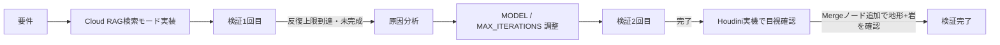
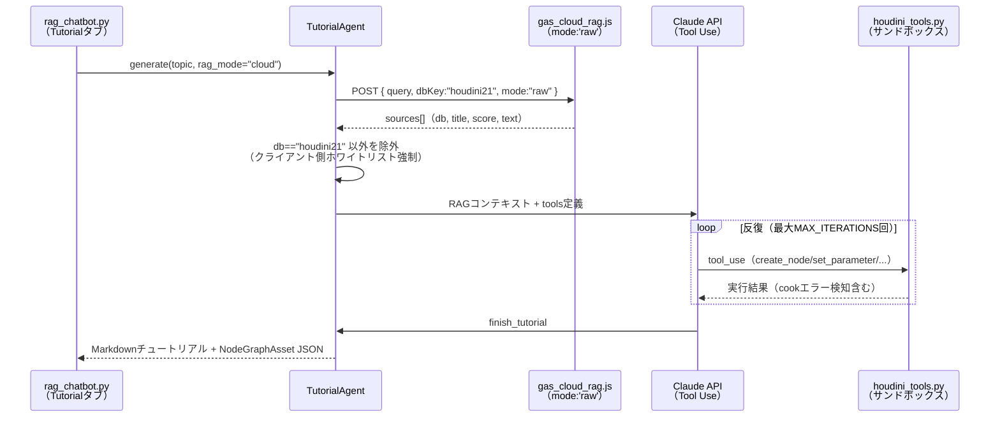
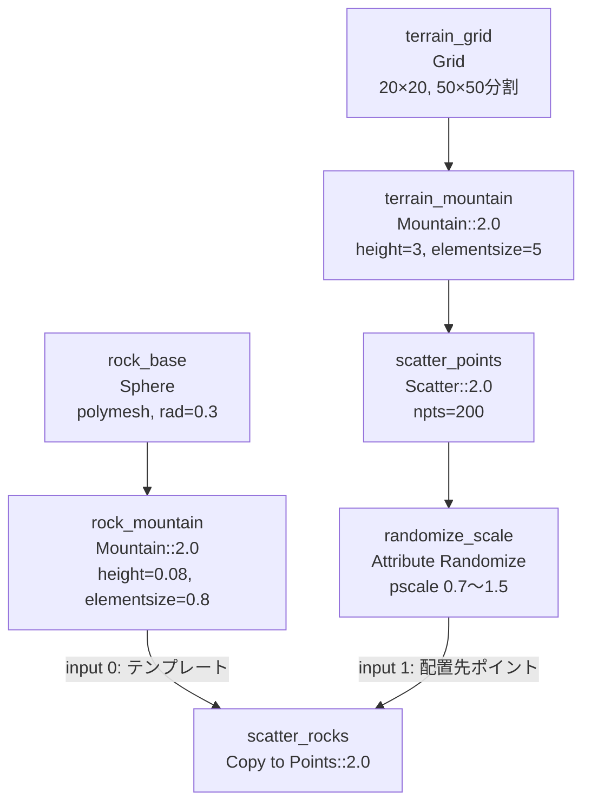
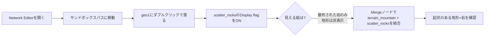
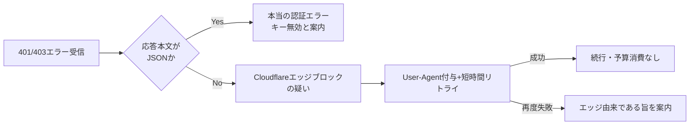

# houdini21チュートリアル自動生成 — Cloud RAG対応・実機検証レポート

**作成日:** 2026-07-23（8章のみ2026-09-20追記）
**対象機能:** houdini21動的チュートリアル生成（[docs/content-generation.md](content-generation.md) §2）
**位置づけ:** 技術資料。実装したCloud RAG対応・チューニングと、Houdini実機での初回エンドツーエンド検証結果を記録する。8章はCloudflareバックエンド移行・動画生成連携以降に実機から報告された不具合と対応を追加記録したもの。

---

## 目次

1. [概要](#1-概要)
2. [実装内容](#2-実装内容)
3. [検証1回目：反復上限による打ち切り](#3-検証1回目反復上限による打ち切り)
4. [原因分析と修正](#4-原因分析と修正)
5. [検証2回目：生成成功](#5-検証2回目生成成功)
6. [Houdini実機での確認手順と結果](#6-houdini実機での確認手順と結果)
7. [わかったこと・今後の改善事項](#7-わかったこと今後の改善事項)
8. [追加検証（2026-08〜09、Cloudflareバックエンド移行・動画生成連携）](#8-追加検証2026-0809cloudflareバックエンド移行動画生成連携)

---

## 1. 概要

houdini21チュートリアル自動生成機能に **Cloud RAG（GAS WebApp経由）モード** を追加し、Houdini実機上で最初のエンドツーエンド検証を実施した。1回目の生成は反復上限に達して未完成のまま打ち切られたが、原因を特定してパラメータを調整した結果、2回目は完全なノードグラフ（地形生成 → 岩の散布 → 岩のコピー配置）を生成できた。生成結果はHoudini操作に不慣れなユーザー（初心者ロール）の視点で実際にネットワークエディタを操作し、視覚的に意図した通りの絵（地形上に散布された岩）が得られることを確認した。


```mermaid
flowchart LR
    A[要件] --> B[Cloud RAG検索モード実装]
    B --> C[検証1回目]
    C -->|反復上限到達・未完成| D[原因分析]
    D --> E[MODEL / MAX_ITERATIONS 調整]
    E --> F[検証2回目]
    F -->|完了| G[Houdini実機で目視確認]
    G -->|Mergeノード追加で地形+岩を確認| H[検証完了]
```

---

## 2. 実装内容

### 2.1 Cloud RAG検索モードの追加（[tutorial_agent.py](../houdini/python_panels/tutorial_agent.py)）

これまでhoudini21チュートリアル生成のRAG検索は `rag_local_bridge.py` の `/search` エンドポイント（Local RAG）のみに対応していた。CloudRAG側に蓄積されたドキュメントが多いという運用実態に合わせ、`gas_cloud_rag.js` を検索元として使えるようにした。


```mermaid
sequenceDiagram
    participant UI as rag_chatbot.py<br/>（Tutorialタブ）
    participant Agent as TutorialAgent
    participant GAS as gas_cloud_rag.js<br/>（mode:'raw'）
    participant Claude as Claude API<br/>（Tool Use）
    participant Houdini as houdini_tools.py<br/>（サンドボックス）

    UI->>Agent: generate(topic, rag_mode="cloud")
    Agent->>GAS: POST { query, dbKey:"houdini21", mode:"raw" }
    GAS-->>Agent: sources[]（db, title, score, text）
    Agent->>Agent: db=="houdini21" 以外を除外<br/>（クライアント側ホワイトリスト強制）
    Agent->>Claude: RAGコンテキスト + tools定義
    loop 反復（最大MAX_ITERATIONS回）
        Claude->>Houdini: tool_use（create_node/set_parameter/...）
        Houdini-->>Claude: 実行結果（cookエラー検知含む）
    end
    Claude->>Agent: finish_tutorial
    Agent-->>UI: Markdownチュートリアル + NodeGraphAsset JSON
```

- `rag_mode` を `"local"` / `"cloud"` で切り替え（既存のSettingsタブの `mode`/`gas_url`/`gas_api_key` を再利用、UI追加なし）
- `mode:'raw'` はGAS側の最終回答生成（Gemini呼び出し）をスキップし、検索結果のみを返す軽量パス
- GAS側はAPIキーにhoudini21権限がないと `dbKey` を `"all"` にフォールバックしてしまうため、**応答の `sources` を `db=="houdini21"` のものだけに絞り込む処理をクライアント側にも実装**し、ホワイトリスト方針を二重に強制している

### 2.2 付随バグ修正：cook成功メッセージの誤検知

「ハマりポイント」自動抽出のフィルタが `"エラー" in str(entry["result"])` という部分文字列判定だったため、cook成功時のメッセージ `"cook 成功: ...（エラー・警告なし）"` にも `"エラー"` という文字列が含まれることを検知し、成功ログが誤って「ハマりポイント」として混入していた。判定を `"[エラー]" in str(entry["result"])`（cook失敗行にのみ付与される接頭辞）に変更して修正した。

---

## 3. 検証1回目：反復上限による打ち切り

**リクエスト:** 「岩を地形に散布するプロシージャルセットアップ」
**設定:** `MODEL = "claude-sonnet-4-6"` / `MAX_ITERATIONS = 25`

| 項目 | 結果 |
|---|---|
| RAG検索 | Cloud RAGで houdini21 ドキュメント5件を取得 |
| 生成結果 | 反復上限（25回）に到達し打ち切り |
| 消費 | 37イテレーション相当のツール呼び出し／$0.327 |
| 完成度 | 地形・岩の形状・散布ポイント・スケールランダム化までは完了。**岩を散布ポイントにコピーする最終ステップ（Copy to Points）が未実行のまま終了** |


```mermaid
gantt
    dateFormat X
    axisFormat %s
    title 検証1回目：反復予算の使われ方（イメージ）
    section 検索フェーズ
    list_available_node_types ×8回 : 0, 8
    section 構築フェーズ
    ノード作成・接続・パラメータ設定 : 8, 25
    section 未達
    Copy to Points（最終工程） : crit, 25, 27
```

原因は明確で、序盤の `list_available_node_types` によるノードタイプ検索に反復予算の3割以上を使い、本題（岩のコピー配置）にたどり着く前に上限を消費した。

---

## 4. 原因分析と修正

2つの独立した改善レバーを適用した（[tutorial_agent.py:41-42](../houdini/python_panels/tutorial_agent.py:41)）。

```diff
- MODEL = "claude-sonnet-4-6"   # 設計判断（§4.1）。変更はコストが変わるため要ユーザー確認
- MAX_ITERATIONS = 25           # 反復上限（§2.6）
+ MODEL = "claude-sonnet-5"     # 設計判断（§4.1）。変更はコストが変わるため要ユーザー確認
+ MAX_ITERATIONS = 40           # 反復上限（§2.6）
```

| 変更 | 狙い |
|---|---|
| `MAX_ITERATIONS`: 25 → 40 | 単純に反復回数の余裕を増やす |
| `MODEL`: Sonnet 4.6 → Sonnet 5 | agentic・コーディング性能の向上により、同じタスクをより少ない反復で終える期待。加えて導入価格（$2/$10 per MTok、2026-08-31まで）がSonnet 4.6（$3/$15）より安く、性能向上とコスト減を両立 |

`COST_LIMIT_USD = 0.50`（自動打ち切り上限）は今回変更していない。反復上限を増やした分、理論上はコスト上限が先に効く可能性があるため、今後の運用で頻発する場合は合わせて見直す。

---

## 5. 検証2回目：生成成功

同じリクエストで再実行した結果、反復上限に達することなく `finish_tutorial` まで到達した。

| 項目 | 検証1回目 | 検証2回目 |
|---|---|---|
| MODEL | claude-sonnet-4-6 | claude-sonnet-5 |
| MAX_ITERATIONS | 25 | 40 |
| 結果 | 反復上限で打ち切り | **完了** |
| 消費イテレーション | 37 | 47 |
| コスト | $0.327 | $0.445 |
| 最終ステップ（Copy to Points） | 未実行 | 実行済み |

生成されたノードグラフ（サンドボックス: `/obj/ai_tutorial_20260722_232252/geo1`）:


```mermaid
flowchart TB
    grid[terrain_grid<br/>Grid<br/>20×20, 50×50分割]
    mountain[terrain_mountain<br/>Mountain::2.0<br/>height=3, elementsize=5]
    scatter[scatter_points<br/>Scatter::2.0<br/>npts=200]
    randomize[randomize_scale<br/>Attribute Randomize<br/>pscale 0.7〜1.5]

    sphere[rock_base<br/>Sphere<br/>polymesh, rad=0.3]
    rockmtn[rock_mountain<br/>Mountain::2.0<br/>height=0.08, elementsize=0.8]

    copy[scatter_rocks<br/>Copy to Points::2.0]

    grid --> mountain --> scatter --> randomize
    sphere --> rockmtn
    rockmtn -->|input 0: テンプレート| copy
    randomize -->|input 1: 配置先ポイント| copy
```

チュートリアル本文はRAG検索で取得したhoudini21ドキュメント5件のうち関連する項目を「参考」として自動引用し、「ハマりポイント」節には以下が自動生成された（要約）:

- Sphereのデフォルトタイプは変形できない形式なので `polymesh` に変更が必要
- Mountainの`height`はオブジェクトのスケールに依存する（地形とミニチュアの岩で値が2桁違う）
- Copy to Pointsの入力順序（0=テンプレート、1=配置先ポイント）を逆にすると意図しない結果になる
- `pscale`属性の命名・class指定を忘れるとスケールランダム化が反映されない

---

## 6. Houdini実機での確認手順と結果

Houdini操作に不慣れなユーザーの視点で、生成結果を実際に確認する手順を実施した。この過程で判明した「初心者にとって非自明な操作」を記録する。


```mermaid
flowchart LR
    A[Network Editorを開く] --> B[サンドボックスパスに移動]
    B --> C[geo1にダブルクリックで潜る]
    C --> D[scatter_rocksのDisplay flagをON]
    D --> E{見える絵は?}
    E -->|散布された岩のみ<br/>地形は非表示| F[Mergeノードで<br/>terrain_mountain + scatter_rocksを結合]
    F --> G[起伏のある地形+岩を確認]
```

| ステップ | 判明したこと |
|---|---|
| サンドボックス直下を開く | サンドボックスはSubnetworkで、`Sub-Network Input`×4個 + `geo1`のみが見える。実体は`geo1`の**さらに1階層下** |
| ノードのフラグ操作 | ノードにマウスを乗せると扇形の「フラグメニュー」が出現し、青い目アイコンがDisplay flag。初見でわかりにくい |
| Copy to Pointsの出力の性質 | `Copy to Points`は複製されたインスタンスのみを出力し、**元の地形サーフェス自体は出力に含まれない**。3Dビューの「地面」はHoudiniの基準グリッド（実体のないガイド線）であり、生成された地形メッシュではない |
| Tabメニューでのノード検索 | ノード名の打ち間違い（`marge`→`merge`）で見つからず。Tabメニューは文字列完全一致寄りの絞り込みのため、スペルミスに弱い |
| Mergeノード追加後 | `terrain_mountain`（地形）+ `scatter_rocks`（岩）をMergeし、その表示フラグをONにすることで、起伏のある地形上に岩が散布された最終的な絵を確認 |

**結論:** 生成されたノードグラフ・パラメータは意図通りに動作しており、機能としては成功。ただし「地形と散布結果を同時に見せる」には現状ユーザー側での追加操作（Mergeノード）が必要で、チュートリアルとしての完成度に改善余地がある（詳細は次章）。

---

## 7. わかったこと・今後の改善事項

### 7.1 今回確認できたこと

- Cloud RAGモードでのhoudini21ドキュメント検索 → エージェントループ → ノードグラフ生成の一連の流れが実機で動作する
- `MODEL`/`MAX_ITERATIONS`の調整で、同一タスクが「打ち切り」から「完了」に改善した
- 生成されたノードグラフ・パラメータは技術的に正しく、意図した結果（起伏地形への岩の散布）が得られる
- 生成されたチュートリアル本文の「ハマりポイント」節は、実際に手を動かした際に意味のある注意点（Sphereのtype、height値のスケール依存、入力順序、pscaleの命名規則）を言語化できている

### 7.2 今後の改善事項

| # | 項目 | 内容 |
|---|---|---|
| 1 | 反復予算の使われ方 | 検証1回目は`list_available_node_types`の検索だけで反復予算の3割超を消費した。よく使うSopノードタイプ（scatter, mountain, copytopoints, attribrandomize等）をあらかじめキャッシュ／プロンプトに含めるなど、検索コストを減らす余地がある |
| 2 | 視覚的完成度（Merge省略問題） | `Copy to Points`/`Scatter`パターンのチュートリアルでは、最終出力に元サーフェスが含まれず「何も表示されていないように見える」誤解を生みやすい。地形系タスクでは自動でMergeノードを追加し表示フラグを設定する、もしくはチュートリアル本文に「地面が見えないのは仕様」である旨を明記するルールをシステムプロンプトに追加すべき |
| 3 | `COST_LIMIT_USD`の見直し | `MAX_ITERATIONS`を25→40に増やしたが`COST_LIMIT_USD=0.50`は未変更。反復回数を使い切る前にコスト上限で打ち切られるケースが今後出てくる可能性があり、要観察 |
| 4 | 打ち切り時の挙動 | 反復上限・コスト上限に達した場合、現状は単純に打ち切って未完成のまま出力する。残り予算が少なくなった時点で残タスクを簡略化する、あるいは最低限「表示可能な状態」まで持っていく優先順位付けを検討する余地がある |
| 5 | 初心者向けのUI操作説明不足 | 生成されたチュートリアルはノード・パラメータの指示に終始しており、「Network Editorで潜る」「Display flagをクリックする」といったHoudini自体の基本操作は説明されない。今回のように操作に不慣れなユーザーが使う場合、Houdini操作の基礎知識を前提にできない。チュートリアル本文または別セクションに「Houdini操作の基礎」的なガイドを添付する案を[docs/houdini21-learning-effect-study.md](houdini21-learning-effect-study.md)の要件に反映する |
| 6 | `rag_local_bridge.py`の`--no-auth`バグ | 別件で発見済みだが未修正: `--no-auth`モードで`/api/users`にアクセスすると`self.auth`が`None`のまま`list_users()`を呼び出し`AttributeError`になる |
| 7 | Houdiniパネルの反映漏れ | `default.pypanel`は保存時にコードを埋め込む方式のため、`.py`ファイルを編集しただけではHoudini上のパネルに反映されない。Python Panel Editorへの再貼り付けが必要（既知の運用上の注意点として継続フォロー） |
| 8 | 進捗の可視化 | 現状は生成完了後にまとめて反復数・コストが表示される。反復中にリアルタイムでコスト消費率を表示できれば、ユーザーが「あとどれくらいで打ち切られそうか」を把握しやすくなる |

---

## 8. 追加検証（2026-08〜09、Cloudflareバックエンド移行・動画生成連携）

2026-07-23の初回検証以降、(a) Claude呼び出し先をGASからCloudflare Workers（`cloudflare-rag-poc`）へ移行する選択肢を追加、(b) 生成したチュートリアルから動画を自動生成するLearningQt連携を追加、という2つの機能拡張を行った。以下はその過程で実機から報告された不具合と対応の記録で、7章の「今後の改善事項」のうち#4（打ち切り時の挙動）に直接対応する内容を含む。

### 8.1 Cloudflareエッジブロックの誤診断回避

`/claude/messages`呼び出しが「認証エラー: Cloudflare APIキーが無効です」として失敗する事象が報告された。`cloudflare-rag-poc/src/*.ts`に該当のエラー文字列（`error code`や`1010`）が一切存在しないこと、Cloudflare Observabilityダッシュボードに該当リクエストのイベントが1件も記録されていないことから、アプリケーション層（`auth.ts`）ではなくCloudflareエッジ（Bot Fight Mode等）でのブロックだと特定した。**Worker本体に到達していない＝トークン予算は消費されていない**ため、この特定パターン（401/403だが応答本文が自前のJSONではない）に限り、一般的なUser-Agentを付与したうえで自動リトライする対応を`tutorial_agent.py`の`_call_api_cloudflare`に追加した（誤って「APIキーが無効」と案内し続けることを防いだ）。


```mermaid
flowchart LR
    A[401/403エラー受信] --> B{応答本文が<br/>JSONか}
    B -->|Yes| C[本当の認証エラー<br/>キー無効と案内]
    B -->|No| D[Cloudflareエッジブロックの疑い]
    D --> E[User-Agent付与+短時間リトライ]
    E -->|成功| F[続行・予算消費なし]
    E -->|再度失敗| G[エッジ由来である旨を案内]
```

### 8.2 「完了扱い」の誤判定対策（7章#4への対応）

実機で、モデルが実際には未完了のまま`tool_use`無しで応答を終えてしまうケースが複数パターン確認された。7章#4で挙げていた「打ち切り時の挙動」の改善として、以下を`tutorial_agent.py`の`_run_loop`に実装した。

| 段階 | 状態 | 対応 |
|---|---|---|
| ① 何も作らず終了 | ノードを1つも作成していない | `_EMPTY_HANDED_NUDGE_TEXT`で再開を促す（2回まで） |
| ② 下書き未確定のまま終了 | `finish_tutorial`は呼んだが`confirm_tutorial`を呼んでいない | `_UNCONFIRMED_FINISH_NUDGE_TEXT`で確認・確定を促す（1回まで） |
| ③ 提出自体を忘れて終了 | ノードは作成済みだが`finish_tutorial`自体を未呼び出し | `_UNFINISHED_WORK_NUDGE_TEXT`で提出を促す（1回まで、後日のリファクタリング時に発見した抜け穴） |

加えて、反復・コスト上限が近づいた時点でまだ未完了なら「今の状態のまま仕上げてください」と一度だけ促す**グレースフル終了**（`_GRACE_NUDGE_TEXT`、残り3反復以内または累計コストが上限の85%を超えた時点）も実装済み。ハード打ち切りで未完成のまま終わる頻度を下げることを狙ったもので、詳細な設計判断は[docs/content-generation.md](content-generation.md) §2.6を参照。

また、`confirm_tutorial`が一度も呼ばれずに打ち切られた場合のフォールバックとして、`finish_tutorial`の全呼び出し履歴（書き直しを含む）の中から本文量が最大の下書きを採用する`best_unconfirmed_draft()`（`houdini_tools.py`）も実装した。モデルが良い下書きを複数回書いた後、最後の呼び出しだけプレースホルダー的な内容（`title="テスト"`等）になり、そのまま確定されずに打ち切られると、それまでの内容が丸ごと汎用フォールバックに置き換わってしまう事例が実機で確認されたための対応。

### 8.3 動画生成連携の不具合（QtWebEngine関連、2件）

チュートリアル保存後にLearningQt側の動画生成エンジンを起動する連携機能を追加した際、Houdini本体（自前のOpenGLビューポート）と埋め込みQtWebEngine（自前のGPUプロセスを持つChromium）の組み合わせに起因する不具合が2件見つかった。詳細は[docs/content-generation.md](content-generation.md) §2.8にまとめてあるため、ここでは概要のみ記す。

1. **動画再生が0:00から進まない**：GPUコンテキスト競合が原因と推定。OS標準プレイヤーで開く「外部プレイヤーで開く」ボタンを保険として追加
2. **【致命的】動画生成直後にパネル全体が操作不能になる**：`VideoLibraryPanel`が動画選択のたびに埋め込みQtWebEngineビューを自動アクティブ化しており、動画生成完了時に自動選択が発生することで、ユーザーが見ているタブに関わらず毎回トリガーされていた。埋め込みQtWebEngineを完全に撤去し、外部プレイヤー方式に統一して解消

いずれも「実機でしか再現しない、DCCソフト特有のGUI統合上の不具合」であり、単体テストや静的解析では検出できなかった。実機ログとユーザーからのスクリーンショット報告が発見の起点になっている。

### 8.4 `cook_node`の偽陽性対策

`node.cook(force=True)`が例外を送出した場合に`except Exception: pass`で握りつぶし、`node.errors()`が空であれば無条件に「cook成功」と報告していた実装を見直した。Houdiniのcook失敗は通常`node.errors()`にも反映されるが、稀に反映されないまま例外だけが飛ぶケースを想定し、その場合は合成のエラー行を結果に含めるよう修正した（詳細は[docs/content-generation.md](content-generation.md) §2.6）。これは実機での不具合報告ではなく、既存コードのリファクタリング・レビュー時に発見した潜在的なリスクへの予防的対応である。

### 8.5 ネットワークエディタのスクリーンショット取得（2026-09-26に原因を特定し作り直し）

動画の各スライドにHoudiniのネットワークエディタ（ノードグラフ）画面を載せたいが、実機では一度も撮れておらず、2026-09-26の実機ログ（33ステップ全てでネットワーク画像が0枚）を精査して、次の3つの原因が重なっていたと特定した。

1. **古いコピーが動いていた**: HoudiniはDocuments/houdini21.0/python_panels/に配置したコピーを読み込む（9/14配置）。リポジトリ側で9/14以降に入れた診断・修正（0x0ウィンドウの除外など）は一度も配置されておらず、ログの文言が古い版のものだった。配置は手動コピーで、リポジトリとHoudiniの内容が乖離しても気づけない
2. **使うAPIを間違えていた**: `hou.PaneTab.screenBounds()`は固定値しか返さないと結論づけていたが、公式ドキュメントにはペインの左上を画面座標で返す`hou.PaneTab.qtScreenGeometry()`（QRect）がある。ウィジェット階層の探索（`hou.qt.mainWindow()`、トップレベルウィンドウ列挙）は、この実行コンテキストではHoudini本体を返さない（0x0のウィンドウしか見つからない）ため、そもそも成立しなかった
3. **撮影対象が違っていた**: 常にサンドボックス直下を映していたが、システムプロンプトの指示で実際の作業はその中のgeoノードの内部で行われるため、仮に撮れてもgeoの箱が1つ映るだけだった

**対応**: `capture_network_editor()`を、(a) `qtScreenGeometry()`で得た画面上の矩形を`QScreen.grabWindow()`で直接切り出す（Houdiniがアクティブでない・自分のパネルが重なっている・ペインが小さい・結果がほぼ単色、のいずれかなら撮らない）、(b) それが成立しなければ、ノード構成をHoudini風のダーク配色で自前描画した図にフォールバックする、の2段構成に作り直した。撮影対象も「作業中のネットワーク（geoの内部）」にし、直近の操作の対象ノードを強調表示する。どちらの方法で撮れたかは`capture.log`に`network capture method: ...`として残る。ヘッドレスのテスト（偽の`hou`・offscreen Qt）で自前描画のフォールバックと各ガードは確認済みだが、(a)の実画面切り出しは実機でのみ検証できるため、実機での結果待ちである。

### 8.5.1 ビューポートが最初のノードのまま変わらなかった問題（打ち切りの根本原因）

同じ実機ログで、ビューポート画像がステップ10以降まったく変化せず、`finish_tutorial`直後の自己確認画像も最初の球のままだった。原因は表示（display/render）フラグで、`createNode()`で作ったSOPは最初の1個にしか表示フラグが付かず、システムプロンプトが「ディスプレイフラグは不要」と案内していたのに、実際にはどこでも設定されていなかった。モデルは画像を見て「意図した見た目ではない」と正しく判断したが、直す手段（フラグ設定ツール）が無く、`set_parameter`で`display`を設定しようとして2回失敗したあと、`confirm_tutorial`を呼べないままテキストのみで終了し、救済回数（当時1回）を使い切って打ち切りになった。

**対応**: `connect_nodes`で末端（出力先の無いノード）になったノード、および`cook_node`したノードにシステムが自動で表示フラグを移す（`finish_tutorial`直前には最後の末端ノードへ戻す）。システムプロンプトと`confirm_tutorial`の説明も実際の挙動に合わせた。あわせて、確認忘れの救済を2回に増やして2回目を「今すぐconfirmだけ呼ぶ」という明示的な文言にし、打ち切り時のモデルの最後の発言を進捗表示と監査ログに残すようにした。

### 8.6 わかったこと（8章のまとめ）

- Cloudflare移行のような「バックエンド差し替え」は、アプリケーション層のエラーとインフラ層（エッジ）のエラーが同じHTTPステータスコードで表面化しうるため、切り分けのための実証的な手がかり（この場合はエラー文字列の有無とObservabilityダッシュボードの記録有無）を用意しておくことが重要だった
- 「モデルが完了したと申告すること」と「実際に完了していること」は別であり、両者のギャップは1つの救済ロジックでは塞ぎきれない（今回3種類のパターンを段階的に発見・対応した）。エージェント設計では「モデルの自己申告を信用しない」前提での多層的なガードが必要
- Houdiniのような商用DCCソフトへのGUI統合（Qt埋め込みウィジェット、外部レンダラの埋め込み）は、公式ドキュメント通りに書いても実行コンテキスト依存で異なる挙動を示すことがあり、実機ログによる実証的な原因特定が不可欠（推測ベースの修正は2回にわたって外れた）
- ウィジェット階層を推測で探す回避策を何度も重ねても直らなかった不具合（8.5節）は、公式ドキュメントに載っている専用API（`qtScreenGeometry()`）を使っていなかったことが根本原因だった。実機で失敗が続いたときは、回避策を足す前に公式APIの一覧を確認し直す、という教訓を得た
- 「システムプロンプトが約束していること」と「ツールが実際にやっていること」の食い違い（表示フラグは不要と案内しつつ、実際は誰も設定していなかった）は、モデルの挙動不良として現れる（8.5.1節）。エージェントの不振はプロンプトやモデルの問題と決めつける前に、環境側の約束が守られているかをログの画像や結果で確かめるべきだった
- 実機の動作が変わらないときは、配置されているファイルが最新かをまず疑う（手動コピー配布の弱点。配置日時とリポジトリの差分の確認が最も安価な切り分けだった）

---

*関連ドキュメント: [docs/content-generation.md](content-generation.md) §2 / [docs/houdini21-learning-effect-study.md](houdini21-learning-effect-study.md)*
