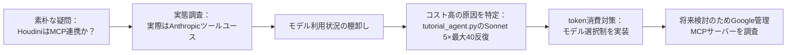
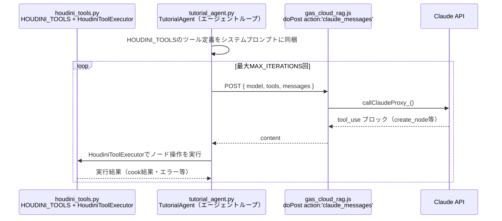
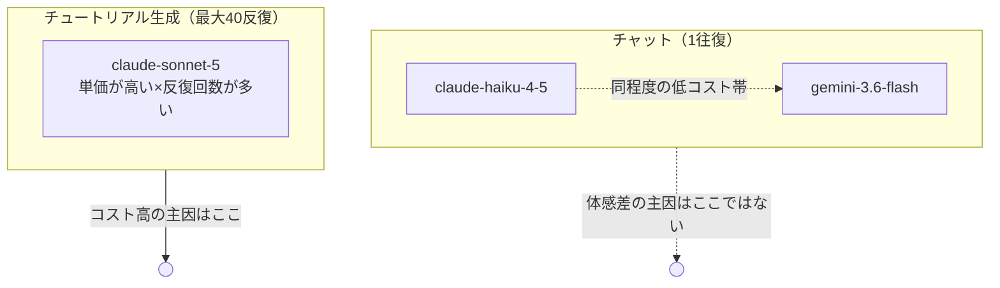
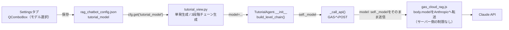

# houdini21チュートリアル生成 モデル運用戦略とGoogle MCP調査レポート

**作成日:** 2026-08-14
**対象機能:** houdini21チュートリアル自動生成（[tutorial_agent.py](../houdini/python_panels/tutorial_agent.py)）のモデル選択・コスト構造、および将来のGoogleサービス連携検討のための調査
**位置づけ:** 技術資料。「Houdiniの自動操作はMCPなのか」という用語整理から出発し、実際のモデル利用状況の棚卸し、token消費対策（生成モデルの選択制対応）の実装、Googleが提供するMCPサーバー（Gmail/Calendar/Maps）の調査までをまとめた記録。

---

## 目次

1. [概要](#1-概要)
2. [Houdini自動操作の実態（MCPではなくツールユース）](#2-houdini自動操作の実態mcpではなくツールユース)
3. [モデル利用状況の確認](#3-モデル利用状況の確認)
4. [token消費対策：チュートリアル生成モデルの選択制対応](#4-token消費対策チュートリアル生成モデルの選択制対応)
5. [Google管理MCPサーバーの調査（参考情報）](#5-google管理mcpサーバーの調査参考情報)
6. [変更ファイル一覧](#6-変更ファイル一覧)
7. [動作確認手順](#7-動作確認手順)
8. [運用上の注意・今後の課題](#8-運用上の注意今後の課題)

---

## 1. 概要

「Houdiniの操作はMCP連携でやっているのか」という素朴な疑問をきっかけに、実装の実態を確認したところ、Houdini自動操作は**MCP（Model Context Protocol）ではなくAnthropicのネイティブなツールユース（function calling）**であることが判明した。あわせてモデル利用状況を棚卸しした結果、チュートリアル生成（`tutorial_agent.py`）だけが高コストな`claude-sonnet-5`を最大40回のエージェントループで呼んでおり、これがコスト面の主な要因だと分かった。そこで生成モデルを`claude-sonnet-5`（既定・高品質）と`claude-haiku-4-5`（低コスト）から選択できるようにする対策を実装した。さらに、将来Google系サービス（Gmail/Calendar/Maps）と連携する可能性を見据え、Googleが公式提供するMCPサーバーの状況も調査した。

---

## 2. Houdini自動操作の実態（MCPではなくツールユース）

`houdini/python_panels/*.py` および `docs/` 配下を確認したところ、"MCP" という文字列は一切登場しない。実際の仕組みは、Anthropicの通常のツールユース（tool-use / function calling）であり、MCPサーバーは存在しない。

**ポイント**

- クライアントは生の`ANTHROPIC_API_KEY`を持たず、Claude API呼び出しは必ずGAS（`gas_cloud_rag.js`、`action:'claude_messages'`）経由（[docs/claude-token-security-report.md](claude-token-security-report.md)参照）
- ツール定義（`HOUDINI_TOOLS`）と実行部（`HoudiniToolExecutor`）はAnthropicの標準的なtool-use契約に沿ったもので、MCPのJSON-RPCハンドシェイク（`initialize`/`tools/list`/`tools/call`）は使っていない
- 「MCP連携」という表現は誤解であり、正しくは「Anthropicツールユースによるエージェントループ」

---

## 3. モデル利用状況の確認

| 用途 | ファイル | モデル | 単価（入力/出力、USD/1Mトークン） |
|---|---|---|---|
| チュートリアル生成エージェント | [tutorial_agent.py](../houdini/python_panels/tutorial_agent.py) | `claude-sonnet-5`（既定） | $3.00 / $15.00 |
| ローカルRAGチャット（Claude） | [rag_local_bridge.py](../scripts/rag_local_bridge.py) | `claude-haiku-4-5` | $1.00 / $5.00 |
| ローカルRAGチャット（Gemini） | [rag_local_bridge.py](../scripts/rag_local_bridge.py) | `gemini-3.6-flash` | （Gemini側の低コスト帯） |
| クラウドRAGチャット・HyDE | [gas_cloud_rag.js](../scripts/gas_cloud_rag.js) | `gemini-3.6-flash` | （Gemini側の低コスト帯） |

チャット系の応答生成は既にHaiku 4.5 / Gemini Flashという低コスト帯を使っており、**「Geminiは安いのにClaudeは高い」という体感の主因は、比較しているタスクの種類が違うこと**にある。チャットは1往復・低コストモデル同士の比較になる一方、チュートリアル生成は高コストなSonnet 5ベースで最大40回ツールを呼ぶエージェントループのため、単価もリクエスト数も桁違いになる。

---

## 4. token消費対策：チュートリアル生成モデルの選択制対応

チュートリアル生成のモデルを`claude-sonnet-5`（既定・高品質）と`claude-haiku-4-5`（低コスト）から選択できるようにした。既定値は変更せず、選ぶかどうかはユーザー側の判断に委ねる方針（品質優先のタスクのため、既定を勝手に下げない）。

### 4.1 モデル別単価テーブル

`_PRICE`（単一モデル固定）を`_MODEL_PRICES`（モデル別辞書）に置き換え、コスト計算・打ち切り判定（`COST_LIMIT_USD`）がどちらのモデルでも正しく効くようにした。

| モデル | 入力 | 出力 | cache_write | cache_read |
|---|---|---|---|---|
| `claude-sonnet-5`（既定） | $3.00 | $15.00 | $3.75 | $0.30 |
| `claude-haiku-4-5`（低コスト） | $1.00 | $5.00 | $1.25 | $0.10 |

単価だけで比較すると、Haiku 4.5は入力・出力とも**約1/3**。cache_write/cache_readはHaiku 4.5の公表値がないため、他モデルと同じ比率（write=input×1.25、read=input×0.1）で概算している。

### 4.2 実装の変更点

| 変更内容 | 該当箇所 |
|---|---|
| `MODEL`定数（単一固定）→ `DEFAULT_MODEL` + `_MODEL_PRICES`辞書 | [tutorial_agent.py:45](../houdini/python_panels/tutorial_agent.py) |
| `TutorialAgent.__init__`に`model`引数を追加（未知の値は`DEFAULT_MODEL`にフォールバック） | [tutorial_agent.py](../houdini/python_panels/tutorial_agent.py) |
| `_usage_cost()`を静的メソッドからインスタンスメソッドに変更し、`self._model`の単価を参照 | [tutorial_agent.py](../houdini/python_panels/tutorial_agent.py) |
| `build_level_chain()`（3段階連続生成）にも`model`引数を追加し、各段の`TutorialAgent`に伝播 | [tutorial_agent.py](../houdini/python_panels/tutorial_agent.py) |
| Settingsタブに「チュートリアル生成モデル」プルダウンを追加（`AVAILABLE_MODELS`をインポートして選択肢を一元化） | [rag_chatbot.py](../houdini/python_panels/rag_chatbot.py) |
| `tutorial_model`設定キーを追加（既定値`claude-sonnet-5`） | [rag_chatbot.py](../houdini/python_panels/rag_chatbot.py) |
| 単発生成・3段階チェーン生成の両方で選択モデルを`TutorialAgent`/`build_level_chain`に渡すよう変更 | [tutorial_view.py](../houdini/python_panels/tutorial_view.py) |

GAS側（`gas_cloud_rag.js`）は`body.model`を検証せずそのままAnthropic APIに転送する実装だったため、**サーバー側の変更は不要**だった。

---

## 5. Google管理MCPサーバーの調査（参考情報）

将来Gmail/Calendar/Maps等のGoogleサービスと連携する可能性を見据え、Googleが公式提供するMCPサーバーの状況を調査した（Google Cloud Next '26で発表）。

| サービス | 状況 |
|---|---|
| Gmail MCP Server | Google Workspace配下でMCPサーバー化済み |
| Calendar MCP Server | エンドポイント `https://calendarmcp.googleapis.com/mcp/v1`。OAuth 2.0スコープ3種（`calendar.calendarlist.readonly` / `calendar.events.freebusy` / `calendar.events.readonly`）が必要 |
| Maps Grounding Lite MCP Server | Google Workspace外だが同様にMCPサーバー化済み |
| Drive / Chat / People API | Workspace配下で同様に対応 |

**Claudeから使う場合**の要件：

- claude.ai のカスタムコネクタ設定でOAuthクライアントID/シークレット・リダイレクトURI（`https://claude.ai/api/mcp/auth_callback`）の登録が必要
- **Enterprise/Pro/Max/Teamプランが必要**（無料プランでは利用不可）

**Gemini自体のMCP対応**（比較検討のための参考情報）：

- Gemini CLI（および後継のAntigravity CLI）はMCPクライアントを標準搭載しており、外部MCPサーバーに接続してツールを発見・実行できる
- Gemini API（`google-genai` SDK）は2026年3月にネイティブMCPサポートを追加。Python/JavaScript SDKからリモートMCPサーバー（Streamable HTTP）に直接接続可能だが、現状は`tools/list`によるツール呼び出しのみでresources/promptsは未対応、かつexperimental扱い

この調査は「今後Googleサービスと連携する際にどの経路が現実的か」を判断するための一次情報であり、本レポート時点では実装には着手していない。

> その後、この一次情報を元にGAS上でMCPクライアントを自前実装し、Google純正MCP（Calendar）・サードパーティMCP（DeepWiki）・複数サーバー横断・代替のネイティブサービス実装までを実機検証した。詳細は [MCPdemo/gas-mcp-demo-report.md](../MCPdemo/gas-mcp-demo-report.md) を参照。

---

## 6. 変更ファイル一覧

| ファイル | 変更内容 |
|---|---|
| [houdini/python_panels/tutorial_agent.py](../houdini/python_panels/tutorial_agent.py) | `MODEL`→`DEFAULT_MODEL`+`_MODEL_PRICES`辞書化、`TutorialAgent(model=...)`対応、`_usage_cost()`のインスタンスメソッド化、`build_level_chain(model=...)`対応 |
| [houdini/python_panels/rag_chatbot.py](../houdini/python_panels/rag_chatbot.py) | `tutorial_model`設定キー追加、Settingsタブにモデル選択プルダウン追加 |
| [houdini/python_panels/tutorial_view.py](../houdini/python_panels/tutorial_view.py) | 単発生成・チェーン生成の両方で選択モデルを`TutorialAgent`/`build_level_chain`に渡すよう変更 |

---

## 7. 動作確認手順

1. Houdiniの `rag_chatbot.py`（`tutorial_agent.py`/`tutorial_view.py`同梱）を起動し、**Settings**タブを開く
2. 「チュートリアル生成モデル（コスト影響あり）」のプルダウンで `claude-haiku-4-5` を選択し、「設定を保存」を押す
3. **Tutorial**タブでトピックを入力して生成を実行
4. 生成完了後のMarkdownプレビュー末尾（`*自動生成: model=... / iterations=... / cost=$...`）で、指定したモデル名（`claude-haiku-4-5`）とコストが表示されていることを確認する
5. 同じトピックで `claude-sonnet-5` に戻して再生成し、末尾のコスト表示が前述の単価テーブルどおり約3倍程度になることを確認する（生成内容の違いはトピックや反復回数に依存するため厳密な倍率一致は求めない）
6. 3段階チェーン生成（Chainチェックボックス）でも同様に、選択したモデルが各段（basic/applied/advanced）に反映されることを確認する

---

## 8. 運用上の注意・今後の課題

| # | 項目 | 内容 |
|---|---|---|
| 1 | 既定値は変更していない | 品質優先のタスクのため、既定は引き続き`claude-sonnet-5`。Haiku 4.5への切り替えは常にユーザーの明示的な選択 |
| 2 | Haiku 4.5選択時の品質リスク | ノードグラフ組み立て・エラー自己修正の精度がSonnet 5より下がる可能性があり、未検証。実際の生成品質は今後の実機検証で確認する必要がある |
| 3 | GAS側にモデル制限なし | `gas_cloud_rag.js`は`body.model`を検証せず転送するため、クライアント側の`AVAILABLE_MODELS`以外の値も理論上は通ってしまう。悪用シナリオは低いが、将来的にGAS側でも許可モデルのホワイトリスト化を検討する余地がある |
| 4 | cache_write/cache_read単価は概算 | Haiku 4.5のキャッシュ単価はAnthropic公表値がなく、他モデルと同じ比率で概算している。実測との乖離があればコスト打ち切り判定（`COST_LIMIT_USD`）の精度に影響する |
| 5 | Google MCP連携は未着手 | 前述のGoogle MCPサーバーの調査は情報収集の段階であり、実装には進んでいない。着手する場合はEnterprise/Pro/Max/Teamプランの要否・OAuth設定コストを踏まえて優先度を判断する |

---

*関連ドキュメント: [docs/claude-token-security-report.md](claude-token-security-report.md) / [docs/content-generation.md](content-generation.md) / [docs/houdini21-tutorial-gen-report.md](houdini21-tutorial-gen-report.md) / [MCPdemo/gas-mcp-demo-report.md](../MCPdemo/gas-mcp-demo-report.md)（本レポートのGoogle MCP調査に対する実機検証編）*
