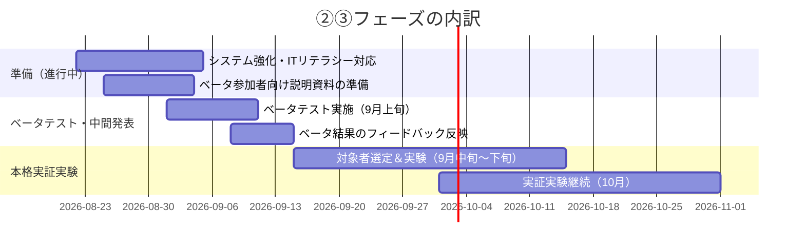

# ベータテスト・本格実証実験 実施提案書

**作成日:** 2026-08-22
**対象システム:** ゲーム開発RAG環境（Cloud RAG / Local RAG / Houdini21チュートリアル自動生成）
**位置づけ:** ベータテスト（9月上旬）・本格実証実験（9月中旬〜）の実施計画。ITリテラシーが高くない参加者でも扱えるレベルまでシステムを強化することを目標とする準備計画も含む。

> 本書は現時点で把握している情報を基にした一次案です。【要記入】の箇所は、対象者数・実施場所・指導教員等、確定次第埋めてください。

---

## 目次

1. [背景・目的](#1-背景目的)
2. [対象システムの概要](#2-対象システムの概要)
3. [システム構成図](#3-システム構成図)
4. [スケジュール（現在地）](#4-スケジュール現在地)
5. [ベータテストと本格実証実験の違い](#5-ベータテストと本格実証実験の違い)
6. [対象者・実施体制](#6-対象者実施体制)
7. [検証内容](#7-検証内容)
8. [成功基準・評価指標](#8-成功基準評価指標)
9. [ITリテラシーへの配慮方針](#9-itリテラシーへの配慮方針)
10. [リスクと対策](#10-リスクと対策)
11. [準備タスク一覧（9月上旬までに）](#11-準備タスク一覧9月上旬までに)

---

## 1. 背景・目的

Unity/Houdini向けのRAG（検索拡張生成）環境を、これまで開発者本人による検証（fake houでのスモークテスト等）で動作確認してきた。次の段階として、**実際のユーザー（開発チームメンバー・非技術者を含む）による実地検証**を行い、以下を明らかにすることを目的とする。

- 実際の利用シーンでRAG検索・チュートリアル自動生成が期待通りに機能するか
- ITリテラシーが高くない利用者でも、迷わず・エラーに詰まらず使えるか
- 実運用に耐えるコスト・性能（トークン消費量、応答時間）か

---

## 2. 対象システムの概要

| 機能 | 概要 | 実装 |
|---|---|---|
| Cloud RAGチャット | チーム共有情報（Unity/Houdini仕様・ゲーム設計書等）を検索し、AIが回答 | `gas_cloud_rag.js`（GAS） |
| Local RAGチャット | 個人情報（チャット履歴・個人メモ等）を検索し、AIが回答 | `rag_local_bridge.py`（Python） |
| Houdini21チュートリアル自動生成 | トピックを入力すると、Houdini上でノードグラフを自動組み立てし、チュートリアルとして出力 | `tutorial_agent.py`ほか |
| Unity/Houdiniパネル統合 | 各ツール内から直接AIに質問できるUI | `rag_chatbot.py`ほか |

---

## 3. システム構成図

RAGとしての分類は **Modular RAG**（Gao et al., *Retrieval-Augmented Generation for Large Language Models: A Survey*, arXiv:2312.10997）に該当する。ハイブリッド検索・HyDEといったAdvanced RAGの要素に加え、namespaceによるルーティング・レベル適応生成・MCPによるツール統合・監査ログを備えるため。

<svg viewBox="0 0 1680 880" xmlns="http://www.w3.org/2000/svg" style="display:block;min-width:900px;">
  <defs>
    <marker id="pa-arrow" viewBox="0 0 10 10" refX="9" refY="5" markerWidth="7" markerHeight="7" orient="auto-start-reverse"><path d="M0,0 L10,5 L0,10 z" fill="var(--d-line)"/></marker>
    <marker id="pa-arrowUser" viewBox="0 0 10 10" refX="9" refY="5" markerWidth="8" markerHeight="8" orient="auto-start-reverse"><path d="M0,0 L10,5 L0,10 z" fill="var(--d-c-chat)"/></marker>
    <marker id="pa-arrowFuture" viewBox="0 0 10 10" refX="9" refY="5" markerWidth="7" markerHeight="7" orient="auto-start-reverse"><path d="M0,0 L10,5 L0,10 z" fill="var(--d-c-future)"/></marker>
  </defs>
  <rect x="20" y="140" width="200" height="170" rx="12" fill="var(--d-panel-2)" stroke="var(--d-border)" stroke-width="1.5"/>
  <text x="120" y="166" font-size="13" fill="var(--d-muted)" text-anchor="middle">クライアント</text>
  <rect x="45" y="180" width="150" height="40" rx="8" fill="#2b2b2b"/>
  <text x="120" y="205" font-size="13" fill="#fff" text-anchor="middle" font-weight="600">Unity</text>
  <rect x="45" y="228" width="150" height="40" rx="8" fill="#2b2b2b"/>
  <text x="120" y="253" font-size="13" fill="#fff" text-anchor="middle" font-weight="600">Houdini</text>
  <line x1="220" y1="200" x2="350" y2="200" stroke="var(--d-line)" stroke-width="2" marker-end="url(#pa-arrow)"/>
  <line x1="220" y1="248" x2="350" y2="248" stroke="var(--d-c-chat)" stroke-width="2.5" marker-end="url(#pa-arrowUser)"/>
  <text x="225" y="233" font-size="11" fill="var(--d-c-chat)" font-weight="600">質問・トピック入力（直接）</text>
  <rect x="350" y="40" width="820" height="580" rx="18" fill="none" stroke="var(--d-border-strong)" stroke-width="2"/>
  <text x="378" y="78" font-size="19" font-weight="700" fill="var(--d-text)">DevelopmentRAGEnvironment（メインリポジトリ）</text>
  <text x="378" y="100" font-size="12.5" fill="var(--d-muted)">Cloud RAG + Local RAG + MCP（このリポジトリ内で完結）</text>
  <rect x="400" y="140" width="340" height="170" rx="12" fill="var(--d-panel-2)" stroke="var(--d-border)" stroke-width="1.5"/>
  <text x="424" y="168" font-size="14" font-weight="700" fill="var(--d-text)">対話・操作</text>
  <text x="424" y="186" font-size="11" fill="var(--d-muted)">Chatbot / MCP Server</text>
  <rect x="424" y="198" width="30" height="30" rx="7" fill="var(--d-c-chat)"/>
  <text x="439" y="218" font-size="14" fill="#fff" text-anchor="middle" font-weight="700">C</text>
  <text x="464" y="212" font-size="12.5" font-weight="600" fill="var(--d-text)">チャットボット</text>
  <text x="464" y="227" font-size="10.5" fill="var(--d-muted)">LLM切替（Claude/Gemini）で応答</text>
  <line x1="439" y1="228" x2="439" y2="250" stroke="var(--d-line)" stroke-width="1.5" marker-end="url(#pa-arrow)"/>
  <rect x="424" y="252" width="30" height="30" rx="7" fill="var(--d-c-mcp)"/>
  <text x="439" y="272" font-size="14" fill="#fff" text-anchor="middle" font-weight="700">M</text>
  <text x="464" y="266" font-size="12.5" font-weight="600" fill="var(--d-text)">MCP Server</text>
  <text x="464" y="281" font-size="10.5" fill="var(--d-muted)">Houdiniを直接操作・記録</text>
  <rect x="400" y="330" width="340" height="250" rx="12" fill="var(--d-panel-2)" stroke="var(--d-border)" stroke-width="1.5"/>
  <text x="424" y="358" font-size="14" font-weight="700" fill="var(--d-text)">RAGデータ基盤</text>
  <text x="424" y="376" font-size="11" fill="var(--d-muted)">Cloud RAG / Local RAG（namespaceで論理分離）</text>
  <rect x="424" y="388" width="30" height="30" rx="7" fill="var(--d-c-cloud)"/>
  <text x="439" y="408" font-size="14" fill="#fff" text-anchor="middle" font-weight="700">Cl</text>
  <text x="464" y="402" font-size="12.5" font-weight="600" fill="var(--d-text)">Cloud RAG</text>
  <text x="464" y="417" font-size="10.5" fill="var(--d-muted)">チーム共有情報（Notion + GAS）</text>
  <line x1="439" y1="418" x2="439" y2="440" stroke="var(--d-line)" stroke-width="1.5" marker-end="url(#pa-arrow)"/>
  <rect x="424" y="442" width="30" height="30" rx="7" fill="var(--d-c-local)"/>
  <text x="439" y="462" font-size="14" fill="#fff" text-anchor="middle" font-weight="700">Lo</text>
  <text x="464" y="456" font-size="12.5" font-weight="600" fill="var(--d-text)">Local RAG</text>
  <text x="464" y="471" font-size="10.5" fill="var(--d-muted)">個人情報（ChromaDB + BM25 + HyDE）</text>
  <rect x="424" y="490" width="296" height="60" rx="8" fill="var(--d-highlight-bg)" stroke="var(--d-highlight-border)" stroke-width="1.3"/>
  <text x="440" y="512" font-size="11" font-weight="600" fill="var(--d-highlight-border)">ハイブリッド検索</text>
  <text x="440" y="530" font-size="10" fill="var(--d-muted)">ベクトル(e5-large) ＋ BM25 を RRF で統合</text>
  <line x1="740" y1="213" x2="760" y2="213" stroke="var(--d-line)" stroke-width="1.5"/>
  <line x1="760" y1="213" x2="760" y2="457" stroke="var(--d-line)" stroke-width="1.5"/>
  <line x1="760" y1="457" x2="742" y2="457" stroke="var(--d-line)" stroke-width="1.5" marker-end="url(#pa-arrow)"/>
  <rect x="800" y="140" width="340" height="230" rx="14" fill="var(--d-panel-2)" stroke="var(--d-c-sec)" stroke-width="2"/>
  <text x="824" y="168" font-size="14" font-weight="700" fill="var(--d-c-sec)">セキュリティ・品質制御</text>
  <rect x="824" y="188" width="30" height="30" rx="7" fill="var(--d-c-sec)"/>
  <text x="839" y="208" font-size="13" fill="#fff" text-anchor="middle" font-weight="700">A</text>
  <text x="864" y="202" font-size="12.5" font-weight="600" fill="var(--d-text)">監査ログ</text>
  <text x="864" y="217" font-size="10.5" fill="var(--d-muted)">クエリをSHA-256でハッシュ化・JSONL記録</text>
  <line x1="839" y1="218" x2="839" y2="240" stroke="var(--d-line)" stroke-width="1.5" marker-end="url(#pa-arrow)"/>
  <rect x="824" y="242" width="30" height="30" rx="7" fill="var(--d-c-sec)"/>
  <text x="839" y="262" font-size="13" fill="#fff" text-anchor="middle" font-weight="700">T</text>
  <text x="864" y="256" font-size="12.5" font-weight="600" fill="var(--d-text)">トークン予算</text>
  <text x="864" y="271" font-size="10.5" fill="var(--d-muted)">RAG/Claude双方をサーバー側で二重管理</text>
  <line x1="839" y1="272" x2="839" y2="294" stroke="var(--d-line)" stroke-width="1.5" marker-end="url(#pa-arrow)"/>
  <rect x="824" y="296" width="30" height="30" rx="7" fill="var(--d-c-sec)"/>
  <text x="839" y="316" font-size="13" fill="#fff" text-anchor="middle" font-weight="700">S</text>
  <text x="864" y="310" font-size="12.5" font-weight="600" fill="var(--d-text)">理解度スコア</text>
  <text x="864" y="325" font-size="10.5" fill="var(--d-muted)">basic→applied→advancedを自動調整</text>
  <line x1="1170" y1="225" x2="1220" y2="225" stroke="var(--d-line)" stroke-width="1.5" marker-end="url(#pa-arrow)"/>
  <text x="1173" y="215" font-size="10" fill="var(--d-muted)">生成・埋め込みAPI呼び出し</text>
  <rect x="1220" y="140" width="280" height="170" rx="12" fill="var(--d-panel-2)" stroke="var(--d-border)" stroke-width="1.5"/>
  <text x="1244" y="168" font-size="14" font-weight="700" fill="var(--d-text)">外部LLM API</text>
  <rect x="1244" y="192" width="232" height="38" rx="8" fill="var(--d-c-llm)"/>
  <text x="1360" y="216" font-size="13" fill="#fff" text-anchor="middle" font-weight="600">Claude API</text>
  <rect x="1244" y="240" width="232" height="38" rx="8" fill="var(--d-c-llm)"/>
  <text x="1360" y="264" font-size="13" fill="#fff" text-anchor="middle" font-weight="600">Gemini API</text>
  <line x1="1170" y1="455" x2="1220" y2="455" stroke="var(--d-line)" stroke-width="1.5" marker-end="url(#pa-arrow)"/>
  <text x="1173" y="445" font-size="10" fill="var(--d-muted)">回答・チュートリアルをHTTP POST</text>
  <rect x="1220" y="340" width="380" height="250" rx="12" fill="var(--d-panel-2)" stroke="var(--d-border)" stroke-width="1.5"/>
  <text x="1244" y="368" font-size="14" font-weight="700" fill="var(--d-text)">LearningQt（別リポジトリ）</text>
  <text x="1244" y="386" font-size="11" fill="var(--d-muted)">GameDevelopment/LearningQt（Qt/C++）</text>
  <rect x="1244" y="398" width="30" height="30" rx="7" fill="var(--d-c-video)"/>
  <text x="1259" y="418" font-size="13" fill="#fff" text-anchor="middle" font-weight="700">Q</text>
  <text x="1284" y="412" font-size="12.5" font-weight="600" fill="var(--d-text)">ナレーション動画生成</text>
  <text x="1284" y="427" font-size="10.5" fill="var(--d-muted)">SAPI5音声合成 ＋ Mermaid図解 ＋ FFmpeg</text>
  <line x1="1259" y1="428" x2="1259" y2="455" stroke="var(--d-line)" stroke-width="1.5" marker-end="url(#pa-arrow)"/>
  <rect x="1244" y="457" width="326" height="60" rx="8" fill="var(--d-highlight-bg)" stroke="var(--d-highlight-border)" stroke-width="1.3"/>
  <text x="1260" y="479" font-size="11" font-weight="600" fill="var(--d-highlight-border)">Web公開（動画ギャラリー）</text>
  <text x="1260" y="497" font-size="10" fill="var(--d-muted)">manifest.json方式で31本を自動公開中</text>
  <text x="350" y="660" font-size="11" fill="var(--d-c-future)" font-weight="600">連携検討中（将来・未確定）</text>
  <line x1="545" y1="620" x2="545" y2="676" stroke="var(--d-c-future)" stroke-width="1.5" stroke-dasharray="5,4" marker-end="url(#pa-arrowFuture)"/>
  <line x1="965" y1="620" x2="965" y2="676" stroke="var(--d-c-future)" stroke-width="1.5" stroke-dasharray="5,4" marker-end="url(#pa-arrowFuture)"/>
  <rect x="350" y="676" width="390" height="140" rx="12" fill="none" stroke="var(--d-c-future)" stroke-width="1.5" stroke-dasharray="6,5"/>
  <text x="374" y="704" font-size="13" font-weight="700" fill="var(--d-c-future)">VisualRegressionQATool（別リポジトリ）</text>
  <text x="374" y="722" font-size="10.5" fill="var(--d-muted)">ピクセル差分によるビジュアル回帰QA</text>
  <text x="374" y="740" font-size="10.5" fill="var(--d-muted)">生成チュートリアル・描画結果の検証への活用を検討中</text>
  <rect x="770" y="676" width="390" height="140" rx="12" fill="none" stroke="var(--d-c-future)" stroke-width="1.5" stroke-dasharray="6,5"/>
  <text x="794" y="704" font-size="13" font-weight="700" fill="var(--d-c-future)">VLMAutoReplayTool（別リポジトリ）</text>
  <text x="794" y="722" font-size="10.5" fill="var(--d-muted)">基盤モデル計画＋専用スキル実行のゲーム自動プレイエージェント</text>
  <text x="794" y="740" font-size="10.5" fill="var(--d-muted)">ローカルRAGブリッジ(:8766)を共用し連携を検討中</text>
</svg>

補足：実務で使われる名称ベースの分類（Hybrid RAG／Agentic RAG等）に当てはめても、ハイブリッド検索の面でHybrid RAG、MCP経由の複数手順操作の面でAgentic RAG的特性に該当するのみで、いずれもModular RAGを構成する要素の一部のため、上記の分類結果に変化はない（詳細は[docs/glossary.md](glossary.md)5章）。

現状はCloud/Localが別インフラ・別実装。統合方針は[docs/cloud-local-unification-plan.md](cloud-local-unification-plan.md)を参照。LearningQtは別リポジトリ（`GameDevelopment/LearningQt`）として運用されており、HTTP経由でCloud RAGの回答・チュートリアルを取得して動画化する。VisualRegressionQATool・VLMAutoReplayToolは性能向上・デバッグ効率化の観点で連携を検討中だが、現時点では未確定（ServerLauncherという起動管理コンポーネントは実在しないため、本書からは削除済み）。

---

## 4. スケジュール（現在地・2026-08-22時点）

計画より遅れが出ているため、8月時点を現在地として再設定した。

<svg viewBox="0 0 1560 380" xmlns="http://www.w3.org/2000/svg" style="display:block;min-width:900px;">
  <defs><marker id="sc-arrow" viewBox="0 0 10 10" refX="9" refY="5" markerWidth="7" markerHeight="7" orient="auto-start-reverse"><path d="M0,0 L10,5 L0,10 z" fill="var(--d-line)"/></marker></defs>
  <text x="20" y="30" font-size="11" fill="var(--d-highlight-border)" font-weight="700">8月　★現在地</text>
  <rect x="20" y="44" width="200" height="110" rx="10" fill="var(--d-highlight-bg)" stroke="var(--d-highlight-border)" stroke-width="2"/>
  <text x="36" y="72" font-size="13" font-weight="700" fill="var(--d-text)">①システム改善・</text>
  <text x="36" y="90" font-size="13" font-weight="700" fill="var(--d-text)">強化</text>
  <text x="36" y="112" font-size="10.5" fill="var(--d-highlight-border)">進行中（計画より遅延）</text>
  <line x1="220" y1="99" x2="240" y2="99" stroke="var(--d-line)" stroke-width="2" marker-end="url(#sc-arrow)"/>
  <text x="240" y="30" font-size="11" fill="var(--d-muted)">9月上旬</text>
  <rect x="240" y="44" width="200" height="110" rx="10" fill="var(--d-highlight-bg)" stroke="var(--d-highlight-border)" stroke-width="2"/>
  <text x="256" y="72" font-size="13" font-weight="700" fill="var(--d-text)">②ベータテスト・</text>
  <text x="256" y="90" font-size="13" font-weight="700" fill="var(--d-text)">中間発表</text>
  <text x="256" y="112" font-size="10.5" fill="var(--d-highlight-border)">マイルストーン</text>
  <line x1="440" y1="99" x2="460" y2="99" stroke="var(--d-line)" stroke-width="2" marker-end="url(#sc-arrow)"/>
  <text x="460" y="30" font-size="11" fill="var(--d-muted)">9月中旬〜下旬</text>
  <rect x="460" y="44" width="200" height="110" rx="10" fill="var(--d-panel-2)" stroke="var(--d-border)" stroke-width="1.5"/>
  <text x="476" y="72" font-size="13" font-weight="700" fill="var(--d-text)">③実証実験</text>
  <text x="476" y="90" font-size="13" font-weight="700" fill="var(--d-text)">対象者選定＆実験</text>
  <text x="476" y="112" font-size="10.5" fill="var(--d-muted)">予定</text>
  <line x1="660" y1="99" x2="680" y2="99" stroke="var(--d-line)" stroke-width="2" marker-end="url(#sc-arrow)"/>
  <text x="680" y="30" font-size="11" fill="var(--d-muted)">10月</text>
  <rect x="680" y="44" width="200" height="110" rx="10" fill="var(--d-panel-2)" stroke="var(--d-border)" stroke-width="1.5"/>
  <text x="696" y="72" font-size="13" font-weight="700" fill="var(--d-text)">④実証実験</text>
  <text x="696" y="90" font-size="13" font-weight="700" fill="var(--d-text)">継続</text>
  <text x="696" y="112" font-size="10.5" fill="var(--d-muted)">予定</text>
  <line x1="880" y1="99" x2="900" y2="99" stroke="var(--d-line)" stroke-width="2" marker-end="url(#sc-arrow)"/>
  <text x="900" y="30" font-size="11" fill="var(--d-muted)">11月</text>
  <rect x="900" y="44" width="200" height="110" rx="10" fill="var(--d-panel-2)" stroke="var(--d-border)" stroke-width="1.5"/>
  <text x="916" y="72" font-size="13" font-weight="700" fill="var(--d-text)">⑤実証実験継続／</text>
  <text x="916" y="90" font-size="13" font-weight="700" fill="var(--d-text)">考察・論文執筆</text>
  <text x="916" y="112" font-size="10.5" fill="var(--d-muted)">中旬〜並行開始</text>
  <line x1="1100" y1="99" x2="1120" y2="99" stroke="var(--d-line)" stroke-width="2" marker-end="url(#sc-arrow)"/>
  <text x="1120" y="30" font-size="11" fill="var(--d-muted)">12月</text>
  <rect x="1120" y="44" width="200" height="110" rx="10" fill="var(--d-panel-2)" stroke="var(--d-border)" stroke-width="1.5"/>
  <text x="1136" y="72" font-size="13" font-weight="700" fill="var(--d-text)">⑥まとめ</text>
  <text x="1136" y="112" font-size="10.5" fill="var(--d-muted)">予定</text>
  <line x1="1320" y1="99" x2="1340" y2="99" stroke="var(--d-line)" stroke-width="2" marker-end="url(#sc-arrow)"/>
  <text x="1340" y="30" font-size="11" fill="var(--d-muted)">12月下旬</text>
  <rect x="1340" y="44" width="200" height="110" rx="10" fill="var(--d-highlight-bg)" stroke="var(--d-highlight-border)" stroke-width="2"/>
  <text x="1356" y="72" font-size="13" font-weight="700" fill="var(--d-text)">⑦最終発表</text>
  <text x="1356" y="112" font-size="10.5" fill="var(--d-highlight-border)">マイルストーン</text>
  <line x1="20" y1="200" x2="1540" y2="200" stroke="var(--d-border)" stroke-width="1"/>
  <text x="20" y="230" font-size="10.5" fill="var(--d-muted)" letter-spacing="0.05em">LEGEND</text>
  <rect x="20" y="244" width="26" height="26" rx="6" fill="var(--d-panel-2)" stroke="var(--d-border)" stroke-width="1.5"/>
  <text x="56" y="262" font-size="12" fill="var(--d-muted)">通常フェーズ（予定）</text>
  <rect x="260" y="244" width="26" height="26" rx="6" fill="var(--d-highlight-bg)" stroke="var(--d-highlight-border)" stroke-width="2"/>
  <text x="296" y="262" font-size="12" fill="var(--d-muted)">現在地・マイルストーン</text>
</svg>

本提案書が対象とするベータテスト・本格実証実験は、上図の②③④フェーズ（9月上旬〜10月）にあたる。日次レベルの詳細スケジュールは以下の通り（確定次第【要記入】部分を更新）。

---

## 5. ベータテストと本格実証実験の違い

| | ベータテスト（9月上旬） | 本格実証実験（9月中旬〜） |
|---|---|---|
| 目的 | 致命的な不具合・ITリテラシー面での詰まりポイントの洗い出し | 実運用に近い条件での効果測定 |
| 対象者 | 少人数（開発チーム内、または近しい協力者）【要記入：人数】 | ベータで洗い出した問題を解消した上で、本来の対象者【要記入：人数・属性】に展開 |
| 実施内容 | 主要機能を一通り触ってもらい、つまずいた箇所を記録 | 一定期間の継続利用を通じた効果検証（下記7.3のAB比較テストを実施） |
| 評価の重点 | 使いやすさ（UI/UX、エラーメッセージの分かりやすさ） | 効果（RAGによる調べ物時間の短縮、チュートリアル生成の有用性等） |

---

## 6. 対象者・実施体制

| 役割 | 内容 |
|---|---|
| 実施者 | 【要記入】 |
| 指導教員・監督者 | 【要記入】（ゼミ活動の一環である場合） |
| ベータテスト参加者 | 【要記入：人数・所属】 |
| 本格実証実験参加者 | 【要記入：人数・属性・ITリテラシーレベルの想定】 |
| サポート体制 | 実証実験中に問い合わせを受け付ける窓口（Slack/メール等）を用意することを推奨 |

---

## 7. 検証内容

### 7.1 機能面

| 検証項目 | 具体的なシナリオ例 |
|---|---|
| Cloud RAGチャット | 「〇〇ツールの使い方を教えて」等、チーム共有ドキュメントに基づく質問 |
| Local RAGチャット | 個人の過去メモ・チャット履歴に基づく質問 |
| Houdiniチュートリアル生成 | 実際の学習トピックを入力し、生成されたチュートリアル通りに手を動かせるか |
| Cloud/Localモード切り替え | 切り替え操作が直感的に分かるか |

### 7.2 非機能面

| 検証項目 | 内容 |
|---|---|
| 応答時間 | チャット回答・チュートリアル生成それぞれの体感速度 |
| コスト | 参加者1人あたりのトークン消費量（GAS側のトークン予算管理で実測可能） |
| エラー時の分かりやすさ | エラーメッセージを見て、非技術者が次に何をすればよいか分かるか |
| 初回セットアップの容易さ | 環境構築手順（GAS URL/APIキー設定等）でつまずかないか |

### 7.3 AB比較テストの設計（対象者・課題内容の共通条件を厳格化）

本格実証実験では、単に「使ってもらう」だけでなく、**従来手法との比較（AB比較テスト）**によって効果を検証する。中間発表資料の実験計画と条件を統一する。

**グループ構成:**

| グループ | 内容 |
|---|---|
| A（コントロール群） | 従来どおり、公式ドキュメントとWeb検索のみでタスクに取り組む |
| B（実験群） | 本システム（チャットボット＋RAG＋MCP）を使ってタスクに取り組む |

**共通課題（対象者条件を厳格に揃えるため、具体的なタスクを1つに固定する）:**

> 例：「プロシージャルな雲のパーティクル表現を作成する」— Houdini 21でのPyroFX/Vellum仕様変更に対応した新しい手順が必要な課題を、両グループに同一内容・同一制限時間・同一PC環境で出題する。
>
> ※上記は一貫性のための例示（研究目的スライドの例題と揃えている）。実際に採用するタスクは中間発表資料の内容と合わせて確定させること。

**対象者の共通条件:**
- DCCツール使用経験1年以上（Houdiniに限らない）
- モデリング等の主要操作・大まかな制作フローを自力で実施できる
- （参考）デジタル造形の履修評定「B以上」はあくまで目安であり、絶対条件ではない

**評価指標の定義:**

| 分類 | 指標 | 測定方法 |
|---|---|---|
| 独立変数 | グループ（A: 従来手法／B: 本システム使用） | 事前アンケートで技術レベルを確認し、両グループが均等になるよう層別割付 |
| 従属変数（主観・5段階Likert） | ①難しさ　②わかりやすさ　③作業への集中維持　④出典の有用性　⑤再利用意向 | 事後アンケート |
| 従属変数（客観） | 所要時間／ミス回数 | 実施ログ計測 |

**統計手法:**
- 5段階アンケート（順序尺度）→ 正規性を仮定しないMann-Whitney U検定を採用し、効果量はrank-biserial correlationで報告
- 客観指標（所要時間・ミス回数）→ Shapiro-Wilk検定で正規性を確認のうえ、t検定またはMann-Whitney U検定を使い分け
- タスクが複数ある場合は実施順序をカウンターバランスし、慣れ・疲労効果を排除

**サンプルサイズ:**

| プラン | 内容 |
|---|---|
| プランA（厳密） | 中効果量(d=0.5)・検出力80%・有意水準5%を想定。各群30名以上（合計60名以上）が目安 |
| プランB（現実的・探索的）※採用 | 各群8〜12名程度。有意差は「傾向」として扱い、効果量と質的データで補強する探索的研究として設計 |

詳細な統計的根拠・参考文献は中間発表資料（勉強会・中間発表資料一式）のAppendixを参照。

---

## 8. 成功基準・評価指標

【要記入・要すり合わせ】以下は叩き台です。7.3で定義した指標をベースに設定する。

| 指標 | 目安 |
|---|---|
| チュートリアル生成の完成率 | 生成したチュートリアル通りに操作して、意図した結果が得られる割合（過去のパイロット検証では3〜5トピックで80%収束を完成条件としていた実績あり） |
| ITリテラシーに起因する離脱率 | セットアップ・基本操作でサポートなしに完了できた参加者の割合 |
| RAG回答の有用性 | 参加者アンケートによる主観評価（7.3の5段階評価を使用） |
| 致命的エラーの発生件数 | ベータテスト期間中にゼロ件を目指す |

---

## 9. ITリテラシーへの配慮方針

「ITリテラシーが無い人でも扱えるレベルまでシステムを強化する」という目標に対して、以下を準備タスクとして位置づける。

| # | 対応内容 | 優先度 |
|---|---|---|
| 1 | 初回セットアップ手順書の作成（[MCPdemo/setup-guide.md](../MCPdemo/setup-guide.md)のような、専門用語を避けたステップバイステップ形式） | 高 |
| 2 | エラーメッセージの平易化（現状「HTTP 403」等の技術的な文言がそのまま表示される箇所を、次に取るべき行動が分かる文言に見直す） | 高 |
| 3 | 用語集の整備（[docs/glossary.md](glossary.md)を参加者向けに配布・参照可能にする） | 中 |
| 4 | サポート窓口の明確化 | 中 |
| 5 | 操作動画・スクリーンショット付き手順の用意 | 中 |

---

## 10. リスクと対策

| # | リスク | 対策 |
|---|---|---|
| 1 | GAS側のトークン予算を使い切り、実証実験中にサービスが止まる | 参加者ごとのAPIキー発行・予算設定（既存の二重トークン予算機能）を事前に確認・調整しておく（[docs/claude-token-security-report.md](claude-token-security-report.md)参照） |
| 2 | ナレッジ登録等の重い処理で実行時間制限に達する | Phase 0のバッチ化対応で緩和済み。継続的に監視する |
| 3 | 非技術者がエラーに遭遇した際、自力で解決できず離脱する | 9章の配慮方針を実証実験開始前に実装しておく |
| 4 | 実証実験期間中に大きな仕様変更を入れてしまい、混乱を招く | [docs/cloud-local-unification-plan.md](cloud-local-unification-plan.md)のバックエンド統合作業は、実証実験終了後に着手する方針を徹底する |

---

## 11. 準備タスク一覧（9月上旬までに）

- [ ] ITリテラシー配慮方針（9章）の実装
- [ ] ベータテスト参加者への説明資料・セットアップ手順書の準備
- [ ] 参加者ごとのAPIキー発行・トークン予算設定
- [ ] サポート窓口の準備
- [ ] 成功基準（8章）の最終確定
- [ ] AB比較テストの共通課題（7.3）を確定
- [ ] ベータテスト実施 → フィードバック収集 → 本格実証実験前の修正

---

*関連ドキュメント: [docs/cloud-local-unification-plan.md](cloud-local-unification-plan.md) / [docs/claude-token-security-report.md](claude-token-security-report.md) / [docs/glossary.md](glossary.md)*
